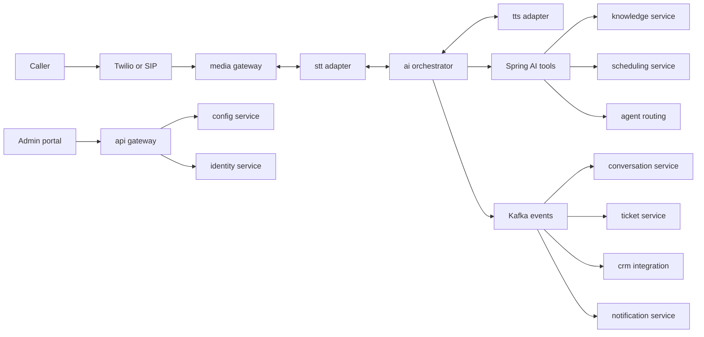

# 1. Executive Summary

VoxAgent is a multi-tenant enterprise AI Voice Agent platform for front desk, customer support, receptionist, and tele-caller use cases. It uses Java 21, Spring Boot 3.3+, Spring AI, PostgreSQL 16 with pgvector, Redis 7, Kafka, WebSockets, Kubernetes, Azure OpenAI with OpenAI fallback, Twilio with SIP trunking at scale, Deepgram or Azure Speech for STT, and Azure Speech TTS or ElevenLabs for TTS.

The architecture is intentionally split into a **streaming hot path** and an **asynchronous cold path**:

- Hot path: `media-gateway-service`, `stt-adapter-service`, `ai-orchestrator-service`, `tts-adapter-service` over gRPC bidirectional streaming or WebSockets only. Kafka is forbidden in the live voice loop.
- Warm path: `knowledge-service`, `scheduling-service`, `agent-routing-service` for low-latency but non-audio operations.
- Async path: `conversation-service`, `ticket-service`, `crm-integration-service`, `notification-service`, `campaign-service`, `analytics-service` via Kafka topics such as `conversation.turns.v1`, `ai.actions.v1`, and `conversation.completed.v1`.
- Control plane: `api-gateway`, `call-management-service`, `identity-service`, `config-service`.

Business value comes from 24x7 call handling, lower support cost per call, faster appointment and ticket flows, better transcript analytics, and scalable outbound campaign automation. The platform design favors measurable latency, tenant isolation, vendor abstraction, auditability, and progressive escape hatches for cost or scale constraints.

Core architectural principles:

| Principle | Production interpretation | Contract alignment |
|---|---|---|
| Streaming first | Speech, LLM, and TTS start before whole responses are complete. Target p50 <= 800 ms and p95 <= 1500 ms from end of user speech to first synthesized audio. | Latency budget section 5 |
| Hot path isolation | `rt-voice` node pool, Guaranteed QoS, no CPU throttling, thin `media-gateway-service`, no Kafka in the voice loop. | D8 and hot-path rule |
| Multi-tenancy by default | Every table has `org_id`, UUIDv7 identifiers, PostgreSQL Row-Level Security, tenant rate limits, Kafka quotas. | Canonical entities and D9 |
| Agentic AI with guardrails | `ai-orchestrator-service` uses Spring AI `@Tool` beans through `ToolRegistry`; all future MCP servers remain behind that abstraction. | D11 |
| Vendor abstraction | Azure OpenAI primary and OpenAI fallback, Deepgram primary STT and Azure Speech fallback, Twilio primary and SIP trunking scale phase. | D5, D6, D7 |
| Evented consistency | Saga and outbox pattern for cross-service workflows; Kafka for replayable post-turn and post-call events. | D1 and D10 |

### Architecture Review (self-critique)

| Flaw or risk | Why it is a problem | Alternatives | Recommendation |
|---|---|---|---|
| Cascaded STT to LLM to TTS adds latency. | Three vendors and network hops consume most of the 800 ms p50 budget. | Speech-to-speech model behind `VoicePipeline`; on-prem STT/TTS for selected tenants. | Keep cascaded path for controllability per D7, but preserve `VoicePipeline` abstraction and measure speech-to-speech in Phase 3. |
| Java in the media path is contested. | JVM GC, allocation spikes, and Netty backpressure can damage jitter-sensitive workloads. | LiveKit/Jambonz media tier; Rust or Go media gateway. | Keep `media-gateway-service` thin, run Java 21 with ZGC on `rt-voice`, and define a replacement boundary at RTP relay and VAD. |
| Shared multi-tenant clusters can create noisy-neighbor issues. | High-volume tenants may consume LLM quota, Kafka partitions, or DB IOPS. | Dedicated schema or DB; dedicated Kubernetes namespace and quota; dedicated cluster for enterprise tenants. | Start shared with hard tenant quotas and graduate enterprise tenants to dedicated DB or cluster. |

# 2. Functional Requirements

| ID | Category | Requirement | Priority | Acceptance criteria |
|---|---|---|---|---|
| FR-001 | Inbound calls | The platform shall receive inbound PSTN or SIP calls through Twilio primary and SIP trunking in the scale phase. | Must | `call-management-service` creates a `Call`; `media-gateway-service` starts a WebSocket or gRPC media session within 500 ms of telephony webhook acceptance. |
| FR-002 | Outbound calls | The platform shall initiate outbound calls for approved campaigns and follow-ups through `campaign-service` and `call-management-service`. | Must | `campaign.dial.commands.v1` creates outbound dial attempts with tenant policy checks and opt-out enforcement. |
| FR-003 | Real-time conversation | The platform shall conduct natural full-duplex conversation with barge-in and streaming partial responses. | Must | End-of-speech to first audio p50 <= 800 ms and p95 <= 1500 ms under approved load tests; barge-in interrupts TTS within 300 ms. |
| FR-004 | Multi-language | The platform shall support multilingual STT, prompting, and TTS voices per tenant and call. | Must | Language is detected or selected; `stt-adapter-service` and `tts-adapter-service` use tenant configuration; transcript records language per `ConversationTurn`. |
| FR-005 | Human transfer | The platform shall transfer calls to a `HumanAgent` or queue through `agent-routing-service`. | Must | Escalation publishes `escalation.events.v1`; call metadata and running summary are visible to the receiving agent. |
| FR-006 | Ticket creation | The platform shall create and update support `Ticket` records from AI actions. | Must | `ai.actions.v1` command results in idempotent `Ticket` creation and `ticket.events.v1` emission. |
| FR-007 | Appointment scheduling | The platform shall book, reschedule, and cancel `Appointment` records through `scheduling-service`. | Must | Calendar constraints are checked before confirmation; `appointment.events.v1` is emitted. |
| FR-008 | FAQ answering | The platform shall answer tenant-approved FAQs using configured prompts and knowledge sources. | Must | Answers include retrieved evidence or policy source in internal trace; unknowns are escalated or qualified. |
| FR-009 | Knowledge retrieval | The platform shall use RAG through `knowledge-service`, `KnowledgeDocument`, and `DocumentChunk` embeddings in pgvector. | Must | Retrieval p95 <= 150 ms until D4 revisit threshold; answers cite top chunks in trace metadata. |
| FR-010 | CRM integration | The platform shall synchronize customer, lead, and call outcomes with external CRM systems. | Must | `crm.sync.commands.v1` is processed idempotently with retry, DLQ, and audit event. |
| FR-011 | Support-tool integration | The platform shall integrate with help desk, order, billing, and internal support tools through Spring AI tools. | Must | Tools are registered in `ToolRegistry`, tenant-scoped, audited, timeout-bound, and permission-checked. |
| FR-012 | Identity verification | The platform shall verify caller identity using configured factors such as phone ownership, DOB, OTP, or knowledge-based checks. | Must | `IdentityVerification` is recorded; high-risk actions require successful verification before execution. |
| FR-013 | Escalation flows | The platform shall support policy-based escalation for frustration, low confidence, regulated topics, and requested human handoff. | Must | Escalation reason is stored and evented on `escalation.events.v1`; the AI stops making commitments after escalation. |
| FR-014 | Call summarization | The platform shall generate post-call `CallSummary` records. | Must | `conversation-service` consumes `conversation.completed.v1` and stores summary within 60 s for 95 percent of calls. |
| FR-015 | Transcripts | The platform shall persist full `Transcript` and `ConversationTurn` data with redaction controls. | Must | Transcript is tied to `org_id`, `callId`, and retention policy; PII redaction pipeline is applied before analytics export. |
| FR-016 | Sentiment capture | The platform shall capture sentiment per turn and call-level trend. | Should | Sentiment is available to `analytics-service` and handoff UI within 10 s of turn completion. |
| FR-017 | Intent capture | The platform shall classify caller intent and update it over the call lifecycle. | Must | Intent changes are emitted in `conversation.turns.v1` metadata and queryable by call. |
| FR-018 | Follow-up actions | The platform shall create `FollowUpAction` records for promised callbacks, documents, reminders, and CRM tasks. | Must | Actions are idempotent, assigned owner and due date, and emitted through `ai.actions.v1`. |
| FR-019 | Post-call SMS and email | The platform shall send approved post-call SMS and email through `notification-service`. | Must | `notification.commands.v1` includes template ID, recipient, consent basis, and delivery status. |
| FR-020 | Consent capture | The platform shall capture call recording, SMS, email, and outbound dialing consent in `ConsentRecord`. | Must | Consent is timestamped, tenant-scoped, immutable except revocation, and auditable. |
| FR-021 | Tenant configuration | The platform shall manage `AIAgentDefinition`, prompts, flows, tools, voices, and policies per `Organization`. | Must | Changes are versioned by `config-service`; active calls keep their starting config version. |
| FR-022 | Auditability | The platform shall emit immutable `audit.events.v1` for security, data access, tool use, and admin changes. | Must | Audit retention is 365 d with tiered archival to S3 or Blob. |
| FR-023 | Future multi-agent | The platform should support multiple collaborating specialized AI agents per call. | Could | `ai-orchestrator-service` can route subgoals while preserving one customer-facing voice policy. |
| FR-024 | Future MCP | The platform should expose tool adapters through MCP-compatible servers. | Could | Existing Spring AI `@Tool` beans can be fronted by MCP without changing call flows. |
| FR-025 | Future voice cloning | The platform could support tenant-approved voice cloning. | Could | Explicit consent, watermarking, abuse controls, and regional legality checks are required before enablement. |
| FR-026 | Future knowledge graph | The platform could augment pgvector RAG with a tenant knowledge graph. | Could | Graph improves entity resolution or answer accuracy by at least 10 percent in evaluation before adoption. |
| FR-027 | Future AI supervisor | The platform should provide an AI supervisor that monitors live calls and recommends interventions. | Could | Supervisor is advisory by default; auto-intervention requires policy and compliance approval. |
| FR-028 | Future agent marketplace | The platform could support reusable agent templates and tools in a marketplace. | Could | Marketplace artifacts are signed, scanned, tenant-approved, and versioned. |
| FR-029 | Campaigns | The platform shall support outbound campaign setup, contact import, dial windows, retries, and disposition. | Should | `Campaign` and `CampaignContact` lifecycle is evented through `lead.events.v1` and `campaign.dial.commands.v1`. |
| FR-030 | Outbound sales | The platform should support compliant sales outreach and product qualification scripts. | Should | Scripts include opt-out, do-not-call screening, and approved claim guardrails. |
| FR-031 | Lead qualification | The platform should qualify `Lead` records using tenant-defined criteria. | Should | Qualification score and rationale sync to CRM through `crm.sync.commands.v1`. |
| FR-032 | Appointment confirmation | The platform shall confirm appointments through outbound calls, SMS, or email. | Should | Confirmation status updates `Appointment` and emits `appointment.events.v1`. |
| FR-033 | Debt collection | The platform could support debt collection workflows only with TCPA, FDCPA, consent, disclosure, and calling-window controls. | Could | Feature is disabled by default; legal policy pack and tenant attestation are mandatory before any production use. |
| FR-034 | Payment flow isolation | The platform shall isolate payment capture from the voice AI path to reduce PCI-DSS scope. | Must | DTMF masking or hosted payment link is used; full card data is never stored in VoxAgent. |
| FR-035 | Model fallback | The platform shall fail over from Azure OpenAI to OpenAI according to tenant data residency and compliance policy. | Should | Fallback is disabled for tenants where data residency forbids it; events identify model provider used. |

### Architecture Review (self-critique)

| Flaw or risk | Why it is a problem | Alternatives | Recommendation |
|---|---|---|---|
| Human-like outbound calling increases regulatory exposure. | TCPA, FDCPA, consent, opt-out, and calling-window violations can create severe legal penalties. | Disable outbound except transactional reminders; require human approval for campaigns; use Amazon Connect compliance tooling. | Launch inbound and transactional reminders first; gate sales and debt collection behind policy packs and tenant attestation. |
| Tool execution can create incorrect business commitments. | LLM hallucinations can promise refunds, appointments, or policy exceptions. | Read-only tools by default; human approval for high-risk actions; deterministic workflow engine. | Use allowlisted `ToolRegistry`, strong schemas, policy checks, idempotency, and confidence thresholds before external writes. |
| Voice cloning creates fraud and brand-risk vectors. | Synthetic voice misuse can impersonate staff or customers. | Do not offer it; offer only stock voices; require per-tenant custom neural voice with legal contracts. | Defer voice cloning until watermarking, explicit consent, and abuse monitoring are mature. |

# 3. Non-Functional Requirements

| ID | Attribute | Target | Measurement | Notes and critique |
|---|---|---|---|---|
| NFR-001 | Scalability | Phase 1: 1K concurrent calls. Phase 2: 10K. Phase 3: 100K with multi-region sharding. | Sustained 60 min load test at target concurrency, p95 voice latency within budget, no error budget burn above 2 percent. | 100K is quota and telecom constrained more than Kubernetes constrained. |
| NFR-002 | Availability control plane | 99.95 percent monthly for `api-gateway`, `identity-service`, `config-service`, `call-management-service`. | SLO from synthetic probes and successful control-plane API requests. | Requires multi-AZ DB and Redis; regional outage still needs DR runbook. |
| NFR-003 | Availability voice path | Goal 99.99 percent for active voice media path. | Call setup success, media continuity, and completed-turn success. | Hard with Twilio, STT, LLM, and TTS dependencies; should initially be an objective not contractual SLA. |
| NFR-004 | Latency | End of user speech to first synthesized audio p50 <= 800 ms, p95 <= 1500 ms. | Distributed trace across telephony ingress, VAD, STT, LLM TTFT, TTS TTFB, egress. | Contract budget: ingress 50 to 100 ms, VAD 150 to 250 ms, STT 100 to 200 ms, LLM 250 to 450 ms, TTS 100 to 200 ms, egress 50 to 100 ms. |
| NFR-005 | Reliability | No lost committed events; at-least-once Kafka delivery; idempotent consumers; DLQ for poison messages. | Outbox lag, consumer lag, DLQ count, replay test. | Exactly-once business semantics come from idempotency keys, not Kafka magic. |
| NFR-006 | Performance | `knowledge-service` retrieval p95 <= 150 ms while pgvector holds <= 20M vectors. | RAG benchmark with tenant filters and RLS. | D4 says revisit pgvector beyond 20M vectors or retrieval p95 > 150 ms. |
| NFR-007 | Security | OAuth2 or OIDC, JWT access tokens <= 15 min, RBAC and ABAC, mTLS service mesh, TLS 1.3, AES-256 at rest, Vault or Azure Key Vault. | Pen test, SAST, DAST, secret scan, mTLS policy audit. | Hot-path services still need least privilege despite low-latency needs. |
| NFR-008 | Compliance | GDPR, SOC2, PCI-DSS scope isolation, optional HIPAA BAA, TCPA and STIR-SHAKEN readiness for outbound. | Compliance control mapping, data inventory, retention and deletion tests. | PCI payment capture must stay outside the conversational transcript. |
| NFR-009 | Observability | 100 percent trace propagation for service calls, RED metrics, call quality metrics, token and vendor cost metrics, tenant dashboards. | OpenTelemetry, Prometheus, Grafana, Loki or ELK, Jaeger or Tempo. | Audio payloads must not be logged. |
| NFR-010 | Disaster recovery tier 0 | Identity, config, call lifecycle, consent, audit: RTO 1 h, RPO 5 min. | DR exercise twice per year. | Requires cross-region backups and tested restore, not just snapshots. |
| NFR-011 | Disaster recovery tier 1 | Transcripts, tickets, appointments, CRM sync: RTO 4 h, RPO 15 min. | Restore and replay from Kafka or outbox. | Kafka retention is short for some topics, so DB and object backups matter. |
| NFR-012 | Disaster recovery tier 2 | Analytics aggregates and derived embeddings: RTO 24 h, RPO 24 h. | Rebuild jobs from source records. | Derived stores must remain reconstructible. |
| NFR-013 | Cost optimization | Cost per resolved inbound call tracked by tenant, provider, model, and use case; alerts at 120 percent of budget. | FinOps dashboard for telephony minutes, STT, TTS, LLM tokens, Kafka, DB storage. | Twilio D6 cost dominates at scale and must trigger SIP migration for high-volume tenants. |
| NFR-014 | Data retention | Tenant-configurable retention with legal hold; audit 365 d; topic retention per contract. | Retention job reports and deletion proofs. | GDPR RTBF needs crypto-shredding or hard-delete jobs across transcripts, embeddings, and search indexes. |

### Architecture Review (self-critique)

| Flaw or risk | Why it is a problem | Alternatives | Recommendation |
|---|---|---|---|
| 99.99 percent voice path may be unrealistic early. | The path depends on telephony, STT, LLM, TTS, network, and Kubernetes. Composite availability can be lower than any one vendor SLA. | Offer 99.9 percent initially; contract only call-control availability; buy dedicated vendor capacity. | Treat 99.99 as a design goal until vendor SLAs and multi-region active-active are proven. |
| GDPR deletion conflicts with analytics and model traces. | Transcripts can be copied into embeddings, logs, summaries, prompts, and vendor traces. | Short retention; per-tenant encryption keys; separate PII vault. | Enforce data classification, redact before export, and implement deletion workflows across PostgreSQL, pgvector, object storage, logs, and vendor data policies. |
| Cost SLOs are harder than latency SLOs. | LLM token volume and telephony minutes vary by caller behavior. | Tenant call limits; cheaper models for low-risk turns; semantic cache. | Track cost per call as a first-class metric and throttle or downgrade by tenant policy. |

# 4. Assumptions

1. Business: Initial commercial focus is inbound front desk, receptionist, and support automation before regulated outbound sales or debt collection.
2. Business: Tenants accept configurable AI disclosure and call recording consent prompts where legally required.
3. Business: Human fallback is available for high-risk, low-confidence, or regulated flows during business hours.
4. Technical: Java 21 with virtual threads and ZGC is the default runtime for services, including a deliberately thin `media-gateway-service`.
5. Technical: Kubernetes is available with a dedicated `rt-voice` node pool using taints, Guaranteed QoS, CPU pinning, and no CPU throttling.
6. Technical: PostgreSQL 16 plus pgvector remains acceptable until vector count exceeds 20M or retrieval p95 exceeds 150 ms.
7. Technical: Kafka is operated as KRaft and used only for async, post-turn, and post-call events, never in the live voice loop.
8. Vendor: Azure OpenAI is the primary LLM provider; OpenAI fallback is available only when tenant compliance permits.
9. Vendor: Deepgram is the primary STT provider and Azure Speech is fallback; Azure Speech TTS is default and ElevenLabs is premium.
10. Vendor: Twilio is primary for market entry; SIP trunking or self-hosted media is expected for high-volume tenants.
11. Compliance: GDPR and SOC2 controls are baseline; HIPAA is optional by tenant contract and requires BAA and stricter data boundaries.
12. Compliance: PCI-DSS scope is minimized by DTMF masking or hosted payment pages, not by processing card numbers in VoxAgent.
13. Team: The engineering team has Spring Boot, Kubernetes, PostgreSQL, Kafka, and OpenTelemetry operating experience or budget for managed offerings.
14. Team: A prompt and evaluation discipline exists, including regression tests for hallucination, tool misuse, latency, and safety.
15. Operations: Production support can respond to vendor incident, quota exhaustion, Kafka lag, and regional failover alerts 24x7 for enterprise tiers.

### Architecture Review (self-critique)

| Flaw or risk | Why it is a problem | Alternatives | Recommendation |
|---|---|---|---|
| Assumptions hide staffing and operations gaps. | Kafka, Kubernetes, AI evaluation, and compliance require specialized skills. | Use managed Kafka and managed PostgreSQL; reduce service count; outsource compliance operations. | Validate team readiness before launch and prefer managed services until operational maturity is proven. |
| Vendor fallback may not be compliance-equivalent. | OpenAI fallback can violate residency or BAA assumptions for some tenants. | Azure-only mode; regional active-active Azure deployments; local model for sensitive tenants. | Make fallback policy tenant-specific and fail closed for regulated tenants. |
| Human fallback may not be 24x7. | A voice agent without escalation can trap callers in failures. | After-hours voicemail; callback queue; third-party contact center overflow. | Require tenant-defined after-hours escalation behavior before enabling production agents. |

# 5. Risks and Mitigation

| ID | Risk | Likelihood | Impact | Severity | Mitigation | Owner | Trigger |
|---|---|---:|---:|---:|---|---|---|
| R-001 | LLM latency variance breaks p95 voice latency. | High | High | Critical | Stream responses, use smaller models for simple turns, semantic response cache in Redis, eager prefill, filler acknowledgements for tool calls > 700 ms. | AI platform lead | LLM TTFT p95 > 450 ms for 15 min. |
| R-002 | Telephony vendor lock-in to Twilio increases cost and migration pain. | Medium | High | High | Abstract telephony in `call-management-service`; support SIP trunking Phase 3; negotiate committed-use pricing. | Platform architect | Telephony exceeds 35 percent of COGS or tenant requests BYOC SIP. |
| R-003 | Hallucination causes wrong commitments to customers. | Medium | High | Critical | Tool allowlists, deterministic policy checks, read-before-write workflow, confirmation prompts, human approval for high-risk actions. | AI safety owner | Unsupported promise appears in transcript sample or eval failure. |
| R-004 | PII leakage to LLM vendors. | Medium | High | Critical | Redact before prompts where feasible, Azure OpenAI primary, no-training guarantees, tenant data policy, private networking, audit prompts. | Security lead | Prompt trace contains forbidden PII or vendor policy changes. |
| R-005 | Cost blowout at scale from LLM tokens, TTS, STT, and Twilio minutes. | High | High | Critical | Per-tenant budgets, token caps, summarization compression, cache, cheaper model routing, SIP migration for high-volume tenants. | FinOps owner | Cost per resolved call exceeds target by 20 percent. |
| R-006 | JVM GC or allocation spikes in media path cause jitter. | Medium | High | High | ZGC, allocation profiling, bounded buffers, dedicated `rt-voice` nodes, keep `media-gateway-service` relay plus VAD only. | Voice infra lead | Media jitter p95 exceeds 50 ms or GC pause p99 exceeds 10 ms. |
| R-007 | STT accuracy degrades for accents, noisy lines, or domain terms. | High | Medium | High | Custom vocabulary, noise suppression, confirmation for critical entities, provider fallback, tenant-specific eval corpora. | Speech lead | Word error rate exceeds tenant threshold or entity extraction fails. |
| R-008 | Prompt injection through caller speech manipulates tools or policy. | High | High | Critical | Treat caller speech as untrusted input, system prompt hierarchy, tool permission checks outside LLM, policy engine, output validation. | AI safety owner | Caller asks agent to ignore rules or access hidden data. |
| R-009 | Recording consent and outbound TCPA violations. | Medium | High | Critical | `ConsentRecord`, jurisdiction rules, do-not-call lists, quiet hours, opt-out handling, audit trails, STIR-SHAKEN readiness. | Compliance officer | New outbound jurisdiction or complaint received. |
| R-010 | Kafka operational complexity slows delivery or causes outages. | Medium | Medium | High | Managed Kafka option, strict topic contracts, schema registry, consumer lag SLOs, DLQ runbooks. | Data platform lead | Consumer lag exceeds SLA or broker incident repeats. |
| R-011 | Model deprecations break behavior or latency. | Medium | Medium | High | Spring AI `ChatModel` abstraction, model conformance tests, canary rollout, pinned model versions where possible. | AI platform lead | Provider announces model retirement or quality regression. |
| R-012 | pgvector hits scale limit. | Medium | Medium | Medium | Partition by `org_id`, HNSW tuning, object storage for documents, revisit Qdrant or Pinecone at D4 trigger. | Data architect | > 20M vectors or retrieval p95 > 150 ms. |
| R-013 | Multi-tenant data leakage through bugs or analytics exports. | Low | High | Critical | PostgreSQL RLS, tenant context middleware, ABAC, integration tests, export redaction, audit events. | Security lead | RLS test failure or cross-tenant access anomaly. |
| R-014 | Vendor quota exhaustion blocks calls. | Medium | High | Critical | Multi-region deployments, Azure OpenAI PTU or dedicated capacity, provider quotas per tenant, graceful transfer to human. | SRE lead | Quota usage > 80 percent sustained for 30 min. |
| R-015 | DLQ growth hides broken business workflows. | Medium | Medium | High | DLQ dashboards, runbooks, replay tooling, poison-message classification, schema compatibility checks. | Service owners | DLQ count grows for two consecutive windows. |

### Architecture Review (self-critique)

| Flaw or risk | Why it is a problem | Alternatives | Recommendation |
|---|---|---|---|
| Many top risks are outside direct control. | LLM, STT, TTS, and telephony vendors can fail or throttle independently. | Single-vendor contact-center suite; self-hosted media and speech; more human fallback. | Keep provider abstractions and fail closed for regulated tenants, but do not overpromise composite SLA. |
| Mitigations add latency and cost. | Guardrails, validation, and human approval can slow conversation and reduce automation rate. | Lower-risk use cases only; async confirmation; rules engine instead of LLM for regulated flows. | Apply risk-based controls: fast path for FAQs, stronger checks for commitments and regulated actions. |
| Risk ownership spans product, legal, SRE, and AI teams. | Unowned risks become production incidents. | Central platform risk board; per-tenant launch checklist; external audit. | Assign accountable owners before GA and review triggers monthly. |
