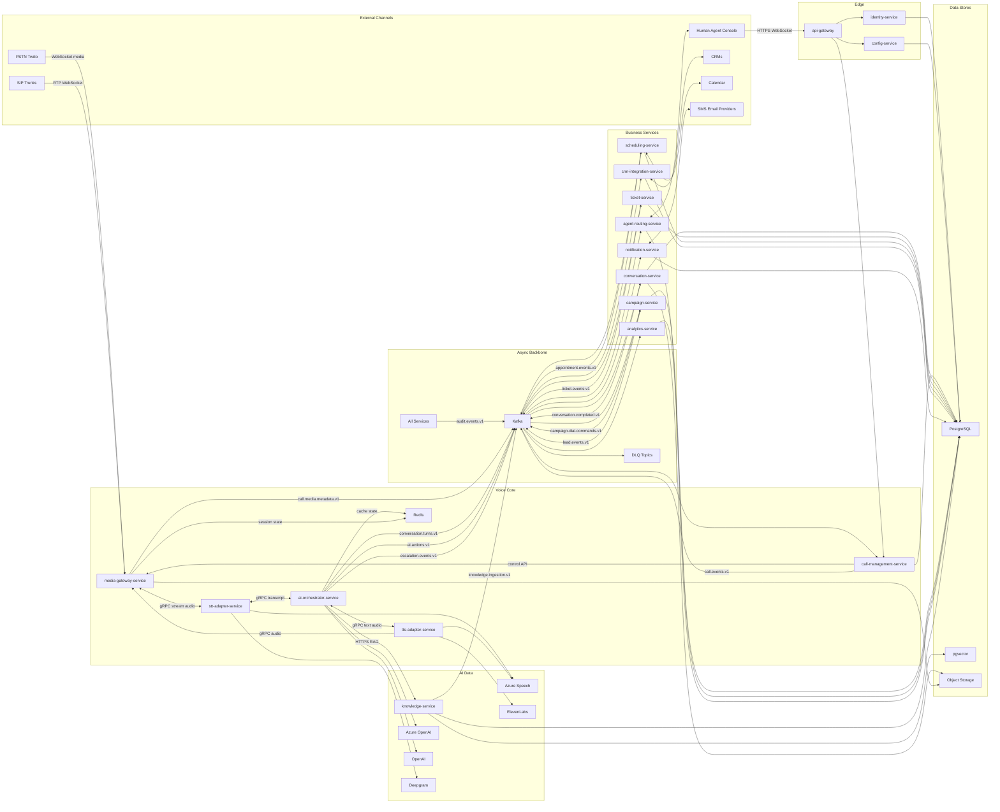
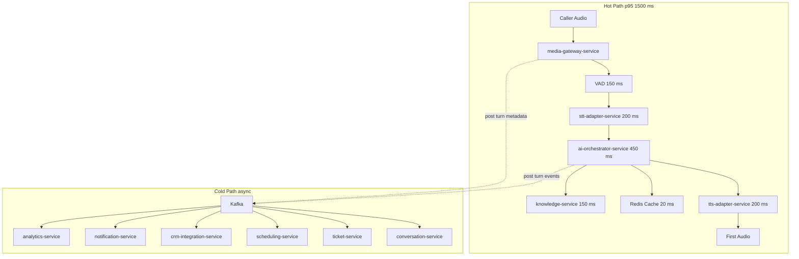

# 8. Complete High Level Architecture

This document follows `00-architecture-contract.md` as the canonical source for service names, topics, entities, latency budgets, and decisions D1-D11. The live voice loop is explicitly **not Kafka based**: `media-gateway-service`, `stt-adapter-service`, `ai-orchestrator-service`, and `tts-adapter-service` use gRPC bidirectional streaming and WebSockets only.

## 8.1 Full High Level Design

## 8.2 Hot Path and Cold Path Split

**Latency rule:** end-of-speech to first synthesized audio targets p50 <= 800 ms and p95 <= 1500 ms. Telephony ingress, VAD, STT, LLM TTFT, TTS TTFB, and jitter buffer are budgeted independently; Kafka is excluded because it cannot provide deterministic per-turn latency and would add broker, serialization, partition, consumer-lag, and retry variance.

## 8.3 Architectural Layering

1. **Edge and control plane:** `api-gateway`, `identity-service`, and `config-service` serve browser, admin, API, and console traffic. They handle OAuth2/OIDC, RBAC/ABAC, tenant configuration, prompts, flows, and non-real-time management APIs.
2. **Call control plane:** `call-management-service` owns `Call` lifecycle state, inbound webhook validation, outbound dialing commands, and bridges call lifecycle to `media-gateway-service`.
3. **Real-time media plane:** `media-gateway-service` stays thin: WebSocket media ingress/egress, VAD, jitter handling, barge-in, stream correlation, and dispatch to STT/AI/TTS over gRPC streaming. D8 is intentionally constrained: Java 21 is acceptable only while the service avoids heavy DSP and runs on the `rt-voice` node pool.
4. **Agent intelligence plane:** `ai-orchestrator-service` owns turn policy, Spring AI model abstraction, tool selection, filler acknowledgements, safety, memory windowing, and semantic response cache. `knowledge-service` supplies RAG with PostgreSQL metadata and pgvector embeddings.
5. **Business service plane:** conversation, ticketing, scheduling, CRM, notification, campaign, agent routing, and analytics consume Kafka events and execute workflows outside the live turn loop.
6. **Data plane:** every service owns its schema or database. PostgreSQL 16 is the system of record, pgvector starts as the vector store per D4, Redis is reconstructible cache only per D3, object storage holds recordings, large transcripts, exports, and long-term artifacts.

## 8.4 Why Hot Path Bypasses Gateway and Kafka

The edge gateway is optimized for HTTP control traffic, identity enforcement, coarse rate limiting, and API policy. The voice loop requires long-lived, low-jitter, full-duplex streaming. Routing media through `api-gateway` would mix L7 admin concerns with real-time backpressure, complicate autoscaling, and increase p95 tail latency. `media-gateway-service` validates call-session tokens issued by `call-management-service` and enforces tenant limits locally, so bypassing the gateway does not bypass security.

Kafka is deliberately reserved for post-turn and post-call integration. Kafka is excellent for replay, fan-out, analytics, and durable workflows, but a poor fit for per-token audio decisions: broker queues create head-of-line risk; partition ordering is coarser than stream state; consumer retries can replay media chunks; and barge-in cancellation must be immediate. Alternatives considered:

- **Kafka in the hot path:** simple integration model, but violates the latency budget and cancellation semantics. Rejected.
- **WebRTC media server such as LiveKit:** strong media primitives and SFU capabilities, but introduces another runtime and may slow initial platform delivery. Keep as D8 fallback for scale.
- **Direct gRPC bidirectional streaming:** lowest operational complexity within the Java/Spring stack and supports backpressure, deadlines, cancellation, and metadata. Recommended for Phase 1 and Phase 2.

## 8.5 Tenant Isolation and Data Governance

All canonical entities carry `org_id` and UUIDv7 identifiers. Isolation is enforced at multiple layers:

- JWT tenant claims from `identity-service` are propagated through Spring Security context and OpenTelemetry baggage.
- PostgreSQL Row-Level Security is mandatory for every service-owned table.
- Kafka record keys include domain identifiers such as `callId`, `ticketId`, or `orgId`; headers include `org_id`, `schema_version`, `trace_id`, and `idempotency_key`.
- Redis keys are prefixed by `org:{orgId}:...` and use bounded TTLs.
- Object storage paths are partitioned by organization and encryption context.
- Enterprise tenants may graduate from shared clusters to dedicated schema or dedicated DB when D9 triggers are met.

The flawed shortcut is relying only on application filters. It fails under ad-hoc SQL, batch jobs, and support tooling. Alternatives are shared DB with RLS, schema-per-tenant, and database-per-tenant. Recommendation: shared DB with RLS for standard tier, dedicated schema or DB for enterprise tier, with identical service contracts.

## 8.6 Config Driven Agent Behavior

`config-service` owns `AIAgentDefinition`, tenant flows, prompts, escalation rules, consent wording, business hours, tool enablement, model routing, voice profiles, and provider preferences. `ai-orchestrator-service` fetches versioned agent configuration at call start, pins it for the call, and listens to config invalidation for future sessions. This prevents mid-call prompt drift and makes conversations auditable.

Runtime behavior is controlled by data, not deployments: a receptionist agent, support triage agent, and tele-caller differ by config, tool allow-list, knowledge scope, and compliance policy. The orchestration code stays common; regulated tenants can restrict tools, retention, languages, and model providers.

## 8.7 Component Responsibility Table

| # | Service | Responsibility | Primary protocols | Owns data |
|---|---------|----------------|-------------------|-----------|
| 1 | `api-gateway` | External HTTP edge, route policy, JWT verification, coarse throttling, admin API ingress. | HTTPS, WebSocket for console | No domain data; route and policy cache only |
| 2 | `call-management-service` | Inbound and outbound call lifecycle, Twilio/SIP webhooks, call state machine, dial requests. | HTTPS, Kafka | `Call`, `ConsentRecord`, call attempts |
| 3 | `media-gateway-service` | Real-time media ingress/egress, VAD, jitter buffer, barge-in, stream correlation. | WebSocket media, gRPC streaming | Media sessions, media metadata, recording references |
| 4 | `stt-adapter-service` | Streaming speech recognition abstraction across Deepgram and Azure Speech. | gRPC streaming, vendor WebSocket | STT sessions, provider metrics |
| 5 | `tts-adapter-service` | Streaming speech synthesis abstraction across ElevenLabs and Azure Speech TTS. | gRPC streaming, vendor HTTPS/WebSocket | TTS sessions, voice cache metadata |
| 6 | `ai-orchestrator-service` | Agent brain, Spring AI model calls, tool routing, response policy, memory, safety. | gRPC streaming, HTTPS, Kafka | Turn state, tool invocations, outbox |
| 7 | `knowledge-service` | Knowledge sources, document ingestion, chunking, embeddings, RAG retrieval. | HTTPS, Kafka | `KnowledgeSource`, `KnowledgeDocument`, `DocumentChunk` |
| 8 | `conversation-service` | Transcript assembly, summaries, sentiment, conversation completion records. | Kafka, HTTPS | `Conversation`, `ConversationTurn`, `Transcript`, `CallSummary` |
| 9 | `ticket-service` | Support ticket creation, updates, status events, ticket integrations. | Kafka, HTTPS | `Ticket`, ticket comments, ticket outbox |
| 10 | `scheduling-service` | Appointment availability, booking, cancellation, calendar sync. | HTTPS, Kafka | `Appointment`, availability holds |
| 11 | `crm-integration-service` | CRM customer, lead, ticket, and activity synchronization with ACL translation. | Kafka, HTTPS | CRM links, sync jobs, external mappings |
| 12 | `notification-service` | SMS and email command handling, templating, provider dispatch, delivery status. | Kafka, HTTPS | Notification jobs, templates, delivery receipts |
| 13 | `campaign-service` | Outbound campaign definitions, lead/contact pacing, dial command production. | HTTPS, Kafka | `Campaign`, `CampaignContact`, `Lead` |
| 14 | `agent-routing-service` | Human handoff, queue selection, escalation, human agent availability. | HTTPS, WebSocket, Kafka | `HumanAgent`, queues, escalation sessions |
| 15 | `identity-service` | Users, organizations, authentication integration, authorization, identity verification. | HTTPS, OIDC | `Organization`, `User`, `IdentityVerification` |
| 16 | `config-service` | Tenant and agent configuration, prompts, flows, feature flags, provider routing. | HTTPS, Kafka audit | `AIAgentDefinition`, config versions |
| 17 | `analytics-service` | Reporting, dashboards, aggregates, audit projections, operational insights. | Kafka, HTTPS | Read models, metrics aggregates, `AuditLog` projection |

### Architecture Review (self-critique)

The architecture chooses operational clarity over maximum theoretical latency reduction. A cascaded STT to LLM to TTS design is more controllable than speech-to-speech, but D7 is a real risk: newer real-time models may beat this pipeline on latency. Two alternatives are a vendor-native speech-to-speech path and a media-server-centric design using LiveKit/Jambonz. Recommendation: keep the gRPC streaming abstraction now, measure p95 per stage, and introduce a `VoicePipeline` strategy interface so Phase 3 can route selected tenants to speech-to-speech without rewriting business services.
