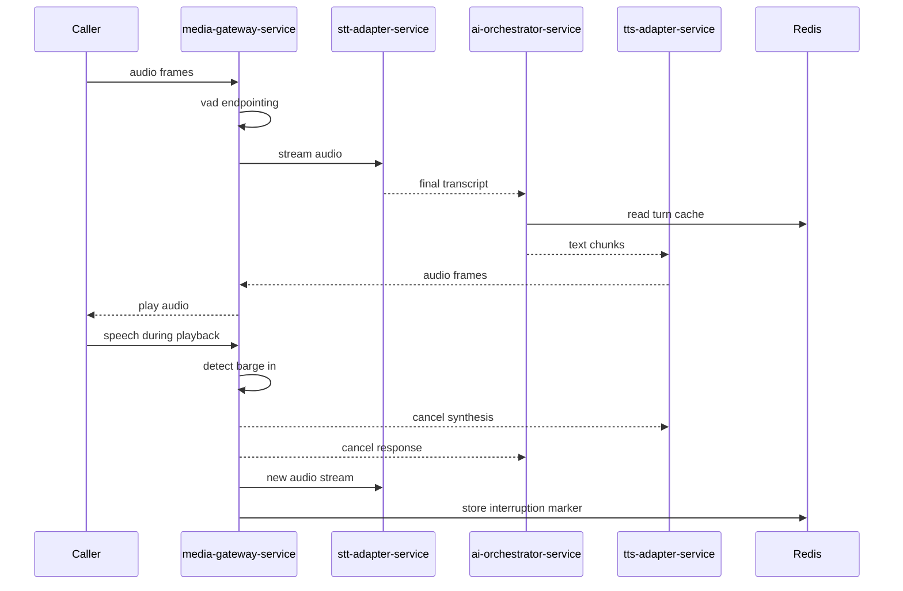
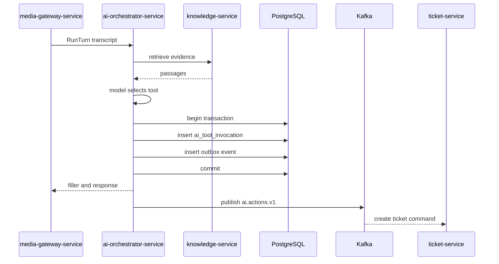
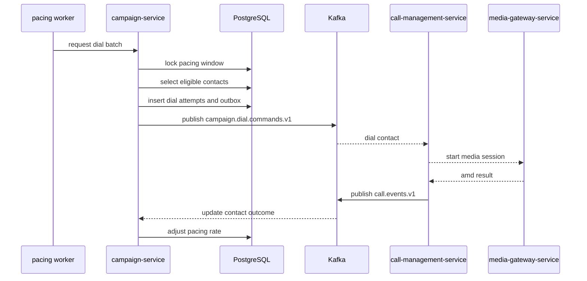

# 9. Detailed Low Level Design

This low-level design follows the architecture contract. Hot-path turn traffic uses gRPC bidirectional streaming and WebSockets only; Kafka is used for async post-turn, post-call, workflow, analytics, and DLQ handling.

## 9.1 Cross-Cutting Implementation Patterns

| Pattern | Production design |
|---------|-------------------|
| Java runtime | Java 21, virtual threads for blocking I/O workloads, ZGC for hot-path services, bounded platform thread pools for CPU-bound DSP and crypto. |
| Spring stack | Spring Boot 3.3+, Spring Security, Spring WebFlux for streaming and high-concurrency outbound calls, Spring MVC with virtual threads where request/response semantics are simpler. |
| HTTP clients | Use `WebClient` for streaming, SSE, vendor WebSocket handshakes, and high fan-out async calls. Use `RestClient` for simple blocking control-plane calls on virtual threads. Do not use `RestTemplate`. |
| gRPC | Bidirectional streaming for `media-gateway-service`, `stt-adapter-service`, `ai-orchestrator-service`, and `tts-adapter-service`; deadlines per stage; cancellation propagated on barge-in and hangup. |
| Outbox | D10 transactional outbox in every service that publishes domain events after database commits. Start with Spring polling publisher; move to Debezium CDC when write volume or tail latency requires it. |
| Kafka consumers | Spring Kafka `DefaultErrorHandler` with exponential backoff, non-retryable exception classification, and `DeadLetterPublishingRecoverer` to `dlq.<consumer-group>` as required by the contract. |
| Idempotency | Every external command and Kafka command has an idempotency key. Store keys in service-owned `idempotency_keys` or command tables with status, response hash, and expiry. |
| Observability | OpenTelemetry traces, RED metrics per API, gRPC stream metrics, Kafka lag, p50/p95 stage timers, per-tenant cost and rate-limit metrics. |
| Security | mTLS service mesh, JWT for ingress, tenant context propagation, PostgreSQL RLS, PII redaction before transcript persistence, audit publication to `audit.events.v1`. |

## 9.2 Service Designs

### 9.2.1 `media-gateway-service`

| Area | Design |
|------|--------|
| Responsibilities | Terminate Twilio media WebSockets and SIP media streams; correlate `callId` and `streamId`; run VAD and endpointing; maintain jitter buffer; bridge audio to STT, AI, and TTS streams; handle barge-in; emit media metadata after turns. |
| Key APIs | `GET /ws/twilio/media/{callId}` WebSocket; `GET /ws/sip/media/{callId}` WebSocket; `POST /internal/media-sessions/{callId}:start`; `POST /internal/media-sessions/{callId}:stop`; gRPC `MediaBridge(stream MediaFrame) returns (stream MediaCommand)`. |
| Owned tables | `media_sessions`, `media_streams`, `recording_refs`, `media_quality_samples`, `idempotency_keys`, `outbox_events`. |
| Error handling | Close media WebSocket with provider-compatible code on authentication failure; degrade to no-recording if object storage upload fails; stop TTS stream immediately on barge-in; publish `call.media.metadata.v1` after recovery. |
| Retry logic | Vendor control callback retry `maxAttempts=3`, `backoff=100ms, multiplier=2.0`; object storage multipart retry `maxAttempts=4`, `backoff=250ms`; no blind retry of live audio frames. |
| Circuit breaker | Sliding window `50` calls, failure threshold `50%`, wait duration `10s`; fallback disables optional recording and switches to direct pass-through hangup prompt if downstream streams are unavailable. |
| Idempotency | `callId:streamId:eventSeq` for media metadata, stored in `idempotency_keys` for 24h; WebSocket reconnect dedupes frames by provider sequence number for 5m. |

### 9.2.2 `call-management-service`

| Area | Design |
|------|--------|
| Responsibilities | Own call lifecycle state machine; validate Twilio and SIP webhooks; create inbound and outbound `Call`; issue short-lived media session tokens; consume `campaign.dial.commands.v1`; publish `call.events.v1`. |
| Key APIs | `POST /webhooks/twilio/calls`; `POST /webhooks/twilio/status`; `POST /api/v1/calls/outbound`; `GET /api/v1/calls/{callId}`; `POST /internal/calls/{callId}/media-token`. |
| Owned tables | `calls`, `call_attempts`, `call_state_transitions`, `consent_records`, `telephony_provider_events`, `idempotency_keys`, `outbox_events`. |
| Error handling | Webhook signature failures return 401; duplicate provider callbacks are acknowledged but not reprocessed; invalid state transitions are rejected and audited. |
| Retry logic | Telephony provider API `maxAttempts=3`, `backoff=500ms, multiplier=2.0`; Kafka publish via outbox retry until success with poison record quarantine after 24h. |
| Circuit breaker | Sliding window `100`, failure threshold `40%`, wait duration `30s`; fallback marks outbound attempts `DEFERRED` and lets campaign pacing retry later. |
| Idempotency | Inbound webhook key `provider:eventId`; outbound request key from `Idempotency-Key` or `campaignId:contactId:attemptNo`; dedupe window 7d. |

### 9.2.3 `ai-orchestrator-service`

| Area | Design |
|------|--------|
| Responsibilities | Maintain per-call turn state; invoke Azure OpenAI primary and OpenAI fallback through Spring AI `ChatModel`; select tools; apply guardrails; call `knowledge-service`; stream text chunks to TTS; publish `conversation.turns.v1`, `ai.actions.v1`, and escalation events. |
| Key APIs | gRPC `RunTurn(stream TurnInput) returns (stream TurnOutput)`; `POST /internal/turns/{callId}/cancel`; `POST /api/v1/agent-simulations`; tool SPI `ToolRegistry.invoke(toolName, args, context)`. |
| Owned tables | `ai_turns`, `ai_tool_invocations`, `ai_prompt_snapshots`, `semantic_cache_refs`, `idempotency_keys`, `outbox_events`. |
| Error handling | If model TTFT exceeds 700ms, stream configured filler acknowledgement; if tool fails, return apologetic fallback and publish compensating `ai.actions.v1` when needed; if safety policy blocks response, route to human handoff. |
| Retry logic | LLM transient errors `maxAttempts=2`, `backoff=150ms`; `knowledge-service` lookup `maxAttempts=2`, `backoff=75ms`; tool commands are not retried inside the turn after user-visible confirmation unless idempotent. |
| Circuit breaker | LLM breaker sliding window `50`, failure threshold `35%`, wait duration `20s`, fallback to OpenAI or smaller Azure deployment; tool breaker sliding window `30`, threshold `50%`, wait `30s`, fallback to queue async action. |
| Idempotency | Turn key `callId:turnNo`; tool key `callId:turnNo:toolName:normalizedArgsHash`; stored 7d. Outbox event ids are deterministic UUIDv7 plus aggregate version. |

### 9.2.4 `stt-adapter-service`

| Area | Design |
|------|--------|
| Responsibilities | Abstract streaming STT providers; normalize interim and final transcripts; support language hints; enforce audio format contracts; emit confidence and word timestamps to the live stream. |
| Key APIs | gRPC `Recognize(stream AudioFrame) returns (stream TranscriptFrame)`; `GET /internal/stt/providers/health`; `POST /internal/stt/sessions/{sessionId}:cancel`. |
| Owned tables | `stt_sessions`, `stt_provider_usage`, `stt_quality_samples`, `idempotency_keys`. |
| Error handling | Provider stream reset triggers fast reconnect only before final transcript; confidence below threshold produces clarification marker to AI; unsupported audio format fails fast. |
| Retry logic | Provider connect `maxAttempts=3`, `backoff=100ms`; partial frame send retry disabled to avoid duplicate audio; health probes `maxAttempts=2`, `backoff=250ms`. |
| Circuit breaker | Sliding window `40`, failure threshold `40%`, wait duration `15s`; fallback from Deepgram to Azure Speech when tenant policy allows. |
| Idempotency | Session key `callId:turnNo:audioStartSeq`; provider events deduped by sequence for 10m in Redis and 24h in `idempotency_keys` for billing events. |

### 9.2.5 `tts-adapter-service`

| Area | Design |
|------|--------|
| Responsibilities | Abstract streaming TTS providers; synthesize sentence chunks; manage voice profile, sample rate, and barge-in cancellation; cache stable prompts where license permits. |
| Key APIs | gRPC `Synthesize(stream TextChunk) returns (stream AudioFrame)`; `POST /internal/tts/sessions/{sessionId}:cancel`; `GET /internal/tts/voices`. |
| Owned tables | `tts_sessions`, `tts_provider_usage`, `voice_cache_entries`, `idempotency_keys`. |
| Error handling | Cancel vendor request immediately on barge-in; fall back from premium to default voice only if tenant policy permits; emit silence padding only for jitter stabilization, not failure masking. |
| Retry logic | Provider connect `maxAttempts=2`, `backoff=100ms`; cache fetch `maxAttempts=2`, `backoff=25ms`; no retry after audio has been delivered for the same text chunk unless provider declares idempotent resume. |
| Circuit breaker | Sliding window `40`, failure threshold `40%`, wait duration `20s`; fallback from ElevenLabs to Azure Speech TTS default voice. |
| Idempotency | Synthesis key `orgId:voiceId:textHash:audioFormat`; cache TTL by tenant policy; session dedupe window 24h. |

### 9.2.6 `knowledge-service`

| Area | Design |
|------|--------|
| Responsibilities | Manage knowledge sources; ingest documents; chunk and embed content; serve low-latency RAG retrieval; publish and consume `knowledge.ingestion.v1` for async workers. |
| Key APIs | `POST /api/v1/knowledge-sources`; `POST /api/v1/documents`; `POST /internal/rag/query`; `DELETE /api/v1/documents/{documentId}`. |
| Owned tables | `knowledge_sources`, `knowledge_documents`, `document_chunks`, `document_embeddings`, `ingestion_jobs`, `idempotency_keys`, `outbox_events`. |
| Error handling | Bad documents fail with actionable validation; ingestion is resumable per chunk; retrieval returns empty evidence rather than blocking turn when vector query times out. |
| Retry logic | Embedding calls `maxAttempts=3`, `backoff=500ms`; object storage reads `maxAttempts=3`, `backoff=250ms`; vector query no retry in hot turn. |
| Circuit breaker | Embedding breaker window `50`, threshold `50%`, wait `60s`, fallback queues ingestion; retrieval breaker window `100`, threshold `30%`, wait `10s`, fallback to lexical search or no evidence. |
| Idempotency | Document key `orgId:sourceId:contentHash`; ingestion step key `documentId:chunkNo:modelVersion`; dedupe window 30d. |

### 9.2.7 `conversation-service`

| Area | Design |
|------|--------|
| Responsibilities | Consume turn and media events; build transcripts; redact PII; compute summaries and sentiment; publish `conversation.completed.v1`. |
| Key APIs | `GET /api/v1/conversations/{conversationId}`; `GET /api/v1/calls/{callId}/transcript`; Kafka consumers for `conversation.turns.v1`, `call.events.v1`, `call.media.metadata.v1`. |
| Owned tables | `conversations`, `conversation_turns`, `transcripts`, `call_summaries`, `sentiment_scores`, `idempotency_keys`, `outbox_events`. |
| Error handling | Out-of-order events are buffered by aggregate version; missing media metadata does not block transcript completion; PII redaction failures quarantine transcript for restricted access. |
| Retry logic | Consumer processing `maxAttempts=5`, `backoff=1s, multiplier=2.0`; summary model call `maxAttempts=2`, `backoff=500ms`. |
| Circuit breaker | Summary breaker window `50`, threshold `50%`, wait `60s`; fallback creates extractive summary and marks quality `DEGRADED`. |
| Idempotency | Event key `topic:partition:offset` and domain key `callId:turnNo:eventType`; dedupe window 14d. |

### 9.2.8 `ticket-service`

| Area | Design |
|------|--------|
| Responsibilities | Create and update support tickets from AI actions or APIs; manage ticket lifecycle; publish `ticket.events.v1`; send notification and CRM sync commands. |
| Key APIs | `POST /api/v1/tickets`; `PATCH /api/v1/tickets/{ticketId}`; `GET /api/v1/tickets/{ticketId}`; Kafka consumer `ai.actions.v1`. |
| Owned tables | `tickets`, `ticket_comments`, `ticket_status_history`, `ticket_external_refs`, `idempotency_keys`, `outbox_events`. |
| Error handling | Duplicate AI tool actions return existing ticket; invalid transitions rejected with audit; CRM sync failures do not roll back ticket creation. |
| Retry logic | Command handling `maxAttempts=4`, `backoff=1s`; outbound notification command publish via outbox until delivered. |
| Circuit breaker | External ticketing bridge window `50`, threshold `50%`, wait `45s`; fallback creates local ticket only and queues `crm.sync.commands.v1`. |
| Idempotency | Key `orgId:source:externalActionId` or `callId:turnNo:createTicket`; dedupe 30d. |

### 9.2.9 `scheduling-service`

| Area | Design |
|------|--------|
| Responsibilities | Search availability, hold slots, book/cancel appointments, integrate calendars, publish `appointment.events.v1`. |
| Key APIs | `GET /api/v1/availability`; `POST /api/v1/appointments/holds`; `POST /api/v1/appointments`; `DELETE /api/v1/appointments/{appointmentId}`; Kafka consumer `ai.actions.v1`. |
| Owned tables | `appointments`, `availability_rules`, `calendar_connections`, `appointment_holds`, `idempotency_keys`, `outbox_events`. |
| Error handling | Holds expire automatically; double booking prevented by transaction and unique slot constraint; calendar failure leaves appointment `PENDING_SYNC`. |
| Retry logic | Calendar calls `maxAttempts=3`, `backoff=500ms`; hold confirmation `maxAttempts=2`, `backoff=100ms`. |
| Circuit breaker | Calendar breaker window `50`, threshold `45%`, wait `30s`; fallback offers callback or books tentative appointment subject to confirmation by policy. |
| Idempotency | Booking key `orgId:customerId:slotStart:serviceType` or client header; hold key `callId:turnNo:slotId`; dedupe 7d. |

### 9.2.10 `notification-service`

| Area | Design |
|------|--------|
| Responsibilities | Consume `notification.commands.v1`; render templates; send SMS/email; track delivery receipts; publish audit events. |
| Key APIs | `POST /api/v1/notifications`; `POST /webhooks/sms/status`; `POST /webhooks/email/status`; Kafka consumer `notification.commands.v1`. |
| Owned tables | `notification_jobs`, `notification_templates`, `delivery_receipts`, `suppression_lists`, `idempotency_keys`, `outbox_events`. |
| Error handling | Suppressed recipients are acknowledged and audited; provider hard bounces stop retries; template rendering errors send to DLQ with context. |
| Retry logic | Provider send `maxAttempts=4`, `backoff=2s, multiplier=2.0`; webhook handling no retry beyond idempotent acknowledgement. |
| Circuit breaker | Provider breaker window `100`, threshold `50%`, wait `60s`; fallback routes SMS/email to secondary provider if configured, otherwise queues delayed retry. |
| Idempotency | Command key `recipientId:templateId:businessRef`; provider webhook key `provider:eventId`; dedupe 14d. |

### 9.2.11 `campaign-service`

| Area | Design |
|------|--------|
| Responsibilities | Manage campaigns, leads, contacts, consent, dial pacing, AMD classification consumption, and production of `campaign.dial.commands.v1` and `lead.events.v1`. |
| Key APIs | `POST /api/v1/campaigns`; `POST /api/v1/campaigns/{campaignId}:start`; `POST /api/v1/campaigns/{campaignId}:pause`; `GET /api/v1/campaigns/{campaignId}/metrics`; Kafka consumers for `call.events.v1`. |
| Owned tables | `campaigns`, `campaign_contacts`, `leads`, `dial_attempts`, `dial_pacing_windows`, `consent_snapshots`, `idempotency_keys`, `outbox_events`. |
| Error handling | Contacts without consent are skipped and audited; AMD result `MACHINE` schedules follow-up by policy; pacing violations stop dial production rather than over-dial. |
| Retry logic | Dial command publication through outbox; pacing worker DB conflicts `maxAttempts=3`, `backoff=100ms`; CRM lead enrichment `maxAttempts=3`, `backoff=1s`. |
| Circuit breaker | Call-management command breaker window `50`, threshold `40%`, wait `30s`; fallback pauses affected campaign shard and emits operational alert. |
| Idempotency | Dial key `campaignId:contactId:attemptNo`; lead event key `leadId:version`; dedupe 30d. |

### 9.2.12 `agent-routing-service`

| Area | Design |
|------|--------|
| Responsibilities | Select human queue; track `HumanAgent` presence; manage escalation sessions; bridge AI handoff to human agent console; publish `escalation.events.v1`. |
| Key APIs | `POST /api/v1/escalations`; `PATCH /api/v1/human-agents/{agentId}/presence`; `GET /ws/agent-console/{agentId}`; Kafka consumer `escalation.events.v1`. |
| Owned tables | `human_agents`, `routing_queues`, `agent_presence`, `escalation_sessions`, `idempotency_keys`, `outbox_events`. |
| Error handling | No available agent triggers fallback promise and notification command; stale console WebSockets are evicted by heartbeat; duplicate escalations attach to existing session. |
| Retry logic | Console push `maxAttempts=3`, `backoff=250ms`; notification command outbox retry until delivered. |
| Circuit breaker | Console delivery breaker window `50`, threshold `50%`, wait `20s`; fallback to SMS/email callback workflow through `notification-service`. |
| Idempotency | Escalation key `callId:reason:turnNo`; presence event key `agentId:sequence`; dedupe 7d. |

### 9.2.13 `crm-integration-service`

| Area | Design |
|------|--------|
| Responsibilities | Provide anti-corruption layer for CRMs; map VoxAgent entities to external objects; consume `crm.sync.commands.v1`, `conversation.completed.v1`, `ticket.events.v1`, `appointment.events.v1`, and `lead.events.v1`. |
| Key APIs | `POST /api/v1/crm/connections`; `POST /api/v1/crm/sync-jobs`; `GET /api/v1/crm/mappings/{customerId}`; provider webhook endpoints under `/webhooks/crm/{provider}`. |
| Owned tables | `crm_connections`, `crm_external_refs`, `crm_sync_jobs`, `crm_field_mappings`, `crm_webhook_events`, `idempotency_keys`, `outbox_events`. |
| Error handling | Provider schema mismatch moves job to `NEEDS_MAPPING`; rate limit responses schedule retry using provider reset time; PII policy blocks forbidden fields. |
| Retry logic | Provider API `maxAttempts=5`, `backoff=2s, multiplier=2.0`, jitter enabled; OAuth refresh `maxAttempts=2`, `backoff=500ms`. |
| Circuit breaker | Per-provider breaker window `100`, threshold `50%`, wait `120s`; fallback persists pending sync and surfaces degraded integration status. |
| Idempotency | Sync key `orgId:provider:entityType:entityId:version`; webhook key `provider:eventId`; dedupe 30d. |

## 9.3 Tricky Internal Sequences

### 9.3.1 Media Gateway Turn Loop with Barge In

### 9.3.2 AI Orchestrator Tool Call with Outbox Publish

### 9.3.3 Campaign Dial Pacing with Answering Machine Detection

## 9.4 Kafka Error Handling and DLQ Convention

Every consumer group uses a group-specific DLQ topic named `dlq.<consumer-group>`. For example, `conversation-service` group `conversation-turn-projector` sends terminal failures to `dlq.conversation-turn-projector`. Retryable exceptions include network timeouts, optimistic locking conflicts, and provider 429/5xx responses. Non-retryable exceptions include schema incompatibility, invalid tenant, authorization failure, and malformed payload. DLQ payloads include original topic, partition, offset, key, headers, exception class, stack fingerprint, and trace id.

A flawed design is retrying indefinitely in the Kafka listener thread. It blocks partition progress and creates invisible lag. Alternatives are blocking retries, retry topics, and outbox plus DLQ. Recommendation: use short in-memory retries for transient local errors, retry topics for delayed provider recovery where ordering is not critical, and DLQ for poison records with replay tooling.

### Architecture Review (self-critique)

The service-level configurations are intentionally conservative and must be tuned with real latency histograms. The weakest area is hot-path fallback: provider failover can itself add latency and produce voice inconsistency. Two alternatives are single-vendor hard dependency with stronger SLO contracts, or active-active provider streaming with first-success wins. Recommendation: use primary/fallback for cost and compliance now, but run synthetic traffic through fallbacks continuously so circuit breakers are warm and credentials, voice profiles, and schemas do not rot.

# 10. Microservice Breakdown

## 10.1 Bounded Context to Service Mapping

| Bounded context | Service | Latency class | Main aggregates |
|----------------|---------|---------------|-----------------|
| Edge | `api-gateway` | control-plane | none |
| Call Lifecycle | `call-management-service` | control-plane | `Call`, `ConsentRecord` |
| Real-time Media | `media-gateway-service` | hot-path | media session, recording reference |
| Speech Recognition | `stt-adapter-service` | hot-path | STT session |
| Speech Synthesis | `tts-adapter-service` | hot-path | TTS session |
| Agentic AI / Conversation Brain | `ai-orchestrator-service` | hot-path | `ConversationTurn`, tool invocation |
| Knowledge & RAG | `knowledge-service` | warm-path | `KnowledgeSource`, `KnowledgeDocument`, `DocumentChunk` |
| Transcripts, Summaries, Sentiment | `conversation-service` | async | `Conversation`, `Transcript`, `CallSummary` |
| Support Tickets | `ticket-service` | async | `Ticket` |
| Appointments | `scheduling-service` | warm-path | `Appointment` |
| CRM Sync | `crm-integration-service` | async | sync job, external reference |
| SMS/Email | `notification-service` | async | notification job |
| Outbound Campaigns & Leads | `campaign-service` | async | `Campaign`, `CampaignContact`, `Lead` |
| Human Handoff & Escalation | `agent-routing-service` | warm-path | `HumanAgent`, escalation session |
| Users, Orgs, AuthN/AuthZ, Identity Verification | `identity-service` | control-plane | `Organization`, `User`, `IdentityVerification` |
| Tenant/Agent Configuration, Prompts, Flows | `config-service` | control-plane | `AIAgentDefinition` |
| Reporting & Insights | `analytics-service` | async | reporting projection, `AuditLog` projection |

## 10.2 Sync vs Async Interaction Matrix

| Caller | Callee | Protocol | Purpose | Path class |
|--------|--------|----------|---------|------------|
| External clients | `api-gateway` | HTTPS, WebSocket | Admin, dashboard, console ingress | control |
| `api-gateway` | `identity-service` | HTTPS/OIDC | AuthN, token introspection, user/org APIs | control |
| `api-gateway` | `config-service` | HTTPS | Tenant and agent configuration APIs | control |
| `api-gateway` | `call-management-service` | HTTPS | Call management APIs | control |
| Twilio/SIP | `media-gateway-service` | WebSocket media | Live audio ingress and egress | hot |
| Twilio/SIP | `call-management-service` | HTTPS webhook | Call status and inbound call control | control |
| `call-management-service` | `media-gateway-service` | HTTPS internal | Create and stop media sessions | control |
| `media-gateway-service` | `stt-adapter-service` | gRPC bidirectional stream | Audio to transcript | hot |
| `stt-adapter-service` | `ai-orchestrator-service` | gRPC bidirectional stream | Transcript frames and turn state | hot |
| `ai-orchestrator-service` | `tts-adapter-service` | gRPC bidirectional stream | Text chunks to audio | hot |
| `ai-orchestrator-service` | `knowledge-service` | HTTPS or gRPC unary | RAG retrieval | warm in turn budget |
| `ai-orchestrator-service` | Azure OpenAI/OpenAI | HTTPS streaming | LLM inference | hot |
| `stt-adapter-service` | Deepgram/Azure Speech | WebSocket/HTTPS streaming | STT provider calls | hot |
| `tts-adapter-service` | ElevenLabs/Azure Speech TTS | HTTPS/WebSocket streaming | TTS provider calls | hot |
| `call-management-service` | Kafka | `call.events.v1` | Durable lifecycle events | async |
| `media-gateway-service` | Kafka | `call.media.metadata.v1` | Media metadata only | async |
| `ai-orchestrator-service` | Kafka | `conversation.turns.v1`, `ai.actions.v1`, `escalation.events.v1` | Post-turn events and actions | async |
| `conversation-service` | Kafka | consumes turn and call topics, publishes `conversation.completed.v1` | Transcript completion | async |
| `ticket-service` | Kafka | consumes `ai.actions.v1`, publishes `ticket.events.v1` | Ticket workflow | async |
| `scheduling-service` | Kafka | consumes `ai.actions.v1`, publishes `appointment.events.v1` | Appointment workflow | async |
| `crm-integration-service` | External CRMs | HTTPS | CRM ACL sync | async |
| `notification-service` | SMS/email providers | HTTPS | Message dispatch | async |
| `campaign-service` | Kafka | publishes `campaign.dial.commands.v1`, `lead.events.v1` | Outbound campaign execution | async |
| `agent-routing-service` | Human agent console | WebSocket | Human handoff | warm |
| All services | Kafka | `audit.events.v1` | Compliance audit stream | async |

## 10.3 Data Ownership Rules

- Database-per-service or schema-per-service is mandatory; no shared tables, no cross-service foreign keys, and no direct reads of another service's database.
- Every table includes `org_id` and enables PostgreSQL Row-Level Security.
- Domain events are the integration contract; read models are local projections and may be rebuilt from Kafka plus snapshots.
- Redis is never a source of truth. Lost Redis state must be recoverable from PostgreSQL, Kafka, or provider callbacks.
- Object storage stores blobs; metadata and authorization live in the owning service database.
- Analytics may maintain denormalized projections but must not become an operational dependency for call handling.

## 10.4 Shared Library Policy Critique

A fat `commons` library is attractive because it reduces initial duplication, but it couples deployments, smuggles domain models across bounded contexts, and turns every service upgrade into a platform migration. Alternatives:

1. **Fat shared commons:** fast start, poor modularity, rejected for domain objects and business rules.
2. **No shared code:** strong autonomy, but duplicated security, tracing, and idempotency plumbing.
3. **Thin platform libraries plus contract-first clients:** generated OpenAPI/gRPC/Kafka schema clients, shared observability/security/idempotency utilities only. Recommended.

Policy: share only stable technical primitives such as trace propagation, tenant context, error envelope, idempotency interceptor, Kafka header constants, and test containers. Do not share JPA entities, aggregate classes, repositories, service-layer code, or prompt templates. External contracts are versioned through OpenAPI, protobuf, and Schema Registry.

### Architecture Review (self-critique)

The microservice split is broad for an early product and can impose operational overhead before scale demands it. Two alternatives are a modular monolith for business services or a smaller set of coarse services around voice, AI, and back office. Recommendation: keep hot-path services separate from day one, but allow async business services to start as independently deployable modules sharing a runtime only if the team enforces module boundaries and keeps database schemas separate.
