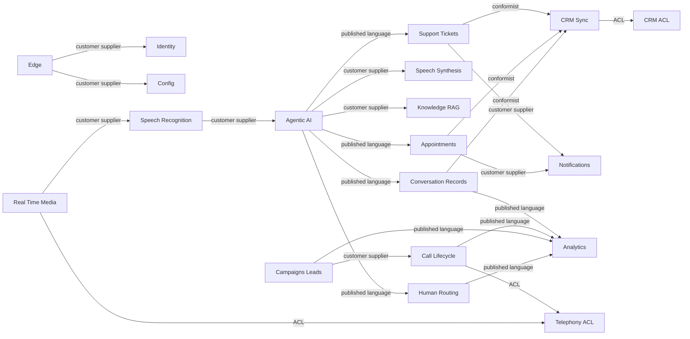

# 11. Domain Driven Design

This DDD model uses the canonical service and entity names from `00-architecture-contract.md`. It treats telephony providers, AI model providers, CRMs, calendars, and messaging providers as external systems behind anti-corruption layers.

## 11.1 Bounded Context Map

Context mapping notes:

- `crm-integration-service` is an anti-corruption layer because CRM object models and field semantics vary by tenant and provider.
- `call-management-service` and `media-gateway-service` both sit behind a telephony ACL boundary. Twilio/SIP callback vocabulary must not leak into domain aggregates.
- `conversation-service`, `ticket-service`, `scheduling-service`, and `analytics-service` conform to published Kafka event language rather than calling hot-path services.
- `campaign-service` is a customer of `call-management-service`; it requests dialing but does not own call state.

## 11.2 Context Models, Aggregates, and Invariants

### Edge Context — `api-gateway`

| Element | Model |
|---------|-------|
| Aggregates | None; gateway policy is configuration, not domain state. |
| Entities | RoutePolicy, RateLimitBucket. |
| Value objects | TenantClaim, Scope, CorrelationId. |
| Invariants | No unauthenticated admin route; tenant claim must be present for tenant APIs; gateway does not persist domain records. |

### Identity Context — `identity-service`

| Element | Model |
|---------|-------|
| Aggregates | `Organization` root with users and tenant settings; `User` root for credentials/profile; `IdentityVerification` root for verification workflow. |
| Entities | `Organization`, `User`, `IdentityVerification`, role assignment, API client. |
| Value objects | EmailAddress, PhoneNumber, RoleName, Permission, TenantId, VerificationStatus. |
| Invariants | A user belongs to at least one organization; privileged actions require RBAC and ABAC claims; verification outcome is append-only; disabled organizations cannot start calls. |

### Config Context — `config-service`

| Element | Model |
|---------|-------|
| Aggregates | `AIAgentDefinition` root; PromptVersion root; TenantFlow root. |
| Entities | `AIAgentDefinition`, prompt template, tool policy, voice profile, escalation rule, consent script. |
| Value objects | LanguageTag, ModelPolicy, VoiceName, PromptText, ConfigVersion, ConsentStatus. |
| Invariants | Published agent definitions are immutable; a call pins one config version; tool allow-list must be explicit; consent script language must match tenant policy. |

### Call Lifecycle Context — `call-management-service`

| Element | Model |
|---------|-------|
| Aggregates | `Call` root; `ConsentRecord` root when consent has independent retention. |
| Entities | `Call`, call attempt, provider event, `ConsentRecord`. |
| Value objects | PhoneNumber, CallDirection, CallState, ProviderCallId, RecordingPolicy, ConsentStatus. |
| Invariants | Call state transitions are monotonic and valid; outbound calls require consent or lawful basis; a completed call cannot re-enter active media; provider events are idempotent. |

### Real-time Media Context — `media-gateway-service`

| Element | Model |
|---------|-------|
| Aggregates | MediaSession root; RecordingReference root for persisted recordings. |
| Entities | media stream, jitter buffer sample, VAD segment, barge-in marker. |
| Value objects | AudioFormat, SampleRate, StreamSequence, JitterMs, BargeInReason. |
| Invariants | Audio frames are processed in sequence per stream; barge-in cancels active TTS before accepting new user turn; recordings follow consent policy; no Kafka dependency inside the live loop. |

### Speech Recognition Context — `stt-adapter-service`

| Element | Model |
|---------|-------|
| Aggregates | SttSession root. |
| Entities | transcript partial, provider usage record, confidence sample. |
| Value objects | LanguageTag, AudioFormat, ConfidenceScore, WordTimestamp, ProviderName. |
| Invariants | Final transcript for a turn is emitted once; unsupported audio format fails before provider call; provider-specific confidence is normalized. |

### Speech Synthesis Context — `tts-adapter-service`

| Element | Model |
|---------|-------|
| Aggregates | TtsSession root; VoiceCacheEntry root where caching is permitted. |
| Entities | synthesis chunk, provider usage record, voice profile. |
| Value objects | AudioFormat, VoiceId, TextHash, SpeakingRate, ProviderName. |
| Invariants | Barge-in cancellation stops future audio chunks; tenant policy controls premium voice use and caching; synthesized audio format matches media session contract. |

### Agentic AI Context — `ai-orchestrator-service`

| Element | Model |
|---------|-------|
| Aggregates | ConversationTurn root for live turn decisions; ToolInvocation root for side-effecting tools. |
| Entities | `ConversationTurn`, tool invocation, prompt snapshot, model response, safety decision. |
| Value objects | Intent, SentimentScore, TokenBudget, ToolName, IdempotencyKey, ModelRoute. |
| Invariants | One accepted AI response per turn; tool side effects require idempotency key; model prompt uses pinned config; unsafe output is blocked or escalated; long tools produce filler acknowledgement. |

### Knowledge and RAG Context — `knowledge-service`

| Element | Model |
|---------|-------|
| Aggregates | `KnowledgeSource` root; `KnowledgeDocument` root; `DocumentChunk` entity under document. |
| Entities | `KnowledgeSource`, `KnowledgeDocument`, `DocumentChunk`, embedding vector, ingestion job. |
| Value objects | DocumentHash, MimeType, EmbeddingModel, ChunkOrdinal, RetrievalScore, LanguageTag. |
| Invariants | Document chunks inherit source access policy; embedding version is recorded; deleted documents are excluded from retrieval; ingestion is idempotent by content hash. |

### Conversation Records Context — `conversation-service`

| Element | Model |
|---------|-------|
| Aggregates | `Conversation` root; `Transcript` root for immutable transcript versions; `CallSummary` root. |
| Entities | `Conversation`, `ConversationTurn`, `Transcript`, `CallSummary`, sentiment annotation. |
| Value objects | SentimentScore, RedactionStatus, TranscriptVersion, SpeakerRole, LanguageTag. |
| Invariants | Transcript text is redacted before broad access; turn order is deterministic per call; a completed conversation emits completion once; summaries reference transcript version. |

### Support Tickets Context — `ticket-service`

| Element | Model |
|---------|-------|
| Aggregates | `Ticket` root. |
| Entities | `Ticket`, ticket comment, status history, external reference. |
| Value objects | TicketPriority, TicketStatus, CustomerImpact, Money, SLAClock, IdempotencyKey. |
| Invariants | Ticket status transitions follow workflow; priority changes are audited; duplicate tool calls do not create duplicate tickets; tenant SLA policy drives due dates. |

### Appointments Context — `scheduling-service`

| Element | Model |
|---------|-------|
| Aggregates | `Appointment` root; AvailabilityCalendar root; AppointmentHold root. |
| Entities | `Appointment`, availability rule, calendar connection, hold. |
| Value objects | TimeSlot, TimeZone, AppointmentStatus, Duration, CalendarProvider, CustomerPreference. |
| Invariants | A confirmed slot cannot overlap another confirmed slot for same resource; holds expire; cancellation policy is enforced; external calendar sync cannot change ownership. |

### CRM Sync Context — `crm-integration-service`

| Element | Model |
|---------|-------|
| Aggregates | CrmConnection root; SyncJob root; ExternalReference root. |
| Entities | CRM connection, field mapping, sync job, webhook event, external reference. |
| Value objects | ProviderName, ExternalId, FieldPath, SyncStatus, OAuthTokenRef, PiiClass. |
| Invariants | External CRM vocabulary is translated at the boundary; forbidden PII fields are never sent; sync jobs are idempotent by entity version; provider rate limits are respected. |

### Notifications Context — `notification-service`

| Element | Model |
|---------|-------|
| Aggregates | NotificationJob root; Template root; SuppressionList root. |
| Entities | notification job, template version, delivery receipt, suppression entry. |
| Value objects | Channel, RecipientAddress, TemplateId, DeliveryStatus, Locale, ConsentStatus. |
| Invariants | Suppressed recipients are not sent messages; template version is immutable after send; provider callbacks are idempotent; consent is checked per channel. |

### Campaigns and Leads Context — `campaign-service`

| Element | Model |
|---------|-------|
| Aggregates | `Campaign` root; `CampaignContact` entity under campaign; `Lead` root. |
| Entities | `Campaign`, `CampaignContact`, `Lead`, dial attempt, pacing window, consent snapshot. |
| Value objects | PhoneNumber, CampaignStatus, DialOutcome, LeadScore, ConsentStatus, TimeWindow. |
| Invariants | No dialing without consent or permitted basis; pacing limits are not exceeded; contact attempt count is bounded; AMD outcome updates contact state exactly once. |

### Human Handoff Context — `agent-routing-service`

| Element | Model |
|---------|-------|
| Aggregates | `HumanAgent` root; EscalationSession root; RoutingQueue root. |
| Entities | `HumanAgent`, presence record, routing queue, escalation session. |
| Value objects | SkillTag, QueuePriority, PresenceStatus, EscalationReason, SLAClock. |
| Invariants | A human agent receives work only when available and authorized for tenant; duplicate escalations attach to active session; queue policy is deterministic and auditable. |

### Analytics Context — `analytics-service`

| Element | Model |
|---------|-------|
| Aggregates | ReportingProjection root; AuditProjection root. |
| Entities | metric bucket, dashboard view, `AuditLog` projection, cost sample. |
| Value objects | MetricName, TimeBucket, Percentile, Money, TenantId, RetentionClass. |
| Invariants | Analytics projections are rebuildable; audit retention follows 365d tiered policy; analytics cannot mutate operational aggregates; tenant filters are mandatory. |

## 11.3 Domain Events

| Domain event | Producing aggregate | Kafka topic | Payload summary |
|--------------|---------------------|-------------|-----------------|
| CallStarted | `Call` | `call.events.v1` | callId, orgId, direction, caller/callee refs, provider, config version. |
| CallAnswered | `Call` | `call.events.v1` | callId, answer timestamp, media session id, consent status. |
| CallEnded | `Call` | `call.events.v1` | callId, end reason, duration, provider disposition. |
| ConsentCaptured | `ConsentRecord` | `call.events.v1` | callId, consent type, language, timestamp, evidence ref. |
| MediaQualityMeasured | MediaSession | `call.media.metadata.v1` | callId, jitter, packet loss, codec, stream timestamps. |
| RecordingStored | RecordingReference | `call.media.metadata.v1` | callId, object ref, retention class, consent flag. |
| ConversationTurnCompleted | `ConversationTurn` | `conversation.turns.v1` | callId, turnNo, transcript text ref, AI response text, latency metrics. |
| AIActionRequested | ToolInvocation | `ai.actions.v1` | callId, turnNo, action type, normalized args, idempotency key. |
| EscalationRequested | ToolInvocation | `escalation.events.v1` | callId, reason, urgency, transcript excerpt ref, queue hint. |
| ConversationCompleted | `Conversation` | `conversation.completed.v1` | conversationId, callId, summary ref, sentiment, next actions. |
| TicketCreated | `Ticket` | `ticket.events.v1` | ticketId, customer ref, priority, source call, status. |
| TicketUpdated | `Ticket` | `ticket.events.v1` | ticketId, changed fields, status, audit actor. |
| AppointmentHeld | AppointmentHold | `appointment.events.v1` | holdId, customer ref, time slot, expiry. |
| AppointmentBooked | `Appointment` | `appointment.events.v1` | appointmentId, customer ref, time slot, calendar ref. |
| AppointmentCancelled | `Appointment` | `appointment.events.v1` | appointmentId, reason, cancellation actor. |
| NotificationRequested | Any command source | `notification.commands.v1` | recipientId, channel, template, business ref, locale. |
| CrmSyncRequested | SyncJob | `crm.sync.commands.v1` | customerId, entity type, entity id, version, operation. |
| DialCommandIssued | `CampaignContact` | `campaign.dial.commands.v1` | contactId, campaignId, phone number ref, attemptNo, pacing token. |
| LeadQualified | `Lead` | `lead.events.v1` | leadId, score, qualification reason, campaign ref. |
| KnowledgeDocumentQueued | `KnowledgeDocument` | `knowledge.ingestion.v1` | documentId, sourceId, content hash, ingestion action. |
| AuditRecorded | Any aggregate | `audit.events.v1` | orgId, actor, action, resource, outcome, trace id. |

## 11.4 Ubiquitous Language Glossary

| Term | Meaning |
|------|---------|
| Organization | Tenant boundary that owns users, customers, calls, data, configuration, and policies. |
| User | Authenticated back-office or admin identity within an organization. |
| Customer | End person or account interacting with the voice agent. |
| Call | Lifecycle record for inbound or outbound telephony interaction. |
| Media Session | Real-time audio session bound to one active call stream. |
| Turn | One user utterance plus one AI response and any tool decisions. |
| Barge In | Caller interrupts synthesized speech; active TTS and AI response are cancelled. |
| VAD | Voice activity detection used for endpointing and interruption detection. |
| Endpointing | Deciding that the caller has finished speaking for the current turn. |
| Transcript | Ordered, redacted text representation of call speech. |
| Summary | Post-call generated synopsis linked to transcript version. |
| Sentiment Score | Normalized measure of caller sentiment for a turn or conversation. |
| Agent Definition | Versioned configuration for prompt, tools, voice, flow, and policies. |
| Tool Invocation | AI-requested side effect such as ticket creation or appointment booking. |
| Knowledge Source | Tenant-approved content repository used for RAG. |
| Document Chunk | Searchable segment of a knowledge document with embedding metadata. |
| Ticket | Support work item created from call, AI action, or user API. |
| Appointment | Scheduled time slot between customer and organization resource. |
| Lead | Prospect or customer opportunity in campaign workflow. |
| Campaign Contact | Person targeted by an outbound campaign with consent and attempt state. |
| Human Handoff | Escalation from AI agent to available human agent or callback flow. |
| Consent Status | Current permission basis for calling, recording, or messaging. |
| Idempotency Key | Business key that makes retries safe and prevents duplicate side effects. |
| Outbox Event | Durable event row written in same transaction as aggregate mutation. |
| Anti Corruption Layer | Boundary translating external provider models into VoxAgent language. |
| DLQ | Dead-letter topic for poison Kafka records using `dlq.<consumer-group>`. |

### Architecture Review (self-critique)

The model deliberately keeps `ConversationTurn` visible in both live AI and conversation records, which risks semantic drift. Two alternatives are making `conversation-service` the sole owner of turns, or treating AI turns as ephemeral decisions and only publishing immutable turn events. Recommendation: use `ai-orchestrator-service` as owner of live turn decision state and `conversation-service` as owner of transcript record state; enforce this with separate tables, separate schemas, and event contracts rather than shared entities.
