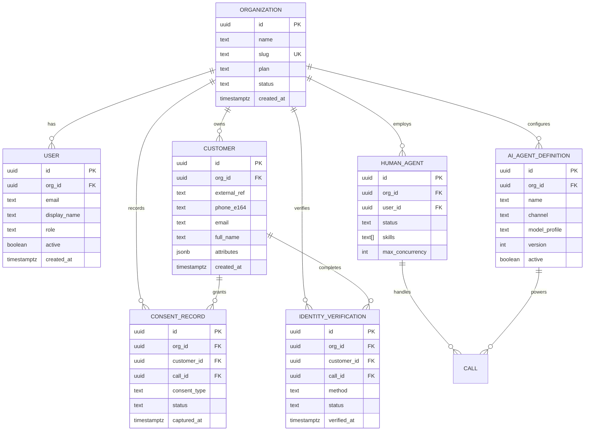
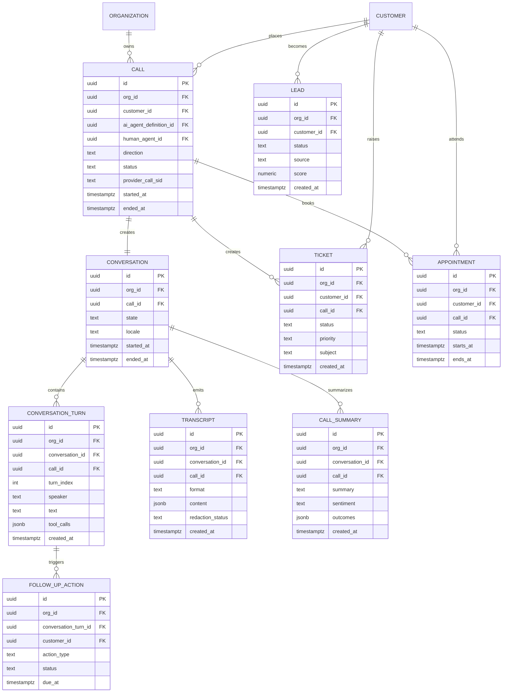
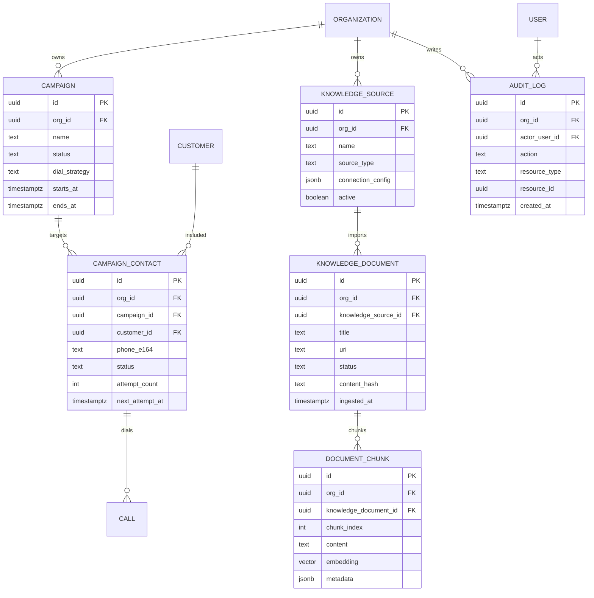

# 12. Entity Relationship Diagram

All persistent domain tables use UUIDv7 primary keys, carry `org_id UUID NOT NULL`, enable PostgreSQL Row-Level Security (RLS), and are accessed with a tenant-scoped session GUC such as `app.current_org_id`. Diagrams show canonical entities from the architecture contract; physical table names are lower snake_case equivalents.

## 12.1 Identity, Customers, Agents, Consent

## 12.2 Calls, Conversations, Work Items

## 12.3 Campaigns, Knowledge, Audit

### Architecture Review (self-critique)

The model is intentionally relational and auditable, but it is not minimal. Alternative 1 is an event-sourced conversation store with projections; it improves replayability but raises query and GDPR deletion complexity. Alternative 2 is a document-centric MongoDB transcript model; it lowers write friction but weakens RLS, joins, and transactional workflows. Recommendation: keep PostgreSQL as the authoritative store per D2, normalize workflow entities, and reserve JSONB for provider metadata, transcript envelopes, and extensible AI tool payloads.

# 13. Database Design

## 13.1 Ownership and Database-per-Service Allocation

Each service owns its schema and writes only its tables. Cross-service access is via APIs or Kafka events; analytics uses replicated projections, not direct OLTP reads.

| Service | Database | Schema | Owned tables | Notes |
|---|---|---|---|---|
| `identity-service` | `voxagent_identity` | `identity` | `organization`, `user`, `identity_verification` | Tenant, auth subject, verification source of truth. |
| `call-management-service` | `voxagent_call_mgmt` | `call_mgmt` | `customer`, `call`, `consent_record` | Owns lifecycle and telephony identifiers; customer may be mastered externally but cached here for call context. |
| `conversation-service` | `voxagent_conversation` | `conversation` | `conversation`, `conversation_turn`, `transcript`, `call_summary`, `follow_up_action` | Async transcripts, summaries, redaction status. |
| `ticket-service` | `voxagent_ticketing` | `ticketing` | `ticket` | Support ticket workflow and external-ticket mapping. |
| `scheduling-service` | `voxagent_scheduling` | `scheduling` | `appointment` | Appointment availability and booking state. |
| `campaign-service` | `voxagent_campaign` | `campaign` | `lead`, `campaign`, `campaign_contact` | Outbound campaign pacing and lead state. |
| `agent-routing-service` | `voxagent_routing` | `routing` | `human_agent` | Human availability, skills, handoff capacity. |
| `config-service` | `voxagent_config` | `config` | `ai_agent_definition` | Tenant prompts, model profile, agent versioning. |
| `knowledge-service` | `voxagent_knowledge` | `knowledge` | `knowledge_source`, `knowledge_document`, `document_chunk` | RAG corpus and pgvector index ownership. |
| All services | service-local | local schema | `outbox_event`, `processed_event` | Local outbox/idempotency tables; service-private. |
| `analytics-service` | `voxagent_analytics` | `analytics` | `audit_log` plus projections | Audit is append-only and tiered. SIEM export consumes `audit.events.v1`. |

## 13.2 Global Physical Standards

- Primary keys: `id UUID PRIMARY KEY DEFAULT uuid_generate_v7()`; use application-generated UUIDv7 if extension availability is constrained.
- Tenant isolation: `org_id UUID NOT NULL` on every domain table; RLS policy `USING (org_id = current_setting('app.current_org_id')::uuid)` except `organization`, which uses `id` as tenant key.
- Index rule: put `org_id` first on tenant-scoped B-tree indexes to mitigate RLS plan overhead and partition pruning misses.
- Time columns: `created_at TIMESTAMPTZ NOT NULL DEFAULT now()`, `updated_at TIMESTAMPTZ NOT NULL DEFAULT now()` where mutable.
- Soft delete: only where product recovery requires it (`deleted_at`, `deleted_by`); GDPR hard delete and crypto-shredding override soft delete.

## 13.3 Table Specifications

### `organization` — `identity-service`

| Column | Type | Null | Default | Constraints / notes |
|---|---:|:---:|---|---|
| `id` | UUID | NO | `uuid_generate_v7()` | PK; tenant identifier. |
| `org_id` | UUID | NO | same as `id` | Required by platform rule; check `org_id = id`. |
| `name` | TEXT | NO | — | Legal/display name. |
| `slug` | TEXT | NO | — | Unique login/URL slug. |
| `plan` | TEXT | NO | `'standard'` | `standard`, `enterprise`, `dedicated`. |
| `status` | TEXT | NO | `'active'` | `active`, `suspended`, `deleted`. |
| `data_region` | TEXT | NO | `'default'` | Residency routing. |
| `settings` | JSONB | NO | `'{}'::jsonb` | Tenant feature flags. |
| `created_at` | TIMESTAMPTZ | NO | `now()` |  |
| `updated_at` | TIMESTAMPTZ | NO | `now()` |  |
| `deleted_at` | TIMESTAMPTZ | YES | — | RTBF/org offboarding marker. |

**Keys and indexes:** PK `(id)`; unique `(slug)`; B-tree `(status, plan)` for admin operations; GIN `(settings jsonb_path_ops)` for feature targeting. RLS uses `id = current_setting('app.current_org_id')::uuid`.

**Partitioning/archival:** not partitioned; low cardinality. Archive only after tenant offboarding and legal hold expiry.

### `user` — `identity-service`

| Column | Type | Null | Default | Constraints / notes |
|---|---:|:---:|---|---|
| `id` | UUID | NO | `uuid_generate_v7()` | PK. |
| `org_id` | UUID | NO | — | FK `organization(id)`. |
| `external_subject` | TEXT | NO | — | OIDC subject. |
| `email` | CITEXT | NO | — | Tenant-unique. |
| `display_name` | TEXT | NO | — |  |
| `role` | TEXT | NO | `'agent'` | RBAC role. |
| `data_scope` | JSONB | NO | `'{}'::jsonb` | ABAC constraints. |
| `active` | BOOLEAN | NO | `true` |  |
| `last_login_at` | TIMESTAMPTZ | YES | — |  |
| `created_at` | TIMESTAMPTZ | NO | `now()` |  |
| `updated_at` | TIMESTAMPTZ | NO | `now()` |  |
| `deleted_at` | TIMESTAMPTZ | YES | — |  |

**Keys and indexes:** PK `(id)`; FK `(org_id)`; unique `(org_id, email)`; unique `(org_id, external_subject)`; B-tree `(org_id, role, active)`; GIN `(data_scope jsonb_path_ops)` for ABAC filters.

**Partitioning/archival:** not partitioned; hard-delete/anonymize subject on account deletion after audit retention constraints are satisfied.

### `customer` — `call-management-service`

| Column | Type | Null | Default | Constraints / notes |
|---|---:|:---:|---|---|
| `id` | UUID | NO | `uuid_generate_v7()` | PK. |
| `org_id` | UUID | NO | — | FK `organization(id)`. |
| `external_ref` | TEXT | YES | — | CRM/customer master reference. |
| `phone_e164` | TEXT | YES | — | E.164; encrypted at rest if required. |
| `email` | CITEXT | YES | — |  |
| `full_name` | TEXT | YES | — |  |
| `preferred_locale` | TEXT | NO | `'en-US'` |  |
| `timezone` | TEXT | YES | — |  |
| `attributes` | JSONB | NO | `'{}'::jsonb` | Extensible CRM attributes. |
| `pii_hash` | BYTEA | YES | — | Deterministic duplicate detection. |
| `created_at` | TIMESTAMPTZ | NO | `now()` |  |
| `updated_at` | TIMESTAMPTZ | NO | `now()` |  |
| `deleted_at` | TIMESTAMPTZ | YES | — | GDPR hard-delete candidate. |

**Keys and indexes:** PK `(id)`; FK `(org_id)`; unique `(org_id, external_ref)` where not null; B-tree `(org_id, phone_e164)` and `(org_id, email)`; GIN `(attributes jsonb_path_ops)` for segmentation. Leading `org_id` avoids RLS bitmap scans.

**Partitioning/archival:** not partitioned. GDPR delete cascades/anonymizes dependent PII and emits audit tombstone.

### `call` — `call-management-service`

| Column | Type | Null | Default | Constraints / notes |
|---|---:|:---:|---|---|
| `id` | UUID | NO | `uuid_generate_v7()` | PK; Kafka key for `call.events.v1`. |
| `org_id` | UUID | NO | — | FK `organization(id)`. |
| `customer_id` | UUID | YES | — | FK `customer(id)`. |
| `ai_agent_definition_id` | UUID | YES | — | FK `ai_agent_definition(id)`. |
| `human_agent_id` | UUID | YES | — | FK `human_agent(id)`. |
| `campaign_contact_id` | UUID | YES | — | FK `campaign_contact(id)`. |
| `direction` | TEXT | NO | — | `inbound`, `outbound`. |
| `status` | TEXT | NO | `'initiated'` | `initiated`, `ringing`, `in_progress`, `completed`, `failed`, `cancelled`. |
| `provider` | TEXT | NO | `'twilio'` | Twilio primary, SIP later. |
| `provider_call_sid` | TEXT | YES | — | Provider unique id. |
| `from_number` | TEXT | YES | — | PII; tokenized in analytics. |
| `to_number` | TEXT | YES | — |  |
| `recording_uri` | TEXT | YES | — | Object storage pointer, not audio blob. |
| `recording_key_id` | UUID | YES | — | Crypto-shredding key reference. |
| `started_at` | TIMESTAMPTZ | YES | — |  |
| `answered_at` | TIMESTAMPTZ | YES | — |  |
| `ended_at` | TIMESTAMPTZ | YES | — |  |
| `duration_seconds` | INTEGER | YES | — |  |
| `termination_reason` | TEXT | YES | — |  |
| `created_at` | TIMESTAMPTZ | NO | `now()` | Partition key. |
| `updated_at` | TIMESTAMPTZ | NO | `now()` |  |

**Keys and indexes:** PK `(id, created_at)` if partitioned; local unique `(org_id, provider, provider_call_sid, created_at)` where provider id exists; B-tree `(org_id, customer_id, created_at DESC)`, `(org_id, status, created_at DESC)`, `(org_id, campaign_contact_id)`; BRIN `(created_at)` for time scans.

**Partitioning/archival:** RANGE by month on `created_at` using pg_partman. Reason: high write rate, 90-day hot queries, cheap partition detach/export. Keep hot 90 days in PostgreSQL; export closed partitions to S3/Azure Blob Parquet and drop after retention/legal hold. Recordings go directly to object storage lifecycle tiers; RTBF deletes metadata and crypto-shreds `recording_key_id` material.

### `conversation` — `conversation-service`

| Column | Type | Null | Default | Constraints / notes |
|---|---:|:---:|---|---|
| `id` | UUID | NO | `uuid_generate_v7()` | PK. |
| `org_id` | UUID | NO | — | FK `organization(id)`. |
| `call_id` | UUID | NO | — | FK `call(id)`, unique. |
| `state` | TEXT | NO | `'active'` | `active`, `completed`, `failed`. |
| `locale` | TEXT | NO | `'en-US'` |  |
| `model_profile` | TEXT | YES | — | AI runtime profile used. |
| `sentiment` | TEXT | YES | — | Latest aggregate. |
| `started_at` | TIMESTAMPTZ | NO | `now()` |  |
| `ended_at` | TIMESTAMPTZ | YES | — |  |
| `created_at` | TIMESTAMPTZ | NO | `now()` |  |
| `updated_at` | TIMESTAMPTZ | NO | `now()` |  |

**Keys and indexes:** PK `(id)`; FK `(org_id)`, `(call_id)`; unique `(org_id, call_id)`; B-tree `(org_id, state, started_at DESC)`.

**Partitioning/archival:** not partitioned initially; rows are one per call. Archive with call lifecycle when associated call partition leaves hot storage.

### `conversation_turn` — `conversation-service`

| Column | Type | Null | Default | Constraints / notes |
|---|---:|:---:|---|---|
| `id` | UUID | NO | `uuid_generate_v7()` | PK. |
| `org_id` | UUID | NO | — | FK `organization(id)`. |
| `conversation_id` | UUID | NO | — | FK `conversation(id)`. |
| `call_id` | UUID | NO | — | Denormalized for Kafka/keyed lookup. |
| `turn_index` | INTEGER | NO | — | Monotonic per conversation. |
| `speaker` | TEXT | NO | — | `customer`, `ai_agent`, `human_agent`, `system`. |
| `text` | TEXT | YES | — | Redacted canonical text. |
| `raw_text` | TEXT | YES | — | Optional encrypted restricted field. |
| `language` | TEXT | YES | — | BCP-47. |
| `start_offset_ms` | INTEGER | YES | — | Audio alignment. |
| `end_offset_ms` | INTEGER | YES | — |  |
| `confidence` | NUMERIC(5,4) | YES | — | STT confidence. |
| `intent` | TEXT | YES | — | Classified intent. |
| `sentiment` | TEXT | YES | — | Turn sentiment. |
| `tool_calls` | JSONB | NO | `'[]'::jsonb` | Spring AI tool calls/results. |
| `metadata` | JSONB | NO | `'{}'::jsonb` | STT/TTS/provider metadata. |
| `created_at` | TIMESTAMPTZ | NO | `now()` | Partition key. |

**Keys and indexes:** PK `(id, created_at)` when partitioned; unique `(org_id, conversation_id, turn_index, created_at)`; B-tree `(org_id, call_id, turn_index)`, `(org_id, created_at DESC)`; GIN `(tool_calls jsonb_path_ops)` for tool audit; optional GIN `to_tsvector('simple', text)` for transcript search.

**Partitioning/archival:** RANGE by month on `created_at` with pg_partman. Reason: largest OLTP table after transcripts; partitions cap vacuum/index bloat and allow tiered export. Hot 90 days in PostgreSQL, cold Parquet by month/org.

### `transcript` — `conversation-service`

| Column | Type | Null | Default | Constraints / notes |
|---|---:|:---:|---|---|
| `id` | UUID | NO | `uuid_generate_v7()` | PK. |
| `org_id` | UUID | NO | — | FK `organization(id)`. |
| `conversation_id` | UUID | NO | — | FK `conversation(id)`. |
| `call_id` | UUID | NO | — |  |
| `format` | TEXT | NO | `'json_v1'` | `json_v1`, `srt`, `vtt`. |
| `content` | JSONB | NO | — | Full transcript envelope or segment array. |
| `redaction_status` | TEXT | NO | `'pending'` | `pending`, `redacted`, `failed`. |
| `pii_detected` | BOOLEAN | NO | `false` |  |
| `object_uri` | TEXT | YES | — | Cold transcript pointer. |
| `created_at` | TIMESTAMPTZ | NO | `now()` | Partition key. |
| `updated_at` | TIMESTAMPTZ | NO | `now()` |  |

**Keys and indexes:** PK `(id, created_at)` when partitioned; unique `(org_id, conversation_id, format, created_at)`; B-tree `(org_id, call_id, created_at DESC)`, `(org_id, redaction_status)`; GIN `(content jsonb_path_ops)` only for hot 90-day search; avoid unbounded JSONB indexing.

**Partitioning/archival:** RANGE by month on `created_at` with pg_partman. Export to Parquet and/or object JSON after 90 days; leave lightweight pointer row if business search requires it.

### `call_summary` — `conversation-service`

| Column | Type | Null | Default | Constraints / notes |
|---|---:|:---:|---|---|
| `id` | UUID | NO | `uuid_generate_v7()` | PK. |
| `org_id` | UUID | NO | — | FK `organization(id)`. |
| `conversation_id` | UUID | NO | — | FK `conversation(id)`. |
| `call_id` | UUID | NO | — |  |
| `summary` | TEXT | NO | — | Human-readable summary. |
| `sentiment` | TEXT | YES | — | Aggregate sentiment. |
| `outcomes` | JSONB | NO | `'{}'::jsonb` | Disposition, next steps, entities. |
| `model` | TEXT | YES | — | Model used for summarization. |
| `quality_score` | NUMERIC(5,4) | YES | — | Optional eval score. |
| `created_at` | TIMESTAMPTZ | NO | `now()` |  |
| `updated_at` | TIMESTAMPTZ | NO | `now()` |  |

**Keys and indexes:** PK `(id)`; unique `(org_id, conversation_id)`; B-tree `(org_id, call_id)`, `(org_id, created_at DESC)`; GIN `(outcomes jsonb_path_ops)` for analytics filters.

**Partitioning/archival:** not partitioned initially; archive with call/conversation cold export.

### `ticket` — `ticket-service`

| Column | Type | Null | Default | Constraints / notes |
|---|---:|:---:|---|---|
| `id` | UUID | NO | `uuid_generate_v7()` | PK; Kafka key for `ticket.events.v1`. |
| `org_id` | UUID | NO | — | FK `organization(id)`. |
| `customer_id` | UUID | YES | — | FK `customer(id)`. |
| `call_id` | UUID | YES | — | FK `call(id)`. |
| `external_ticket_ref` | TEXT | YES | — | CRM/helpdesk reference. |
| `status` | TEXT | NO | `'open'` |  |
| `priority` | TEXT | NO | `'normal'` |  |
| `subject` | TEXT | NO | — |  |
| `description` | TEXT | YES | — | Redacted. |
| `category` | TEXT | YES | — |  |
| `assigned_user_id` | UUID | YES | — | FK `user(id)`. |
| `created_at` | TIMESTAMPTZ | NO | `now()` |  |
| `updated_at` | TIMESTAMPTZ | NO | `now()` |  |
| `closed_at` | TIMESTAMPTZ | YES | — |  |

**Keys and indexes:** PK `(id)`; B-tree `(org_id, status, priority, created_at DESC)`, `(org_id, customer_id, created_at DESC)`, `(org_id, external_ticket_ref)`; optional full-text GIN on `subject || description`.

**Partitioning/archival:** not partitioned until volume justifies; close-state tickets exported after tenant retention period.

### `appointment` — `scheduling-service`

| Column | Type | Null | Default | Constraints / notes |
|---|---:|:---:|---|---|
| `id` | UUID | NO | `uuid_generate_v7()` | PK; Kafka key for `appointment.events.v1`. |
| `org_id` | UUID | NO | — | FK `organization(id)`. |
| `customer_id` | UUID | YES | — | FK `customer(id)`. |
| `call_id` | UUID | YES | — | FK `call(id)`. |
| `external_calendar_ref` | TEXT | YES | — | Calendar id. |
| `status` | TEXT | NO | `'scheduled'` | `scheduled`, `rescheduled`, `cancelled`, `completed`, `no_show`. |
| `title` | TEXT | NO | — |  |
| `location` | TEXT | YES | — |  |
| `starts_at` | TIMESTAMPTZ | NO | — |  |
| `ends_at` | TIMESTAMPTZ | NO | — | Check `ends_at > starts_at`. |
| `metadata` | JSONB | NO | `'{}'::jsonb` |  |
| `created_at` | TIMESTAMPTZ | NO | `now()` |  |
| `updated_at` | TIMESTAMPTZ | NO | `now()` |  |

**Keys and indexes:** PK `(id)`; B-tree `(org_id, starts_at)`, `(org_id, customer_id, starts_at DESC)`, `(org_id, status, starts_at)`; GiST exclusion `(org_id, tstzrange(starts_at, ends_at))` when resource calendars are introduced.

**Partitioning/archival:** not partitioned; archive completed/no-show appointments by retention policy.

### `lead` — `campaign-service`

| Column | Type | Null | Default | Constraints / notes |
|---|---:|:---:|---|---|
| `id` | UUID | NO | `uuid_generate_v7()` | PK; Kafka key for `lead.events.v1`. |
| `org_id` | UUID | NO | — | FK `organization(id)`. |
| `customer_id` | UUID | YES | — | FK `customer(id)`. |
| `source` | TEXT | NO | — | `campaign`, `inbound_call`, `webhook`, etc. |
| `status` | TEXT | NO | `'new'` |  |
| `score` | NUMERIC(6,2) | YES | — |  |
| `qualification` | JSONB | NO | `'{}'::jsonb` | BANT/MEDDICC/etc. |
| `owner_user_id` | UUID | YES | — | FK `user(id)`. |
| `created_at` | TIMESTAMPTZ | NO | `now()` |  |
| `updated_at` | TIMESTAMPTZ | NO | `now()` |  |
| `converted_at` | TIMESTAMPTZ | YES | — |  |

**Keys and indexes:** PK `(id)`; B-tree `(org_id, status, score DESC)`, `(org_id, customer_id)`, `(org_id, created_at DESC)`; GIN `(qualification jsonb_path_ops)`.

**Partitioning/archival:** not partitioned initially; export converted/lost leads after retention.

### `campaign` — `campaign-service`

| Column | Type | Null | Default | Constraints / notes |
|---|---:|:---:|---|---|
| `id` | UUID | NO | `uuid_generate_v7()` | PK. |
| `org_id` | UUID | NO | — | FK `organization(id)`. |
| `name` | TEXT | NO | — |  |
| `status` | TEXT | NO | `'draft'` | `draft`, `active`, `paused`, `completed`, `cancelled`. |
| `dial_strategy` | TEXT | NO | `'progressive'` | `preview`, `progressive`, `predictive`. |
| `timezone` | TEXT | NO | `'UTC'` | Calling windows. |
| `daily_start_time` | TIME | YES | — | Tenant local time. |
| `daily_end_time` | TIME | YES | — |  |
| `pacing_config` | JSONB | NO | `'{}'::jsonb` | Dialer pacing. |
| `starts_at` | TIMESTAMPTZ | YES | — |  |
| `ends_at` | TIMESTAMPTZ | YES | — |  |
| `created_at` | TIMESTAMPTZ | NO | `now()` |  |
| `updated_at` | TIMESTAMPTZ | NO | `now()` |  |

**Keys and indexes:** PK `(id)`; B-tree `(org_id, status, starts_at)`, `(org_id, created_at DESC)`; GIN `(pacing_config jsonb_path_ops)`.

**Partitioning/archival:** not partitioned; campaign results move to cold analytics after completion.

### `campaign_contact` — `campaign-service`

| Column | Type | Null | Default | Constraints / notes |
|---|---:|:---:|---|---|
| `id` | UUID | NO | `uuid_generate_v7()` | PK; Kafka key for `campaign.dial.commands.v1` is contactId. |
| `org_id` | UUID | NO | — | FK `organization(id)`. |
| `campaign_id` | UUID | NO | — | FK `campaign(id)`. |
| `customer_id` | UUID | YES | — | FK `customer(id)`. |
| `lead_id` | UUID | YES | — | FK `lead(id)`. |
| `phone_e164` | TEXT | NO | — |  |
| `status` | TEXT | NO | `'pending'` | `pending`, `queued`, `dialing`, `completed`, `failed`, `do_not_call`. |
| `attempt_count` | INTEGER | NO | `0` |  |
| `last_attempt_at` | TIMESTAMPTZ | YES | — |  |
| `next_attempt_at` | TIMESTAMPTZ | YES | — |  |
| `disposition` | TEXT | YES | — |  |
| `metadata` | JSONB | NO | `'{}'::jsonb` |  |
| `created_at` | TIMESTAMPTZ | NO | `now()` |  |
| `updated_at` | TIMESTAMPTZ | NO | `now()` |  |

**Keys and indexes:** PK `(id)`; unique `(org_id, campaign_id, phone_e164)`; B-tree `(org_id, campaign_id, status, next_attempt_at)`, `(org_id, customer_id)`, `(org_id, lead_id)`; GIN `(metadata jsonb_path_ops)`.

**Partitioning/archival:** default unpartitioned for small tenants. For very large outbound tenants, use HASH partitioning by `campaign_id` to spread write/update hot spots and vacuum load; pair with per-campaign lifecycle archival.

### `human_agent` — `agent-routing-service`

| Column | Type | Null | Default | Constraints / notes |
|---|---:|:---:|---|---|
| `id` | UUID | NO | `uuid_generate_v7()` | PK. |
| `org_id` | UUID | NO | — | FK `organization(id)`. |
| `user_id` | UUID | NO | — | FK `user(id)`, tenant-unique. |
| `status` | TEXT | NO | `'offline'` | `offline`, `available`, `busy`, `away`. |
| `skills` | TEXT[] | NO | `'{}'` | Routing skills. |
| `languages` | TEXT[] | NO | `'{}'` |  |
| `max_concurrency` | INTEGER | NO | `1` |  |
| `current_load` | INTEGER | NO | `0` | Reconstructible from sessions; cached in Redis for live routing. |
| `last_seen_at` | TIMESTAMPTZ | YES | — |  |
| `created_at` | TIMESTAMPTZ | NO | `now()` |  |
| `updated_at` | TIMESTAMPTZ | NO | `now()` |  |

**Keys and indexes:** PK `(id)`; unique `(org_id, user_id)`; B-tree `(org_id, status, current_load)`; GIN `(skills)`, GIN `(languages)` for routing filters.

**Partitioning/archival:** not partitioned; deactivate rather than delete while audit references exist.

### `ai_agent_definition` — `config-service`

| Column | Type | Null | Default | Constraints / notes |
|---|---:|:---:|---|---|
| `id` | UUID | NO | `uuid_generate_v7()` | PK. |
| `org_id` | UUID | NO | — | FK `organization(id)`. |
| `name` | TEXT | NO | — |  |
| `channel` | TEXT | NO | `'voice'` |  |
| `version` | INTEGER | NO | `1` | Immutable semantic version per publish. |
| `active` | BOOLEAN | NO | `false` | One active per name/channel. |
| `model_profile` | TEXT | NO | — | Azure OpenAI/OpenAI profile abstraction. |
| `system_prompt` | TEXT | NO | — | Versioned prompt. |
| `tool_policy` | JSONB | NO | `'{}'::jsonb` | Spring AI `@Tool` exposure policy. |
| `voice_profile` | JSONB | NO | `'{}'::jsonb` | STT/TTS settings. |
| `guardrails` | JSONB | NO | `'{}'::jsonb` | Safety and compliance. |
| `created_by` | UUID | YES | — | FK `user(id)`. |
| `created_at` | TIMESTAMPTZ | NO | `now()` |  |
| `updated_at` | TIMESTAMPTZ | NO | `now()` |  |

**Keys and indexes:** PK `(id)`; unique `(org_id, name, channel, version)`; partial unique `(org_id, name, channel) WHERE active`; B-tree `(org_id, active)`; GIN indexes on `tool_policy`, `guardrails` for config search.

**Partitioning/archival:** not partitioned; immutable historical versions retained for replay/audit.

### `knowledge_source` — `knowledge-service`

| Column | Type | Null | Default | Constraints / notes |
|---|---:|:---:|---|---|
| `id` | UUID | NO | `uuid_generate_v7()` | PK. |
| `org_id` | UUID | NO | — | FK `organization(id)`. |
| `name` | TEXT | NO | — |  |
| `source_type` | TEXT | NO | — | `upload`, `web`, `sharepoint`, `confluence`, etc. |
| `connection_config` | JSONB | NO | `'{}'::jsonb` | No secrets; references Vault/Key Vault. |
| `sync_policy` | JSONB | NO | `'{}'::jsonb` | Crawl schedule and filters. |
| `active` | BOOLEAN | NO | `true` |  |
| `created_at` | TIMESTAMPTZ | NO | `now()` |  |
| `updated_at` | TIMESTAMPTZ | NO | `now()` |  |

**Keys and indexes:** PK `(id)`; unique `(org_id, name)`; B-tree `(org_id, active, source_type)`; GIN `(connection_config jsonb_path_ops)`, `(sync_policy jsonb_path_ops)`.

**Partitioning/archival:** not partitioned; delete cascades to documents/chunks after retention.

### `knowledge_document` — `knowledge-service`

| Column | Type | Null | Default | Constraints / notes |
|---|---:|:---:|---|---|
| `id` | UUID | NO | `uuid_generate_v7()` | PK; Kafka key for `knowledge.ingestion.v1`. |
| `org_id` | UUID | NO | — | FK `organization(id)`. |
| `knowledge_source_id` | UUID | NO | — | FK `knowledge_source(id)`. |
| `title` | TEXT | NO | — |  |
| `uri` | TEXT | NO | — | Object/source URI. |
| `content_hash` | TEXT | NO | — | Dedup/version detection. |
| `mime_type` | TEXT | YES | — |  |
| `status` | TEXT | NO | `'pending'` | `pending`, `ingesting`, `ready`, `failed`, `deleted`. |
| `metadata` | JSONB | NO | `'{}'::jsonb` |  |
| `ingested_at` | TIMESTAMPTZ | YES | — |  |
| `created_at` | TIMESTAMPTZ | NO | `now()` |  |
| `updated_at` | TIMESTAMPTZ | NO | `now()` |  |

**Keys and indexes:** PK `(id)`; unique `(org_id, knowledge_source_id, content_hash)`; B-tree `(org_id, status, updated_at)`, `(org_id, knowledge_source_id)`; GIN `(metadata jsonb_path_ops)`.

**Partitioning/archival:** not partitioned; object content managed by source lifecycle, chunks deleted/rebuilt on reingestion.

### `document_chunk` — `knowledge-service`

| Column | Type | Null | Default | Constraints / notes |
|---|---:|:---:|---|---|
| `id` | UUID | NO | `uuid_generate_v7()` | PK. |
| `org_id` | UUID | NO | — | FK `organization(id)`. |
| `knowledge_document_id` | UUID | NO | — | FK `knowledge_document(id)`. |
| `chunk_index` | INTEGER | NO | — | Stable per document version. |
| `content` | TEXT | NO | — | Redacted chunk text. |
| `embedding` | VECTOR(1536) | NO | — | Dimension aligned to embedding model. |
| `embedding_model` | TEXT | NO | — | Needed for reindex/re-embed. |
| `token_count` | INTEGER | YES | — | Budgeting. |
| `metadata` | JSONB | NO | `'{}'::jsonb` | Section/page/security labels. |
| `created_at` | TIMESTAMPTZ | NO | `now()` |  |
| `updated_at` | TIMESTAMPTZ | NO | `now()` |  |

**Keys and indexes:** PK `(id)`; unique `(org_id, knowledge_document_id, chunk_index)`; B-tree `(org_id, knowledge_document_id)`; HNSW vector index on `embedding vector_cosine_ops` with a partial/per-tenant strategy where feasible; B-tree `(org_id, created_at DESC)`; GIN `(metadata jsonb_path_ops)`. Rationale: HNSW provides low-latency approximate nearest-neighbor retrieval for RAG; metadata/RLS filters must be applied before or during candidate recheck.

**Partitioning/archival:** not time-partitioned; consider LIST/HASH partition by `org_id` for tenants with millions of chunks. Revisit pgvector per D4 when corpus exceeds 20M vectors or retrieval p95 exceeds 150 ms.

### `consent_record` — `call-management-service`

| Column | Type | Null | Default | Constraints / notes |
|---|---:|:---:|---|---|
| `id` | UUID | NO | `uuid_generate_v7()` | PK. |
| `org_id` | UUID | NO | — | FK `organization(id)`. |
| `customer_id` | UUID | YES | — | FK `customer(id)`. |
| `call_id` | UUID | YES | — | FK `call(id)`. |
| `consent_type` | TEXT | NO | — | `recording`, `sms`, `marketing`, etc. |
| `status` | TEXT | NO | — | `granted`, `denied`, `revoked`. |
| `capture_channel` | TEXT | NO | `'voice'` |  |
| `evidence_uri` | TEXT | YES | — | Recording/snippet pointer. |
| `policy_version` | TEXT | NO | — |  |
| `captured_at` | TIMESTAMPTZ | NO | `now()` |  |
| `expires_at` | TIMESTAMPTZ | YES | — |  |
| `created_at` | TIMESTAMPTZ | NO | `now()` |  |

**Keys and indexes:** PK `(id)`; B-tree `(org_id, customer_id, consent_type, captured_at DESC)`, `(org_id, call_id)`, `(org_id, status, expires_at)`.

**Partitioning/archival:** not partitioned initially; retain by regulatory policy. Evidence recordings follow object lifecycle and crypto-shredding rules.

### `follow_up_action` — `conversation-service`

| Column | Type | Null | Default | Constraints / notes |
|---|---:|:---:|---|---|
| `id` | UUID | NO | `uuid_generate_v7()` | PK. |
| `org_id` | UUID | NO | — | FK `organization(id)`. |
| `conversation_turn_id` | UUID | YES | — | FK `conversation_turn(id)`. |
| `call_id` | UUID | YES | — |  |
| `customer_id` | UUID | YES | — | FK `customer(id)`. |
| `action_type` | TEXT | NO | — | `send_sms`, `create_ticket`, `schedule_callback`, etc. |
| `status` | TEXT | NO | `'pending'` |  |
| `payload` | JSONB | NO | `'{}'::jsonb` | Tool/action payload. |
| `due_at` | TIMESTAMPTZ | YES | — |  |
| `completed_at` | TIMESTAMPTZ | YES | — |  |
| `created_at` | TIMESTAMPTZ | NO | `now()` |  |
| `updated_at` | TIMESTAMPTZ | NO | `now()` |  |

**Keys and indexes:** PK `(id)`; B-tree `(org_id, status, due_at)`, `(org_id, call_id)`, `(org_id, customer_id, created_at DESC)`; GIN `(payload jsonb_path_ops)`.

**Partitioning/archival:** not partitioned; completed actions archived after workflow retention.

### `audit_log` — `analytics-service`

| Column | Type | Null | Default | Constraints / notes |
|---|---:|:---:|---|---|
| `id` | UUID | NO | `uuid_generate_v7()` | PK. |
| `org_id` | UUID | NO | — | FK `organization(id)`; Kafka key for `audit.events.v1`. |
| `actor_user_id` | UUID | YES | — | FK `user(id)` where applicable. |
| `actor_type` | TEXT | NO | — | `user`, `service`, `system`. |
| `service_name` | TEXT | YES | — | Canonical service name. |
| `action` | TEXT | NO | — | Verb. |
| `resource_type` | TEXT | NO | — | Entity/table/domain. |
| `resource_id` | UUID | YES | — |  |
| `trace_id` | TEXT | YES | — | OpenTelemetry trace id. |
| `ip_address` | INET | YES | — |  |
| `user_agent` | TEXT | YES | — |  |
| `before` | JSONB | YES | — | Redacted diff. |
| `after` | JSONB | YES | — | Redacted diff. |
| `created_at` | TIMESTAMPTZ | NO | `now()` | Partition key; immutable. |

**Keys and indexes:** PK `(id, created_at)` when partitioned; B-tree `(org_id, created_at DESC)`, `(org_id, actor_user_id, created_at DESC)`, `(org_id, resource_type, resource_id, created_at DESC)`; BRIN `(created_at)`; GIN `(after jsonb_path_ops)` only if justified by audit search workload.

**Partitioning/archival:** RANGE by month on `created_at` using pg_partman. Retention is 365d with tiering to S3/Blob per contract; immutable cold storage for SIEM/legal hold.

### `identity_verification` — `identity-service`

| Column | Type | Null | Default | Constraints / notes |
|---|---:|:---:|---|---|
| `id` | UUID | NO | `uuid_generate_v7()` | PK. |
| `org_id` | UUID | NO | — | FK `organization(id)`. |
| `customer_id` | UUID | YES | — | FK `customer(id)`. |
| `call_id` | UUID | YES | — | FK `call(id)`. |
| `method` | TEXT | NO | — | `otp`, `kbv`, `voice_pin`, `crm_match`. |
| `status` | TEXT | NO | `'pending'` | `pending`, `verified`, `failed`, `expired`. |
| `verification_ref` | TEXT | YES | — | External provider reference. |
| `attempt_count` | INTEGER | NO | `0` |  |
| `risk_score` | NUMERIC(5,4) | YES | — |  |
| `evidence` | JSONB | NO | `'{}'::jsonb` | Redacted; no secrets. |
| `verified_at` | TIMESTAMPTZ | YES | — |  |
| `expires_at` | TIMESTAMPTZ | YES | — |  |
| `created_at` | TIMESTAMPTZ | NO | `now()` |  |
| `updated_at` | TIMESTAMPTZ | NO | `now()` |  |

**Keys and indexes:** PK `(id)`; B-tree `(org_id, customer_id, created_at DESC)`, `(org_id, call_id)`, `(org_id, status, expires_at)`; GIN `(evidence jsonb_path_ops)` for fraud review.

**Partitioning/archival:** not partitioned initially; purge failed/expired verification evidence aggressively unless regulated retention requires otherwise.

### Service-local `outbox_event` — all event-producing services

| Column | Type | Null | Default | Constraints / notes |
|---|---:|:---:|---|---|
| `id` | UUID | NO | `uuid_generate_v7()` | PK; also Kafka envelope `eventId`. |
| `org_id` | UUID | NO | — | Tenant for RLS and quotas. |
| `aggregate_type` | TEXT | NO | — | Entity name, e.g. `Call`, `Ticket`. |
| `aggregate_id` | UUID | NO | — | Aggregate UUIDv7. |
| `topic` | TEXT | NO | — | Canonical Kafka topic. |
| `event_key` | TEXT | NO | — | Kafka key such as `callId`. |
| `event_type` | TEXT | NO | — | Envelope `eventType`. |
| `schema_version` | TEXT | NO | `'1.0.0'` | Envelope schema version. |
| `traceparent` | TEXT | YES | — | W3C trace context. |
| `payload` | JSONB | NO | — | Event envelope or payload. |
| `headers` | JSONB | NO | `'{}'::jsonb` | Kafka headers to publish. |
| `status` | TEXT | NO | `'pending'` | `pending`, `publishing`, `published`, `failed`. |
| `attempt_count` | INTEGER | NO | `0` | Publisher retry count. |
| `next_attempt_at` | TIMESTAMPTZ | NO | `now()` | Backoff scheduling. |
| `published_at` | TIMESTAMPTZ | YES | — | Set after broker ack. |
| `created_at` | TIMESTAMPTZ | NO | `now()` |  |
| `updated_at` | TIMESTAMPTZ | NO | `now()` |  |

**Keys and indexes:** PK `(id)`; B-tree partial `(status, next_attempt_at, created_at) WHERE status IN ('pending','failed')`; B-tree `(org_id, aggregate_type, aggregate_id, created_at DESC)`; optional GIN `(payload jsonb_path_ops)` only for operational debugging.

**Partitioning/archival:** service-local table is not partitioned initially; purge `published` rows after 7–30 days once Kafka retention and replay needs are satisfied. High-throughput services may RANGE partition by `created_at`.

### Service-local `processed_event` — all Kafka-consuming services

| Column | Type | Null | Default | Constraints / notes |
|---|---:|:---:|---|---|
| `org_id` | UUID | NO | — | Tenant. |
| `event_id` | UUID | NO | — | Envelope `eventId`. |
| `consumer_group` | TEXT | NO | — | `<service>-<topic>-cg`. |
| `topic` | TEXT | NO | — | Consumed topic. |
| `partition_no` | INTEGER | NO | — | Kafka partition. |
| `offset_no` | BIGINT | NO | — | Kafka offset. |
| `processed_at` | TIMESTAMPTZ | NO | `now()` | Durable idempotency timestamp. |

**Keys and indexes:** PK `(org_id, event_id, consumer_group)`; B-tree `(consumer_group, topic, partition_no, offset_no)` for replay diagnostics; B-tree `(processed_at)` for retention cleanup.

**Partitioning/archival:** retain for at least the source topic retention plus maximum replay window. Partition by month only if row count becomes material; old rows can be deleted after replay risk expires.

## 13.4 Redis Data Structures

Redis 7 is a latency cache/coordination layer only. Per D3, Redis is never the source of truth; every key must be reconstructible from PostgreSQL, Kafka replay, provider callbacks, or object storage.

| Key pattern | Type | TTL | Eviction | Owner | Purpose |
|---|---|---:|---|---|---|
| `call:session:{callId}` | HASH | call duration + 2h | `volatile-ttl` | `media-gateway-service` / `call-management-service` | Live call state, provider stream ids, barge-in flags. |
| `conv:context:{callId}` | LIST or STREAM | 24h | `volatile-ttl` | `ai-orchestrator-service` | Recent turns for low-latency prompt context; persisted to `conversation_turn`. |
| `semcache:{orgId}:{hash}` | STRING/JSON | 1h–24h | `allkeys-lfu` in dedicated cache | `ai-orchestrator-service` | Semantic response cache for repeated intents; invalidated on config/knowledge version change. |
| `ratelimit:{orgId}:{api}` | STRING counter | window + skew | `volatile-ttl` | `api-gateway` | Per-tenant API quota using atomic increment or Lua. |
| `dialer:pacing:{campaignId}` | HASH | 5m | `volatile-ttl` | `campaign-service` | Current pacing, active calls, throttle state; rebuilt from DB/Kafka. |
| `agent:presence:{humanAgentId}` | HASH | 60s | `volatile-ttl` | `agent-routing-service` | Human agent heartbeat and routability. |
| `stt:partial:{callId}` | STREAM | 2h | `volatile-ttl` | `stt-adapter-service` | Short-lived partial transcripts for barge-in/debug. |
| `tts:chunk:{callId}:{seq}` | STRING bytes/ref | 15m | `volatile-ttl` | `tts-adapter-service` | Optional synthesized chunk cache during live call. |
| `idem:{orgId}:{operation}:{key}` | STRING | 24h–7d | `volatile-ttl` | all services | Fast idempotency guard backed by durable `processed_event`. |

## 13.5 Partitioning and Archival Strategy

- `call`, `conversation_turn`, `transcript`, and `audit_log` are RANGE partitioned monthly on `created_at` using pg_partman. These tables have high insert volume, time-bounded access patterns, and retention-driven deletion needs. Partitioning improves vacuum isolation, index build windows, backup/restore scope, and cold export.
- Hot retention: 90 days in PostgreSQL for call/conversation/transcript operational access. Audit remains queryable for the compliance retention window where mandated, with tiered object export for cost control.
- Cold export: scheduled job closes immutable partitions, writes Parquet to S3/Azure Blob partitioned by `org_id` and month, validates row counts/checksums, then detaches/drops OLTP partitions after retention/legal-hold gates.
- Recordings: never stored in PostgreSQL; stream directly to object storage with lifecycle tiers (hot, cool, archive). Metadata lives in `call.recording_uri` with per-recording envelope encryption keys.
- GDPR delete: hard-delete or anonymize relational PII by tenant/customer, enqueue cold-object tombstones, and crypto-shred recordings by destroying tenant/customer data-encryption keys. Audit logs retain non-identifying compliance evidence where legally allowed.

## 13.6 Required Critiques and Recommendations

### Transcript JSONB vs normalized turns

- Alternative 1: store full transcript only as `transcript.content JSONB`. This is cheap to write and mirrors provider output, but queries such as “all customer turns with intent X” become expensive and indexing unbounded JSONB becomes fragile.
- Alternative 2: store only normalized `conversation_turn` rows and reconstruct transcript on read. This is excellent for analytics and RLS but loses provider-native segment structures unless modeled exhaustively.
- Recommendation: use both with clear ownership: `conversation_turn` is canonical for turn-level search/analytics/tool audit; `transcript.content` is the immutable redacted transcript artifact and provider-format envelope.

### pgvector HNSW index build times at scale

- Alternative 1: keep pgvector HNSW in PostgreSQL. It preserves ACID metadata updates and lowers system count, but HNSW builds are CPU/memory heavy and can block operational windows for large tenants.
- Alternative 2: move vectors to Qdrant/Pinecone. This improves vector scale and reindex operations but introduces cross-store consistency, tenancy isolation, and cost complexity.
- Recommendation: start with pgvector per D4, isolate index builds to workers/maintenance windows, partition or shard very large tenants, and trigger dedicated vector DB evaluation at >20M vectors or retrieval p95 >150 ms.

### RLS performance overhead

- Alternative 1: pure application tenancy filters. Fast and simple, but a single missed predicate causes data leakage.
- Alternative 2: RLS with session GUC. Strong database-enforced boundary, but predicates can harm plan quality if indexes are not tenant-leading.
- Recommendation: use RLS with `SET LOCAL app.current_org_id`, keep `org_id` as the leading index column, avoid generic connection-pool leakage by resetting GUCs, and benchmark top queries with RLS enabled.

### Architecture Review (self-critique)

The design favors correctness, tenant isolation, and auditability over raw simplicity. The main weaknesses are operational: monthly partition management, RLS plan regressions, and pgvector maintenance require mature DBA automation. A simpler single-schema/no-RLS design would ship faster but is not acceptable for enterprise multi-tenancy. A database-per-tenant design would isolate better but raises fleet, migration, and cost overhead. Recommendation: shared clusters with RLS for standard tenants per D9, with dedicated schema/database for enterprise tenants that justify isolation and noisy-neighbor protection.
