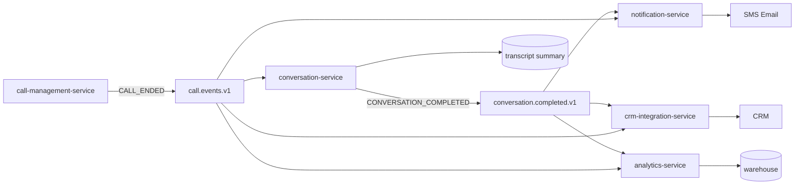
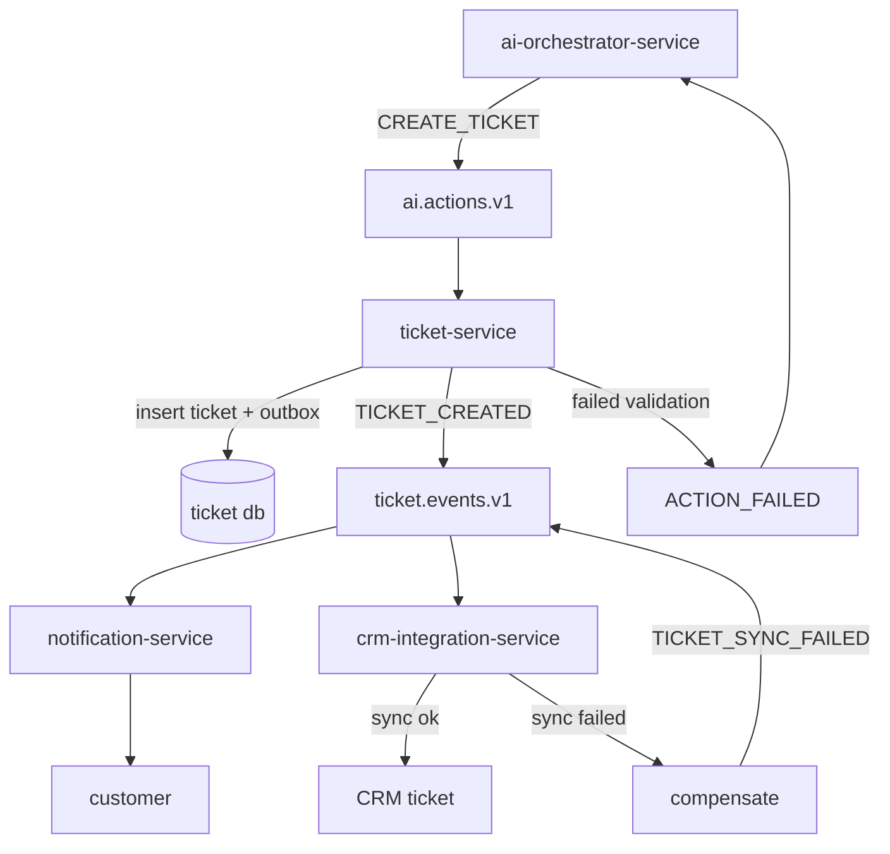
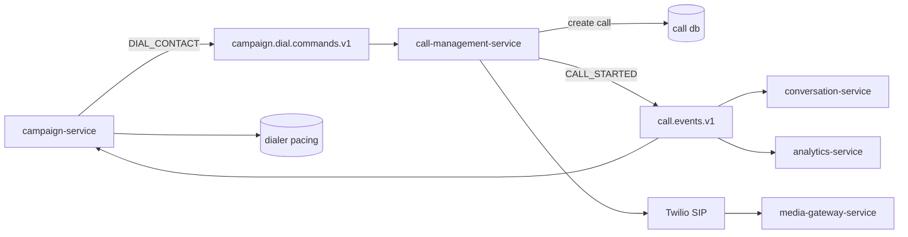

# 14. Event Driven Architecture

The live voice loop (`media-gateway-service` ↔ `stt-adapter-service` ↔ `ai-orchestrator-service` ↔ `tts-adapter-service`) stays on gRPC bidirectional streaming/WebSockets only. Kafka is used for asynchronous, post-turn, post-call, integration, analytics, and command workflows. All events use JSON Schema or Avro in Schema Registry and carry the standard envelope shown below.

## 14.1 Canonical Kafka Topics

This table reproduces the architecture contract and must remain exact.

| Topic | Key | Partitions (base) | Retention | Producers → Consumers |
|---|---|---:|---|---|
| `call.events.v1` | callId | 50 | 7d | call-mgmt → conversation, analytics, crm, campaign |
| `call.media.metadata.v1` | callId | 50 | 3d | media-gateway → conversation, analytics |
| `conversation.turns.v1` | callId | 50 | 7d | ai-orchestrator → conversation, analytics |
| `conversation.completed.v1` | callId | 20 | 7d | conversation → notification, crm, analytics |
| `ai.actions.v1` | callId | 20 | 7d | ai-orchestrator → ticket, scheduling, crm, notification |
| `ticket.events.v1` | ticketId | 10 | 7d | ticket → notification, crm, analytics |
| `appointment.events.v1` | appointmentId | 10 | 7d | scheduling → notification, crm, analytics |
| `notification.commands.v1` | recipientId | 10 | 3d | * → notification |
| `crm.sync.commands.v1` | customerId | 10 | 7d | * → crm-integration |
| `campaign.dial.commands.v1` | contactId | 20 | 3d | campaign → call-mgmt |
| `lead.events.v1` | leadId | 10 | 30d | campaign, ai-orchestrator → crm, analytics |
| `escalation.events.v1` | callId | 10 | 7d | ai-orchestrator, agent-routing → analytics, notification |
| `knowledge.ingestion.v1` | documentId | 10 | 3d | knowledge → knowledge (workers) |
| `audit.events.v1` | orgId | 20 | 365d (tiered → S3/Blob) | all → analytics, SIEM |
| `dlq.<consumer-group>` | — | 5 | 14d | per consumer group |

**Naming rule:** `<domain>.<event-type>.v<version>`. A backward-compatible schema change stays on the same topic. A breaking schema change creates a new major topic, e.g. `conversation.turns.v2`.

## 14.2 Event Envelope and Payload Examples

Standard envelope:

```json
{
  "eventId": "019932bd-7c7b-7a1d-8a17-75dc0f7745b1",
  "eventType": "DOMAIN_EVENT_NAME",
  "occurredAt": "2026-09-24T17:20:12.245Z",
  "orgId": "019932b7-1111-7a01-9000-000000000001",
  "traceparent": "00-4bf92f3577b34da6a3ce929d0e0e4736-00f067aa0ba902b7-01",
  "schemaVersion": "1.0.0",
  "payload": {}
}
```

### `call.events.v1` — `CALL_STARTED`

Key: `callId`; preserves all lifecycle events for a call in partition order.

```json
{
  "eventId": "019932bd-8000-7c9d-a53f-9b8a1f98f101",
  "eventType": "CALL_STARTED",
  "occurredAt": "2026-09-24T17:21:00.015Z",
  "orgId": "019932b7-1111-7a01-9000-000000000001",
  "traceparent": "00-5feceb66ffc86f38d952786c6d696c79-19c9b182395f7f0a-01",
  "schemaVersion": "1.0.0",
  "payload": {
    "callId": "019932bd-7fff-7a44-a342-452138cfbe11",
    "customerId": "019932bb-1000-7bb1-a000-5d9636f9ce10",
    "direction": "inbound",
    "provider": "twilio",
    "providerCallSid": "CA7f4d2c4c3b0a4c91a6",
    "fromNumber": "+14155550100",
    "toNumber": "+18005550199",
    "aiAgentDefinitionId": "019932ba-2000-7a11-a010-753b3e670901",
    "startedAt": "2026-09-24T17:21:00.000Z"
  }
}
```

### `call.events.v1` — `CALL_ENDED`

```json
{
  "eventId": "019932c1-cadd-747a-a7d4-0033bb34cb8b",
  "eventType": "CALL_ENDED",
  "occurredAt": "2026-09-24T17:25:39.345Z",
  "orgId": "019932b7-1111-7a01-9000-000000000001",
  "traceparent": "00-5feceb66ffc86f38d952786c6d696c79-9af3cc179d4f2e22-01",
  "schemaVersion": "1.0.0",
  "payload": {
    "callId": "019932bd-7fff-7a44-a342-452138cfbe11",
    "customerId": "019932bb-1000-7bb1-a000-5d9636f9ce10",
    "status": "completed",
    "startedAt": "2026-09-24T17:21:00.000Z",
    "endedAt": "2026-09-24T17:25:39.210Z",
    "durationSeconds": 279,
    "terminationReason": "caller_hangup",
    "recordingUri": "azblob://voxagent-prod-recordings/org=019932b7/call=019932bd.wav",
    "recordingKeyId": "019932c1-c900-7981-8333-c4b096c3e011"
  }
}
```

### `conversation.turns.v1` — `TURN_RECORDED`

```json
{
  "eventId": "019932be-0c83-75b3-aa5a-2ccadf064e21",
  "eventType": "TURN_RECORDED",
  "occurredAt": "2026-09-24T17:21:35.912Z",
  "orgId": "019932b7-1111-7a01-9000-000000000001",
  "traceparent": "00-5feceb66ffc86f38d952786c6d696c79-1111111111111111-01",
  "schemaVersion": "1.0.0",
  "payload": {
    "callId": "019932bd-7fff-7a44-a342-452138cfbe11",
    "conversationId": "019932bd-9000-7b1e-9aa7-cac252177401",
    "turnId": "019932be-0c7f-7614-b3c1-4a8c45a90c01",
    "turnIndex": 4,
    "speaker": "customer",
    "text": "I need to reschedule my appointment to Friday afternoon.",
    "language": "en-US",
    "startOffsetMs": 34210,
    "endOffsetMs": 38140,
    "confidence": 0.9571,
    "intent": "RESCHEDULE_APPOINTMENT",
    "sentiment": "neutral"
  }
}
```

### `ai.actions.v1` — `CREATE_TICKET`

```json
{
  "eventId": "019932bf-2a10-7c20-aee5-7a3d6a1e4201",
  "eventType": "CREATE_TICKET",
  "occurredAt": "2026-09-24T17:22:51.402Z",
  "orgId": "019932b7-1111-7a01-9000-000000000001",
  "traceparent": "00-5feceb66ffc86f38d952786c6d696c79-2222222222222222-01",
  "schemaVersion": "1.0.0",
  "payload": {
    "actionId": "019932bf-29ff-739c-a5b3-65d87ea24501",
    "callId": "019932bd-7fff-7a44-a342-452138cfbe11",
    "conversationId": "019932bd-9000-7b1e-9aa7-cac252177401",
    "customerId": "019932bb-1000-7bb1-a000-5d9636f9ce10",
    "intent": "CREATE_TICKET",
    "idempotencyKey": "019932bd-7fff-7a44-a342-452138cfbe11:create-ticket:billing-refund",
    "ticket": {
      "subject": "Billing refund request",
      "description": "Customer reports being charged twice and requests refund review.",
      "priority": "normal",
      "category": "billing"
    },
    "requestedBy": "ai-orchestrator-service"
  }
}
```

### `ticket.events.v1` — `TICKET_CREATED`

```json
{
  "eventId": "019932bf-7112-7981-88b2-6de56b444801",
  "eventType": "TICKET_CREATED",
  "occurredAt": "2026-09-24T17:23:09.110Z",
  "orgId": "019932b7-1111-7a01-9000-000000000001",
  "traceparent": "00-5feceb66ffc86f38d952786c6d696c79-3333333333333333-01",
  "schemaVersion": "1.0.0",
  "payload": {
    "ticketId": "019932bf-7000-7d25-9dc2-3e26b9ba1c01",
    "customerId": "019932bb-1000-7bb1-a000-5d9636f9ce10",
    "callId": "019932bd-7fff-7a44-a342-452138cfbe11",
    "status": "open",
    "priority": "normal",
    "subject": "Billing refund request",
    "externalTicketRef": "ZD-883912",
    "createdAt": "2026-09-24T17:23:09.000Z"
  }
}
```

### `appointment.events.v1` — `APPOINTMENT_BOOKED`

```json
{
  "eventId": "019932c0-0100-7bf7-b51d-6a5868db4b01",
  "eventType": "APPOINTMENT_BOOKED",
  "occurredAt": "2026-09-24T17:23:45.500Z",
  "orgId": "019932b7-1111-7a01-9000-000000000001",
  "traceparent": "00-5feceb66ffc86f38d952786c6d696c79-4444444444444444-01",
  "schemaVersion": "1.0.0",
  "payload": {
    "appointmentId": "019932c0-00f0-7c55-b954-4398c5018d01",
    "customerId": "019932bb-1000-7bb1-a000-5d9636f9ce10",
    "callId": "019932bd-7fff-7a44-a342-452138cfbe11",
    "status": "scheduled",
    "title": "Consultation",
    "startsAt": "2026-09-25T19:00:00.000Z",
    "endsAt": "2026-09-25T19:30:00.000Z",
    "externalCalendarRef": "cal_evt_8ba1"
  }
}
```

### `notification.commands.v1` — `SEND_SMS`

```json
{
  "eventId": "019932c0-6700-7a6d-90a0-2a9ca690c801",
  "eventType": "SEND_SMS",
  "occurredAt": "2026-09-24T17:24:11.003Z",
  "orgId": "019932b7-1111-7a01-9000-000000000001",
  "traceparent": "00-5feceb66ffc86f38d952786c6d696c79-5555555555555555-01",
  "schemaVersion": "1.0.0",
  "payload": {
    "recipientId": "019932bb-1000-7bb1-a000-5d9636f9ce10",
    "customerId": "019932bb-1000-7bb1-a000-5d9636f9ce10",
    "channel": "sms",
    "templateId": "appointment_confirmation_v1",
    "to": "+14155550100",
    "message": "Your appointment is confirmed for Fri Sep 25 at 3:00 PM.",
    "idempotencyKey": "appointment:019932c0-00f0-7c55-b954-4398c5018d01:sms-confirmation"
  }
}
```

### `campaign.dial.commands.v1` — `DIAL_CONTACT`

```json
{
  "eventId": "019932d0-1000-7591-987a-5f336bb1e001",
  "eventType": "DIAL_CONTACT",
  "occurredAt": "2026-09-24T17:41:00.000Z",
  "orgId": "019932b7-1111-7a01-9000-000000000001",
  "traceparent": "00-9feceb66ffc86f38d952786c6d696c70-6666666666666666-01",
  "schemaVersion": "1.0.0",
  "payload": {
    "campaignId": "019932cf-a000-7b11-98fd-111111111111",
    "contactId": "019932cf-b000-7b11-98fd-222222222222",
    "customerId": "019932bb-1000-7bb1-a000-5d9636f9ce10",
    "phoneE164": "+14155550100",
    "attempt": 2,
    "aiAgentDefinitionId": "019932ba-2000-7a11-a010-753b3e670901",
    "notBefore": "2026-09-24T17:41:00.000Z",
    "idempotencyKey": "campaign:019932cf-a000-7b11-98fd-111111111111:contact:019932cf-b000-7b11-98fd-222222222222:attempt:2"
  }
}
```

## 14.3 Consumer Groups, Offsets, and Error Handling

Group id convention is `<service>-<topic>-cg`. Each consumer writes a durable `processed_event` row keyed by `(org_id, event_id, consumer_group)` before or atomically with side effects. Retry topics use the same schema and headers with attempt metadata; terminal failures publish to `dlq.<consumer-group>` as required by the contract.

| Consumer group | Topic | Service | Concurrency | Offset policy | Error handler |
|---|---|---|---:|---|---|
| `conversation-service-call-events-v1-cg` | `call.events.v1` | `conversation-service` | 12–24 | `read_committed`, commit after DB tx | Retry with exponential backoff → `dlq.conversation-service-call-events-v1-cg`. |
| `analytics-service-call-events-v1-cg` | `call.events.v1` | `analytics-service` | 24–50 | Commit after projection write | Retry → DLQ; tolerate late events with upsert projections. |
| `crm-integration-service-call-events-v1-cg` | `call.events.v1` | `crm-integration-service` | 8–16 | Commit after outbox/API state write | Retry with circuit breaker → DLQ. |
| `campaign-service-call-events-v1-cg` | `call.events.v1` | `campaign-service` | 8–16 | Commit after contact disposition update | Retry → DLQ; idempotent by callId/contactId. |
| `conversation-service-call-media-metadata-v1-cg` | `call.media.metadata.v1` | `conversation-service` | 12–24 | Commit after metadata append | Retry → DLQ. |
| `analytics-service-call-media-metadata-v1-cg` | `call.media.metadata.v1` | `analytics-service` | 12–24 | Commit after projection write | Retry → DLQ. |
| `conversation-service-conversation-turns-v1-cg` | `conversation.turns.v1` | `conversation-service` | 24–50 | Commit after `conversation_turn` insert | Retry → DLQ; unique `(call_id, turn_index)` protects duplicates. |
| `analytics-service-conversation-turns-v1-cg` | `conversation.turns.v1` | `analytics-service` | 24–50 | Commit after metrics projection | Retry → DLQ. |
| `notification-service-conversation-completed-v1-cg` | `conversation.completed.v1` | `notification-service` | 8–16 | Commit after command/outbox write | Retry → DLQ. |
| `crm-integration-service-conversation-completed-v1-cg` | `conversation.completed.v1` | `crm-integration-service` | 8–16 | Commit after sync job persisted | Retry → DLQ. |
| `analytics-service-conversation-completed-v1-cg` | `conversation.completed.v1` | `analytics-service` | 8–16 | Commit after summary projection | Retry → DLQ. |
| `ticket-service-ai-actions-v1-cg` | `ai.actions.v1` | `ticket-service` | 8–20 | Commit after ticket transaction | Retry → `dlq.ticket-service-ai-actions-v1-cg`; compensate via action failure event. |
| `scheduling-service-ai-actions-v1-cg` | `ai.actions.v1` | `scheduling-service` | 8–20 | Commit after appointment transaction | Retry → DLQ; release slot on compensation. |
| `crm-integration-service-ai-actions-v1-cg` | `ai.actions.v1` | `crm-integration-service` | 8–16 | Commit after sync intent persisted | Retry → DLQ. |
| `notification-service-ai-actions-v1-cg` | `ai.actions.v1` | `notification-service` | 8–16 | Commit after notification command persisted | Retry → DLQ. |
| `notification-service-ticket-events-v1-cg` | `ticket.events.v1` | `notification-service` | 4–12 | Commit after notification outbox | Retry → DLQ. |
| `crm-integration-service-ticket-events-v1-cg` | `ticket.events.v1` | `crm-integration-service` | 4–12 | Commit after CRM sync state | Retry → DLQ. |
| `analytics-service-ticket-events-v1-cg` | `ticket.events.v1` | `analytics-service` | 4–12 | Commit after projection | Retry → DLQ. |
| `notification-service-appointment-events-v1-cg` | `appointment.events.v1` | `notification-service` | 4–12 | Commit after notification outbox | Retry → DLQ. |
| `crm-integration-service-appointment-events-v1-cg` | `appointment.events.v1` | `crm-integration-service` | 4–12 | Commit after CRM sync state | Retry → DLQ. |
| `analytics-service-appointment-events-v1-cg` | `appointment.events.v1` | `analytics-service` | 4–12 | Commit after projection | Retry → DLQ. |
| `notification-service-notification-commands-v1-cg` | `notification.commands.v1` | `notification-service` | 8–20 | Commit after provider send record | Retry with provider-aware backoff → DLQ. |
| `crm-integration-service-crm-sync-commands-v1-cg` | `crm.sync.commands.v1` | `crm-integration-service` | 8–20 | Commit after external sync result | Retry with circuit breaker → DLQ. |
| `call-management-service-campaign-dial-commands-v1-cg` | `campaign.dial.commands.v1` | `call-management-service` | 12–24 | Commit after call row/outbox | Retry → DLQ; dedupe by command idempotency key. |
| `crm-integration-service-lead-events-v1-cg` | `lead.events.v1` | `crm-integration-service` | 4–12 | Commit after CRM lead state | Retry → DLQ. |
| `analytics-service-lead-events-v1-cg` | `lead.events.v1` | `analytics-service` | 4–12 | Commit after projection | Retry → DLQ. |
| `analytics-service-escalation-events-v1-cg` | `escalation.events.v1` | `analytics-service` | 4–10 | Commit after projection | Retry → DLQ. |
| `notification-service-escalation-events-v1-cg` | `escalation.events.v1` | `notification-service` | 4–10 | Commit after alert outbox | Retry → DLQ. |
| `knowledge-service-knowledge-ingestion-v1-cg` | `knowledge.ingestion.v1` | `knowledge-service` | 4–16 | Commit after document/chunk tx | Retry → DLQ; poison docs marked failed. |
| `analytics-service-audit-events-v1-cg` | `audit.events.v1` | `analytics-service` | 12–20 | Commit after audit append | Retry → DLQ; alert on any failure. |
| `siem-audit-events-v1-cg` | `audit.events.v1` | SIEM connector | 4–12 | Commit after SIEM acknowledgement | Retry → DLQ and security alert. |

## 14.4 Transactional Outbox Pattern (D10)

Every service that mutates PostgreSQL and publishes Kafka events writes both business state and an outbox row in the same local transaction. A publisher then sends to Kafka and marks rows published. Consumers still remain idempotent because Kafka delivery is at-least-once.

### Outbox DDL

```sql
CREATE TABLE outbox_event (
  id UUID PRIMARY KEY DEFAULT uuid_generate_v7(),
  org_id UUID NOT NULL,
  aggregate_type TEXT NOT NULL,
  aggregate_id UUID NOT NULL,
  topic TEXT NOT NULL,
  event_key TEXT NOT NULL,
  event_type TEXT NOT NULL,
  schema_version TEXT NOT NULL DEFAULT '1.0.0',
  traceparent TEXT,
  payload JSONB NOT NULL,
  headers JSONB NOT NULL DEFAULT '{}'::jsonb,
  status TEXT NOT NULL DEFAULT 'pending',
  attempt_count INTEGER NOT NULL DEFAULT 0,
  next_attempt_at TIMESTAMPTZ NOT NULL DEFAULT now(),
  published_at TIMESTAMPTZ,
  created_at TIMESTAMPTZ NOT NULL DEFAULT now(),
  updated_at TIMESTAMPTZ NOT NULL DEFAULT now(),
  CONSTRAINT outbox_status_chk CHECK (status IN ('pending','publishing','published','failed'))
);

CREATE INDEX outbox_event_pending_idx
  ON outbox_event (status, next_attempt_at, created_at)
  WHERE status IN ('pending','failed');

CREATE INDEX outbox_event_org_aggregate_idx
  ON outbox_event (org_id, aggregate_type, aggregate_id, created_at DESC);
```

### Idempotency DDL

```sql
CREATE TABLE processed_event (
  org_id UUID NOT NULL,
  event_id UUID NOT NULL,
  consumer_group TEXT NOT NULL,
  topic TEXT NOT NULL,
  partition_no INTEGER NOT NULL,
  offset_no BIGINT NOT NULL,
  processed_at TIMESTAMPTZ NOT NULL DEFAULT now(),
  PRIMARY KEY (org_id, event_id, consumer_group)
);

CREATE INDEX processed_event_consumer_offset_idx
  ON processed_event (consumer_group, topic, partition_no, offset_no);
```

### Debezium vs Spring Polling Publisher

| Option | Strengths | Weaknesses | Fit |
|---|---|---|---|
| Debezium CDC | Low application coupling; preserves commit order; scales well; mature connector offsets. | More platform components; connector operations/schema changes must be disciplined; CDC lag must be monitored. | Best for high-throughput production topics and audit-grade ordering. |
| Spring polling publisher | Simple to understand; no CDC infrastructure; easy local development; service team owns behavior. | Polling lag/DB load; duplicate publish risk if locking is wrong; harder fleet-wide consistency. | Acceptable for early phase and low-volume services. |

**Recommendation:** start with a shared Spring polling publisher library for MVP consistency, but design the `outbox_event` schema Debezium-compatible and migrate hot/high-value streams (`call.events.v1`, `conversation.turns.v1`, `audit.events.v1`) to Debezium CDC before enterprise scale.

## 14.5 Event Flow Diagrams

### 14.5.1 Post-call Fan-out



### 14.5.2 `ai.actions.v1` Ticket Saga with Compensation



Compensation is semantic, not distributed rollback. If CRM sync fails after local ticket creation, `ticket-service` keeps the ticket, marks external sync status failed, emits a failure event, and retries or asks the AI/human workflow to notify the customer.

### 14.5.3 Campaign Dial Command Flow



## 14.6 Delivery Semantics and Ordering

- Delivery: at-least-once. Producers may publish duplicates; consumers must be idempotent using `processed_event`, natural keys, and business idempotency keys.
- Ordering: only guaranteed within a topic partition. Events that require call sequencing use `callId` as key (`call.events.v1`, `conversation.turns.v1`, `escalation.events.v1`). Ticket and appointment streams order by their aggregate ids.
- Offset commits: commit only after durable side effects complete. For batch listeners, isolate poison records and avoid committing successful records that depend on failed earlier events for the same key.
- Replays: supported by retention window and cold archives. Replayed consumers must run with a distinct group id or a controlled offset reset procedure.

### Exactly-once critique

Kafka exactly-once transactions solve Kafka-to-Kafka or producer idempotency cases, but they do not provide a true atomic transaction across PostgreSQL, external APIs, and Kafka without operationally fragile coordination. Alternative 1 is distributed transactions/2PC; this is rejected because it couples service availability and is poorly supported across Kafka, PostgreSQL, Twilio, CRMs, and calendars. Alternative 2 is Kafka EOS plus database writes; this still leaves DB+Kafka gaps. Recommendation: use transactional outbox plus idempotent consumers. It is simpler to reason about, observable, and aligned with D10.

## 14.7 Schema Evolution and Topic Versioning

- Use Schema Registry for JSON Schema or Avro with backward-compatible mode for existing topics.
- Additive fields must be optional or have defaults. Do not rename, remove, or change the semantic meaning of existing fields in-place.
- `eventType` additions are allowed within the same topic if consumers ignore unknown event types safely.
- Breaking changes require a new major topic, e.g. `ai.actions.v2`, dual-publishing during migration, and consumer cutover by group.
- Envelope fields are mandatory: `eventId`, `eventType`, `occurredAt`, `orgId`, `traceparent`, `schemaVersion`, `payload`.
- PII policy: payloads carry only operationally necessary PII. Sensitive fields are tokenized/redacted where consumers do not need raw values.
- Contract tests: producer schemas, consumer compatibility tests, and golden payload fixtures are required in CI for each service.

## 14.8 Kafka Sizing, Quotas, and Tenant Isolation (D9)

Base partitions from the contract are sized for parallelism, not infinite throughput. Partition counts are reviewed with observed p95 consumer lag, produce rate, broker IO, and key skew.

| Concern | Control | Recommendation |
|---|---|---|
| Noisy tenant producer | Per-tenant producer quota keyed by principal/client-id and `orgId` headers | Enforce byte-rate and request-rate quotas for standard tenants; enterprise tenants can receive dedicated topics/clusters. |
| Hot key | Correct aggregate key and load testing | `callId` spreads call traffic; avoid `orgId` key for high-volume call topics except `audit.events.v1`. |
| Consumer lag | Lag SLOs and autoscaling | Scale concurrency up to partition count; alert on sustained lag beyond retention-risk threshold. |
| Large payloads | Payload size cap and object pointers | Keep Kafka messages small (<256 KB target); store recordings/transcript artifacts in object storage. |
| Retention cost | Tiered storage | `audit.events.v1` uses 365d retention tiered to S3/Blob; short-lived command topics stay at 3d. |
| Tenant isolation | Shared clusters with quotas; dedicated schema/DB/topic option for enterprise | Follow D9: shared by default, dedicated resources for enterprise or regulated high-volume tenants. |

Initial broker sizing should assume replication factor 3, min in-sync replicas 2, compression `zstd` or `lz4`, idempotent producers, acks `all`, and separate client ids per canonical service. Hot-path services must not block live audio on Kafka acknowledgements; they publish outbox events off the media/LLM critical path.

### Architecture Review (self-critique)

Kafka gives replay, fan-out, and analytics reuse per D1, but it adds operational complexity and can be misused as a synchronous workflow bus. Alternative 1 is direct service-to-service REST for every integration; it is simpler initially but creates tight coupling and poor replay. Alternative 2 is a managed event bus with fewer knobs; it lowers ops but may limit partitioning, replay, and schema controls. Recommendation: keep Kafka for async domains, enforce the hot-path no-Kafka rule, use outbox/idempotency rather than exactly-once promises, and revisit managed Kafka if platform operations become the bottleneck.
