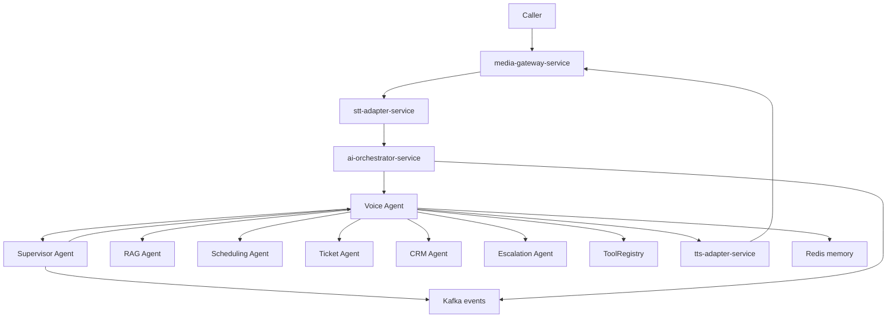
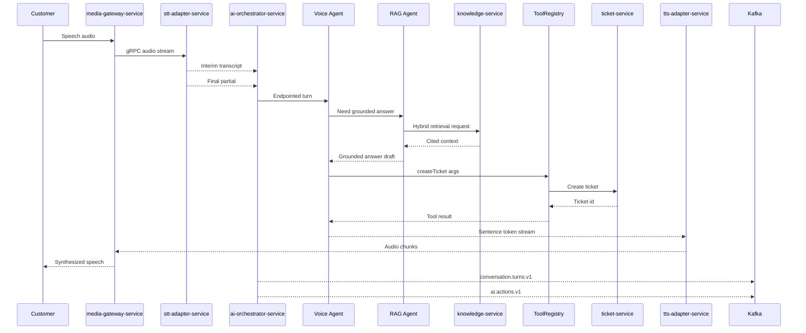
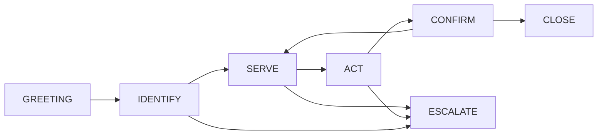

# 15. AI Agent Architecture

VoxAgent implements its agentic runtime inside `ai-orchestrator-service`, the latency-critical conversation brain in the hot path. Agents are not deployed as one microservice per role. They are an in-process Spring AI agent graph with a shared `ToolRegistry`, shared conversation state, Redis-backed memory, and gRPC streaming integration to `media-gateway-service`, `stt-adapter-service`, and `tts-adapter-service`.

The non-negotiable boundary is the live voice loop: `media-gateway-service` ↔ `stt-adapter-service` ↔ `ai-orchestrator-service` ↔ `tts-adapter-service` uses gRPC bidirectional streaming and WebSockets only. Kafka is used after the turn for durable events such as `conversation.turns.v1`, `ai.actions.v1`, `escalation.events.v1`, and `audit.events.v1`; it is never used to move audio, partial transcripts, LLM tokens, or TTS chunks on the hot path.

## 15.1 Agent Roster and Runtime Placement

All agents below are hosted inside `ai-orchestrator-service` as an in-process graph. Each agent is a logical role with prompt profile, tools, policies, and routing rules, not a separately deployed service.

| Agent | Responsibility | Latency posture | Primary integrations |
|---|---|---:|---|
| Supervisor Agent | Routes intents, monitors quality, escalates, runs post-turn QA | Mostly off hot path | `conversation.turns.v1`, `audit.events.v1`, `agent-routing-service` |
| Voice Agent | Conversation lead for live calls; owns tone, turn-taking, endpointing decision, and response streaming | Hot path | `stt-adapter-service`, `tts-adapter-service`, Spring AI `ChatClient` |
| RAG Agent | Retrieves grounded knowledge and assembles cited context | Warm path within turn | `knowledge-service`, PostgreSQL 16 with pgvector, Redis 7 |
| Scheduling Agent | Books, reschedules, and cancels appointments | Warm path tool path | `scheduling-service`, `appointment.events.v1` |
| Ticket Agent | Creates and updates support tickets | Warm path tool path | `ticket-service`, `ticket.events.v1` |
| CRM Agent | Reads and updates customer CRM context | Warm path or async | `crm-integration-service`, `crm.sync.commands.v1` |
| Escalation Agent | Transfers to human agents and packages context | Warm path | `agent-routing-service`, `escalation.events.v1` |

### Agent-per-microservice antipattern

A microservice per agent looks attractive on an org chart, but it is the wrong default for VoxAgent's p50 ≤800 ms voice-to-voice target. It adds network hops, serialization, cross-service retries, independent caches, distributed traces for intra-turn reasoning, duplicated prompt state, and failure modes that are indistinguishable to a caller as awkward silence. It also tempts teams to use Kafka for agent handoffs; that directly violates the hot-path rule.

The recommended model is in-process orchestration in `ai-orchestrator-service` with Spring AI. Keep agent boundaries at the code and policy level, not the deployment level. Split to separate services only for true bounded contexts that already exist in the contract, such as `knowledge-service`, `scheduling-service`, `ticket-service`, `crm-integration-service`, and `agent-routing-service`.

### Architecture Review (self-critique)

The in-process graph improves latency and consistency but concentrates runtime complexity in `ai-orchestrator-service`. This creates a risk of a monolithic brain with large blast radius. The mitigation is strict package boundaries, per-agent policy tests, feature flags from `config-service`, bounded thread pools for tools, and aggressive OpenTelemetry spans. A future split is acceptable only when a role is no longer latency-sensitive and has a stable API boundary.

## 15.2 Orchestration Model

Three orchestration styles were evaluated.

| Model | Strengths | Flaws | Fit for VoxAgent |
|---|---|---|---|
| Supervisor-router pattern | Clear routing, policy control, specialist delegation, auditable decisions | Extra LLM call if used for every turn; can become a bottleneck | Good for intent routing, escalations, QA, and multi-step tasks |
| Planner-executor | Strong for complex workflows with multiple dependent actions | Too slow and verbose for live voice; plans can drift from caller intent | Use sparingly for asynchronous or long-running workflows |
| Single agent with tools | Lowest latency, simplest streaming, best conversational continuity | Can overload one prompt; weaker separation of duties | Best for latency-critical turns |

Recommendation: use a hybrid.

1. The Voice Agent leads the live turn and has direct access to safe, low-latency tools through `ToolRegistry`.
2. The Supervisor Agent is invoked only when routing uncertainty, policy risk, escalation, or multi-step task complexity justifies the cost.
3. Specialist sub-agents run in-process and are invoked as structured functions, not remote agent services.
4. An asynchronous Supervisor Agent consumes `conversation.turns.v1` after the turn for QA, coaching signals, compliance checks, and conversation health scoring.

### Hot path decision rule

- If the answer can be produced from current memory, safe tool metadata, or one fast RAG lookup, the Voice Agent handles it directly.
- If the action is irreversible, regulated, or multi-step, the Voice Agent confirms intent and delegates to a specialist sub-agent.
- If a tool call is expected to exceed 700 ms, the Voice Agent emits a filler acknowledgement through `tts-adapter-service` while the tool continues.
- If confidence is below threshold or caller sentiment degrades, Escalation Agent prepares handoff through `agent-routing-service`.

### Architecture Review (self-critique)

The hybrid model can degrade into hidden planner-executor behavior if every specialist delegation triggers more reasoning. Enforce a maximum intra-turn reasoning budget, capture tool latency histograms, and require prompt reviews for new agent routes. The Supervisor Agent must not sit in front of every turn by default; otherwise the architecture spends the latency budget before retrieval or TTS begins.

## 15.3 Spring AI Implementation Notes

### ChatClient composition

`ai-orchestrator-service` should construct role-specific Spring AI `ChatClient` instances backed by Azure OpenAI primary and OpenAI fallback, honoring D5. Model access is abstracted through Spring AI `ChatModel` so deployments can move between Azure OpenAI, OpenAI fallback, and future models without rewriting agent code.

Implementation pattern:

- `VoiceAgentChatClient` for latency-critical streaming responses.
- `SupervisorAgentChatClient` for routing, QA, and risk scoring.
- `RagAgentChatClient` for query rewrite and answer synthesis where needed.
- Per-tenant system prompts and policy fragments loaded from `config-service`.
- Model, temperature, max token, tool allow-list, and escalation thresholds scoped by `org_id`.

### Tool callbacks and ToolRegistry

Spring AI `@Tool` beans expose business capabilities to agents. These are not called directly from prompts. They are registered through a `ToolRegistry` abstraction as required by D11.

Expected tool categories:

| Tool category | Backing service | Notes |
|---|---|---|
| Knowledge retrieval | `knowledge-service` | RAG lookup with citations and confidence |
| Ticket actions | `ticket-service` | Create, update, classify, attach summary |
| Scheduling actions | `scheduling-service` | Availability lookup, appointment booking, cancellation |
| CRM lookup | `crm-integration-service` | Customer profile, entitlements, prior cases |
| Escalation | `agent-routing-service` | Human handoff, queue selection, context package |
| Notification | `notification-service` | SMS or email follow-up via `notification.commands.v1` |

The `ToolRegistry` enforces:

- Tenant-level allow-lists from `config-service`.
- Tool argument JSON schema validation before invocation.
- Per-tool timeout and circuit breaker.
- Idempotency keys for actions that mutate state.
- Confirmation requirements for irreversible actions.
- Audit events to `audit.events.v1` for tool decisions and denied tool calls.
- Future MCP server adapters without changing agent prompts.

### Advisors API for memory and guardrails

Use Spring AI Advisors around each `ChatClient` invocation:

- Memory Advisor: injects Redis sliding window, compressed summaries, and key facts.
- Guardrail Advisor: applies input risk scoring, prompt-injection flags, and output validation.
- Tool Policy Advisor: injects tenant tool policy and blocks disallowed tools.
- Observability Advisor: adds callId, orgId, turnId, model, latency, token, and tool spans.

### Conversation memory design

Memory is split by durability and latency:

| Memory type | Store | Purpose | Recovery behavior |
|---|---|---|---|
| Sliding window | Redis 7 | Last N turns for low-latency context | Reconstructed from `conversation-service` if missing |
| Running summary | Redis 7 and PostgreSQL 16 | Compressed facts and intent history | Reloaded by callId on pod restart |
| Durable transcript | `conversation-service` | Source of truth for transcript and summary | Written from `conversation.turns.v1` |
| Customer profile | `crm-integration-service` | Long-term customer context | Fetched by tool with tenant policy |

Sliding windows should be small. Voice latency is more sensitive to prompt bloat than chat latency. Prefer summary compression after meaningful state changes and keep exact last turns for pronoun resolution, confirmation, and barge-in repair.

### Architecture Review (self-critique)

Spring AI is still evolving, and relying too heavily on framework abstractions can hide provider-specific streaming behavior. Keep provider adapters thin but observable, run compatibility tests for Azure OpenAI primary and OpenAI fallback, and avoid encoding business semantics in Advisor side effects. The `ToolRegistry` is a strategic seam; if it becomes a generic service locator, it will undermine policy clarity.

## 15.4 Turn Requiring RAG and Ticket Tool

Operational notes:

- `knowledge-service` is warm-path. It can be called in-turn but must have a strict timeout and fallback behavior.
- Ticket creation should be idempotent with callId plus turnId plus action type.
- The Voice Agent should speak the useful answer first when ticket creation is slow, then confirm ticket creation after the tool result arrives.
- If retrieval confidence is low, the Voice Agent should say it is not certain and offer human escalation.

### Architecture Review (self-critique)

The sequence still risks exceeding the 250–450 ms AI orchestrator budget if retrieval and ticket creation are serialized. The production implementation should overlap safe work: start TTS for acknowledgement, issue retrieval with tight deadlines, and defer ticket mutation until confirmation when appropriate. For high-volume tenants, cache frequent RAG answers and prefetch CRM context at call start.

## 15.5 Per-call Conversation State Machine

State lives in Redis 7 under a call-scoped key such as `org:{orgId}:call:{callId}:state`. Redis is not the source of truth per D3; state must be reconstructible from `call.events.v1`, `conversation.turns.v1`, and durable records in `conversation-service`.

| State | Purpose | Exit conditions |
|---|---|---|
| GREETING | Start call, consent, brand voice, initial intent | Consent captured or required disclosure completed |
| IDENTIFY | Verify caller identity and tenant-specific eligibility | Identity verified, low-risk anonymous path, or escalation |
| SERVE | Answer questions and gather details | Intent fulfilled, action required, or escalation |
| ACT | Invoke tools such as ticket, schedule, CRM update | Tool success, tool failure, confirmation required |
| CONFIRM | Confirm action, summarize, ask next need | Caller accepts, asks more, corrects, or escalates |
| CLOSE | End call with summary and next steps | Hangup or completed closure |
| ESCALATE | Transfer to human with context | `agent-routing-service` accepts handoff |

### Crash recovery

On pod crash or reschedule:

1. `media-gateway-service` reconnects the call stream to another `ai-orchestrator-service` pod through service discovery.
2. The new pod reads call state, memory window, and summary from Redis.
3. If Redis state is missing, the pod reconstructs from recent durable turns in `conversation-service` and call lifecycle events.
4. The Voice Agent emits a repair phrase only if the caller was mid-turn, such as “Thanks for holding, I’m back with you.”
5. Duplicate actions are suppressed using idempotency keys persisted by backing services.

### Architecture Review (self-critique)

Redis recovery is fast but not perfect during network partitions or evictions. The design must treat Redis as a cache and state accelerator, not as a ledger. The cost is more reconstruction logic in `conversation-service` and action services. That cost is justified because putting the state machine directly in PostgreSQL for every turn would add tail latency and lock contention to the hot path.

## 15.6 Future MCP Integration and Agent Marketplace

D11 requires all tools to be Spring AI `@Tool` beans behind `ToolRegistry` that can front MCP servers later. The MCP integration should be incremental:

1. Define stable internal `ToolDescriptor`, `ToolPolicy`, `ToolInvocation`, and `ToolResult` contracts.
2. Add an MCP adapter that maps MCP tool metadata into `ToolDescriptor`.
3. Run MCP servers outside the hot path first for CRM enrichment, analytics, and back-office actions.
4. Permit hot-path MCP tools only after latency, isolation, and policy conformance tests.
5. Publish tool invocation decisions to `audit.events.v1`.

### Agent marketplace implications

A marketplace for tenant-installed agents or tools creates major enterprise risk. Third-party tools can exfiltrate PII, inject prompt instructions through tool descriptions, create hidden spending, or perform actions that exceed tenant policy.

Required mitigations:

- Marketplace tools run in sandboxed workloads with network egress allow-lists.
- Tool manifests are signed and versioned.
- Tool descriptions are treated as untrusted data, not system instructions.
- Each tool receives minimum necessary scoped credentials from Vault or Azure Key Vault.
- Tenant administrators approve tool categories and spending limits.
- Irreversible actions require caller confirmation and policy approval.
- Tool outputs are validated and summarized before reaching the Voice Agent prompt.
- Runtime anomaly detection flags unusual tool chains and high-volume invocations.

### Architecture Review (self-critique)

MCP improves extensibility but expands the attack surface. The safest recommendation is to keep first-party tools in-process and use MCP initially for non-critical back-office capabilities. The platform should not allow arbitrary marketplace tools on live calls until sandboxing, signing, audit, latency SLOs, and tenant approvals are enforced by default.
