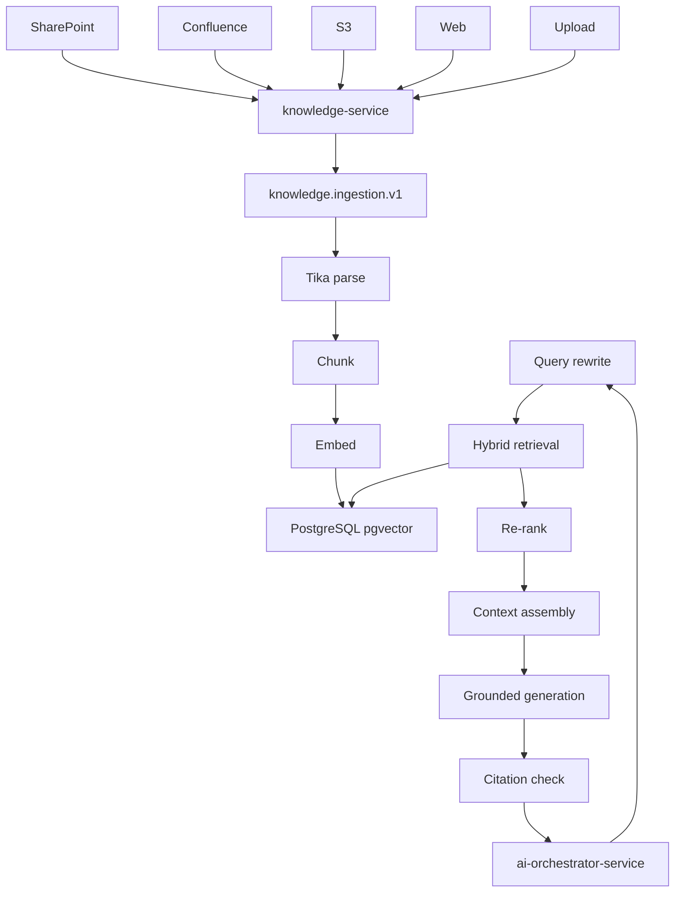
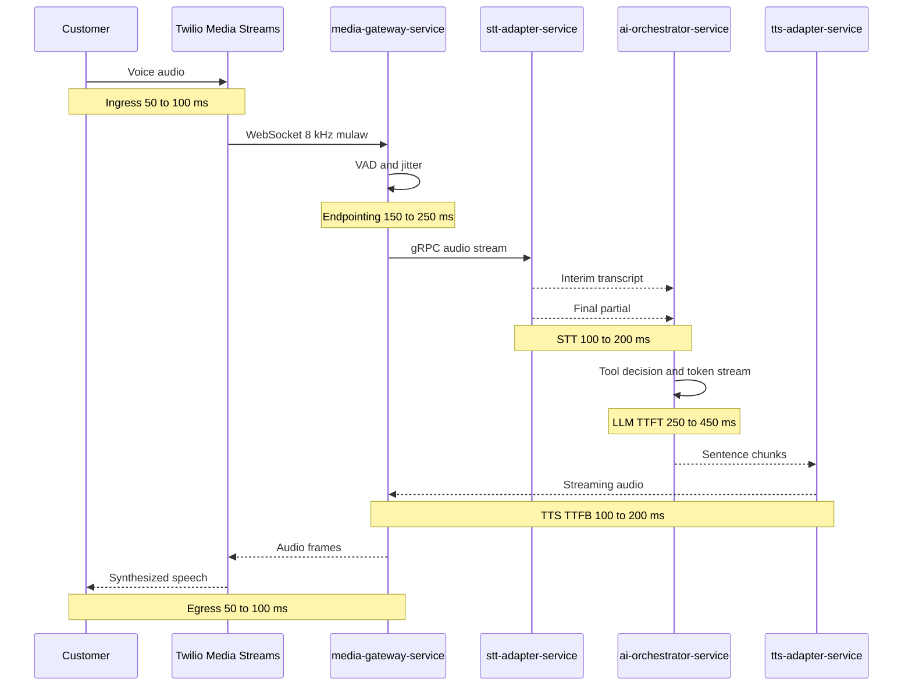

# 16. RAG Architecture

VoxAgent uses retrieval augmented generation to answer tenant-specific questions with citations while preserving the p50 ≤800 ms voice-to-voice target. The architecture separates ingestion, indexing, retrieval, and answer validation. `knowledge-service` owns ingestion and retrieval; `ai-orchestrator-service` consumes retrieved context through in-turn tools exposed via `ToolRegistry`.

Kafka is used for asynchronous ingestion through `knowledge.ingestion.v1`. Kafka is not used in the live audio loop. The hot path remains gRPC streaming and WebSockets among `media-gateway-service`, `stt-adapter-service`, `ai-orchestrator-service`, and `tts-adapter-service`.

## 16.1 End-to-end RAG Flow

Ingestion path:

1. Connectors ingest from SharePoint, Confluence, S3, web crawl, and upload.
2. `knowledge-service` validates tenant authorization and creates `KnowledgeSource`, `KnowledgeDocument`, and ingestion jobs.
3. `knowledge-service` publishes `knowledge.ingestion.v1` keyed by documentId.
4. Workers parse content with Apache Tika, normalize text, extract metadata, detect language, and remove boilerplate.
5. Chunking produces `DocumentChunk` records with org_id, documentId, chunkId, heading path, page anchors, version, hash, and ACL metadata.
6. Embeddings are written to PostgreSQL 16 with pgvector under Row-Level Security.

Query path:

1. Voice Agent sends caller question, call context, tenant, language, and policy to the RAG Agent.
2. Query rewrite normalizes ASR artifacts, expands abbreviations, and generates search variants.
3. Hybrid retrieval runs BM25 and vector search with org_id filter and document ACL constraints.
4. Reciprocal Rank Fusion combines lexical and semantic results.
5. Re-ranker selects the smallest useful context set.
6. Context assembly includes citations, source metadata, and freshness signals.
7. Grounded generation uses answer-from-context-only prompting.
8. Citation check verifies answer claims map to retrieved chunks.
9. Low confidence returns a safe fallback such as “I’m not fully certain. Let me connect you to a human.”

### Architecture Review (self-critique)

The RAG flow is correct but can exceed turn latency if every question performs query rewrite, hybrid retrieval, re-ranking, generation, and citation verification synchronously. The recommendation is two-tier behavior: latency-critical FAQ retrieval uses cached retrieval and smaller context; complex policy questions use the full path and trigger filler speech if the tool call exceeds 700 ms. Accuracy must not be sacrificed silently for latency.

## 16.2 Chunking Strategy

Recommended chunking:

- Semantic and heading-aware chunking.
- 300–500 tokens per chunk for policy, FAQ, and procedural documents.
- 15% overlap to preserve references across boundaries.
- Preserve heading path, section title, source URL, page number, ACL, timestamp, and document version.
- Split tables into row groups with header carry-forward.
- Keep short FAQ pairs atomic even if below normal chunk size.
- Store parent document summaries for context expansion.

Fixed-size chunking is a weak default for enterprise voice. It slices procedures across steps, separates definitions from exceptions, and increases hallucination risk because a retrieved chunk may contain half of a policy. It is only acceptable as a fallback for unstructured documents after semantic parsing fails.

Alternatives:

1. Fixed-size chunks of 512 tokens with overlap. Simple and cheap, but lower precision for structured documents.
2. Hierarchical chunks with small child chunks and larger parent summaries. More complex, but better for answers requiring broader context.
3. Semantic boundary chunks using headings, paragraphs, and embeddings. Best default for VoxAgent.

Recommendation: use semantic and heading-aware chunks as default, add hierarchical parent summaries for long policy documents, and keep fixed-size fallback only for noisy sources.

### Architecture Review (self-critique)

Semantic chunking requires better parsers and can produce inconsistent chunk sizes. That complicates evaluation and caching. However, voice answers are short and high-risk when wrong; preserving meaning beats implementation simplicity. Track retrieval hit rate by source type and auto-flag documents with poor chunk quality.

## 16.3 Embedding Model Choice

The platform should support Azure OpenAI embeddings as the enterprise default under D5, with OpenAI fallback through model abstraction.

| Model | Strengths | Tradeoffs | Recommendation |
|---|---|---|---|
| `text-embedding-3-large` | Better recall, multilingual strength, richer semantic separation | Higher cost, larger vectors, more storage and index memory | Default for enterprise knowledge and multilingual tenants |
| `text-embedding-3-small` | Lower cost, lower latency, smaller storage footprint | Lower recall on nuanced policy and long-tail queries | Use for FAQ-heavy tenants and cost-sensitive workloads |

Dimension tradeoff:

- Higher dimensions improve recall but increase pgvector index size, cache pressure, and query latency.
- If using reduced dimensions, validate with tenant-specific golden Q&A sets before rollout.
- Store embedding model and dimension per `DocumentChunk` version to support migrations.

Operational recommendation:

- Start with `text-embedding-3-large` for enterprise tenants where correctness matters.
- Allow `text-embedding-3-small` per tenant for FAQ workloads with measured retrieval quality.
- Revisit pgvector per D4 when vector count exceeds 20M or retrieval p95 exceeds 150 ms; evaluate Qdrant or Pinecone then.

### Architecture Review (self-critique)

Choosing the larger model can hide poor retrieval design behind brute-force semantics and inflate cost. The platform needs per-tenant retrieval evals, cost attribution, and explicit downgrade paths. Model selection should be data-driven rather than treated as a permanent architecture decision.

## 16.4 Hybrid Search and Fusion

VoxAgent should use hybrid retrieval combining:

- BM25 for exact product names, policy codes, ticket categories, phone numbers, and acronyms.
- Vector search for paraphrase, ASR noise, multilingual similarity, and semantic intent.
- Metadata filters for org_id, ACL, document type, language, effective dates, and source freshness.

Use Reciprocal Rank Fusion to combine lexical and vector rankings. RRF is stable, explainable, and less sensitive to raw score calibration differences than weighted score blending.

Retrieval defaults:

- Top 30 lexical candidates.
- Top 30 vector candidates.
- RRF fuse to top 12.
- Re-rank to top 4–6 chunks for context assembly.
- Hard cap context tokens for the Voice Agent to protect TTS latency.

### Architecture Review (self-critique)

Hybrid search is more complex than vector-only retrieval and requires tuning. The complexity is justified because voice transcripts contain ASR errors while enterprise documents contain exact identifiers. A vector-only design will fail on codes and names; BM25-only will fail on paraphrase. Monitor both channels separately to catch regressions.

## 16.5 Re-ranking Options

| Option | Strengths | Flaws | Fit |
|---|---|---|---|
| Cross-encoder re-ranker | High precision, deterministic scoring, smaller prompt context | Adds model hosting or external call latency | Best default for high-confidence retrieval if latency is controlled |
| LLM re-rank | Flexible reasoning over nuanced context | Expensive, slower, less deterministic, prompt-injection exposure | Use for offline curation or slow paths, not default hot path |
| Cohere rerank | Strong managed quality, simple API | Additional vendor and data path, compliance review | Good fallback if enterprise approvals allow |

Recommendation: use a compact cross-encoder re-ranker for top candidates where latency allows. Skip re-ranking for cached FAQs and very high-confidence single-source matches. Avoid LLM re-rank in the hot path unless the call has already moved into a slow tool path with filler speech.

### Architecture Review (self-critique)

A cross-encoder introduces another model lifecycle and deployment concern. It must be warmed, autoscaled, and monitored like any production model. If the team cannot operate it reliably, use RRF plus conservative confidence thresholds until a managed re-ranker is approved.

## 16.6 Freshness and Incremental Re-indexing

Freshness requirements:

- Every `KnowledgeDocument` carries source version, content hash, last seen timestamp, effective date, expiration date, and ACL hash.
- Connectors perform incremental sync using source cursors and etags when available.
- Changed documents produce new chunk versions; stale chunk versions are tombstoned after validation.
- Deleted source documents trigger hard delete or crypto-shredding according to tenant policy.
- Index updates invalidate Redis semantic cache entries for the org and affected source.

For high-risk knowledge such as pricing, medical office policy, or refund policy, the answer should include freshness metadata in hidden context and fail closed when source freshness is outside the tenant threshold.

### Architecture Review (self-critique)

Incremental indexing is operationally harder than nightly full rebuilds. Full rebuilds are simpler but create stale answers and cache invalidation storms. Incremental indexing is the correct production default, with scheduled reconciliation jobs to detect missed source changes.

## 16.7 Multi-tenant Vector Isolation

Every vector row carries `org_id` and is protected by PostgreSQL Row-Level Security. Retrieval also applies application-level tenant context, source ACL filters, and rate limits. This follows the contract baseline: every table carries org_id, and multi-tenancy is enforced by PostgreSQL RLS plus application-level tenant context.

Required safeguards:

- Set tenant context at transaction start and reject missing org_id.
- Include org_id in vector index strategy and query predicates.
- Filter by source ACL and document visibility before re-ranking.
- Prevent cross-tenant semantic cache hits by including org_id and embedding model in cache keys.
- Emit denied access attempts to `audit.events.v1`.
- Provide dedicated schema or dedicated DB for enterprise tier when required by D9.

### Architecture Review (self-critique)

RLS reduces blast radius but does not eliminate application bugs or operational mistakes. Test for cross-tenant leakage with adversarial integration tests and seed data. For regulated tenants, shared-cluster RLS may not be sufficient; offer dedicated DB isolation as a product tier.

## 16.8 Guardrails and Hallucination Prevention

RAG answers must follow a grounded-answer-only policy:

- Answer only from retrieved context.
- Include citations internally and externally when channel supports it.
- Refuse or escalate when context is insufficient.
- Distinguish policy facts from generated conversational phrasing.
- Never invent ticket status, appointment availability, pricing, refunds, or medical advice.

Controls:

1. Answer-from-context-only system prompt.
2. Citation verification that maps claims to chunk IDs.
3. Retrieval confidence thresholds per tenant and source type.
4. Groundedness scoring for high-stakes answers.
5. Human escalation fallback for low confidence.
6. Eval harness with golden Q&A sets and RAGAS-style metrics in CI.

CI metrics should include faithfulness, answer relevancy, context precision, context recall, citation accuracy, refusal accuracy, and latency. Regression thresholds should block releases for critical tenants.

### Architecture Review (self-critique)

Automated groundedness scoring is imperfect and can create false confidence. It must be paired with human review of sampled calls and incident-driven test additions. The strongest control is product behavior: when unsure, say so and escalate rather than generating a polished but unsupported answer.

## 16.9 Caching Strategy

### Redis semantic cache

Semantic cache keys include org_id, normalized query embedding, language, model, policy version, source freshness watermark, and answer type. Cache values include answer text, citations, confidence, expiry, and source document versions.

Policy:

- Per-org cache namespace.
- TTL based on source volatility.
- Invalidate on document update, ACL change, policy change, or embedding model migration.
- Require high similarity threshold of 0.97 or above.
- Restrict semantic cache to FAQs and low-risk informational answers.

Staleness risk is real. A cached answer can remain fluent after a policy changes. That is more dangerous in voice because callers often cannot inspect citations. Use strict invalidation and avoid caching high-risk commitments.

### Embedding cache

Embedding cache stores normalized text hash to embedding vector by org_id, model, dimension, and language. It reduces cost during ingestion retries, query rewrites, and duplicate FAQs.

### False positives in voice

Semantic-cache false positives are worse in voice than chat because a caller may not see citations, may not have time to compare details, and may act immediately. Recommendation: use semantic cache only for stable FAQs, require 0.97+ similarity, and verify cached citations are still current before playback.

### Architecture Review (self-critique)

Caching is necessary for p50 latency but can undermine correctness. The platform should treat cache hit rate as secondary to verified answer quality. Cache observability must report false-positive incidents, stale hit attempts, and policy-driven bypasses.

# 17. Voice Processing Flow

VoxAgent uses a cascaded STT → LLM → TTS pipeline per D7. The design favors controllability, guardrails, tool calling, and vendor swap over direct speech-to-speech. A future speech-to-speech option must sit behind a `VoicePipeline` abstraction and must preserve safety, audit, tool policy, and tenant controls.

## 17.1 Exact Streaming Flow

Live turn path:

1. Customer voice enters PSTN and Twilio Media Streams as WebSocket audio at 8 kHz mulaw.
2. `media-gateway-service` terminates the Twilio stream, performs thin relay, VAD assistance, jitter buffering, and barge-in detection.
3. `media-gateway-service` sends audio over gRPC stream to `stt-adapter-service`.
4. `stt-adapter-service` uses Deepgram streaming for interim results and final partials, with Azure Speech fallback.
5. `ai-orchestrator-service` receives transcripts, performs endpointing decision, invokes the Voice Agent, streams LLM tokens from Azure OpenAI primary, and calls tools as needed.
6. `tts-adapter-service` performs sentence-chunked streaming synthesis with Azure Speech TTS default or ElevenLabs premium.
7. `media-gateway-service` sends synthesized audio back to Twilio, then to the customer.

Budget target from end of user speech to first synthesized audio: p50 ≤800 ms and p95 ≤1500 ms.

### Architecture Review (self-critique)

The budget is aggressive for cascaded voice, especially when RAG or tools are involved. The architecture depends on streaming everywhere, low-prompt token counts, warm connections, semantic response cache, and early TTS chunks. If those optimizations are not implemented together, the documented budget is aspirational rather than achievable.

## 17.2 VAD and Endpointing

Endpointing decides when the caller has finished enough speech for the agent to respond. A poor endpointing strategy creates either interruptions or dead air.

Alternatives:

| Strategy | Strengths | Flaws |
|---|---|---|
| Fixed silence timeout | Simple, predictable, cheap | Fails with hesitant speakers, noisy lines, and different languages |
| Semantic endpointing | Uses transcript meaning to infer completion | Requires interim STT quality and model logic; can add latency |
| Adaptive endpointing | Combines VAD, silence, ASR confidence, punctuation, intent, and caller history | More complex but best caller experience |

Recommendation: adaptive endpointing. Start with VAD plus dynamic silence thresholds, then incorporate semantic endpointing signals from interim transcripts. Use shorter thresholds for yes or no confirmations and longer thresholds for free-form explanations.

Endpointing signals:

- Energy and silence from `media-gateway-service`.
- Interim transcript stability from `stt-adapter-service`.
- Punctuation and final partial confidence from Deepgram.
- Intent completeness from `ai-orchestrator-service`.
- Barge-in state and current TTS playback state.

### Architecture Review (self-critique)

Adaptive endpointing can become a pile of heuristics. It needs offline replay tests with real calls and per-tenant tuning. Keep the initial implementation explainable and instrument false cutoffs, long waits, and barge-in rates.

## 17.3 Barge-in Handling

Barge-in is mandatory for natural voice. When the customer speaks during TTS:

1. `media-gateway-service` detects speech above threshold while output audio is active.
2. It sends a barge-in control frame to `ai-orchestrator-service` and `tts-adapter-service`.
3. `tts-adapter-service` kills the current synthesis stream.
4. `media-gateway-service` flushes the outbound jitter buffer.
5. `ai-orchestrator-service` cancels in-flight LLM generation and tool calls where safe.
6. The Voice Agent treats the caller input as the new priority turn and repairs context.

Cancellation rules:

- Read-only tools can be abandoned.
- Mutating tools require idempotency and confirmation checkpoints.
- If a mutating action already committed, the next response must disclose the outcome.

### Architecture Review (self-critique)

Barge-in cancellation is easy to claim and hard to implement safely. The dangerous case is a caller interrupting during an irreversible action. The architecture must separate speech cancellation from business action cancellation and rely on idempotent action APIs plus confirmation policy.

## 17.4 Backpressure and Audio Buffering

Backpressure strategy:

- Use bounded direct buffers in `media-gateway-service` for inbound and outbound audio.
- Drop or compress non-critical interim frames before allowing unbounded queues.
- Propagate gRPC flow-control signals from downstream services.
- Keep jitter buffers small and observable.
- Isolate hot-path services in namespace `voice-core` on node pool `rt-voice` with Guaranteed QoS, CPU pinning, and no throttling.
- Prefer fail-fast degradation over accumulating seconds of delayed audio.

Buffer ownership:

| Component | Buffer responsibility |
|---|---|
| Twilio Media Streams | PSTN media ingress and egress frames |
| `media-gateway-service` | Thin jitter buffer, VAD frames, output flush on barge-in |
| `stt-adapter-service` | Provider stream buffer and transcript stabilization |
| `ai-orchestrator-service` | Token stream and tool timeout coordination |
| `tts-adapter-service` | Sentence chunks and audio frame synthesis |

### Architecture Review (self-critique)

JVM services can accidentally allocate in ways that hurt tail latency. Backpressure must be validated under packet loss, provider slowdown, and noisy-neighbor scenarios. Use load tests with real audio cadence rather than HTTP-only benchmarks.

## 17.5 Filler Utterances During Slow Tool Calls

The contract mandates filler acknowledgements for tool calls over 700 ms. The Voice Agent should use short, honest phrases:

- “Let me check that for you.”
- “I’m looking up your appointment now.”
- “One moment while I create that ticket.”

Rules:

- Do not use filler to hide uncertainty or invent progress.
- Do not speak over the caller if barge-in is detected.
- Avoid repeated filler loops; after one or two, offer escalation or callback.
- Continue streaming tool progress only when it improves caller trust.

### Architecture Review (self-critique)

Filler speech can mask latency but also irritate callers if overused. Measure silence duration, filler frequency, abandonment, and sentiment. The better fix is reducing slow tool paths; filler is a safety valve, not a performance strategy.

## 17.6 Multi-language Support

Per-call language handling:

1. Detect language from initial STT plus tenant configuration.
2. Store selected locale in Redis call state.
3. Route STT to Deepgram language configuration or Azure Speech fallback.
4. Select TTS voice from Azure Speech TTS default or ElevenLabs premium based on tenant policy.
5. Switch locale only after confidence threshold or explicit caller request.
6. Preserve original language in transcripts and summaries.

Additional considerations:

- Retrieval should filter or boost documents by language.
- Translation should not bypass groundedness checks.
- Mixed-language calls need stable memory keys for names, dates, and product terms.
- Human escalation should include language preference for `agent-routing-service`.

### Architecture Review (self-critique)

Language detection errors can derail the entire call. The platform should prefer tenant default at call start, switch cautiously, and expose a correction path. Multilingual quality must be evaluated per language, not inferred from English metrics.

## 17.7 Speech-to-speech Future Behind VoicePipeline

D7 selects cascaded STT → LLM → TTS now because it supports guardrails, tool-calling maturity, and per-stage vendor swap. Speech-to-speech can reduce latency but weakens inspection points and may complicate enterprise compliance.

`VoicePipeline` abstraction should define:

- Input audio stream.
- Transcript events where available.
- Agent intent and tool request events.
- Output audio stream.
- Barge-in and cancellation controls.
- Guardrail hooks.
- Audit metadata.

Alternatives:

1. Continue cascaded pipeline. Best control and audit, higher latency.
2. Adopt full speech-to-speech model for all turns. Lowest latency, weaker tool and guardrail maturity.
3. Hybrid pipeline where simple conversational turns use speech-to-speech and regulated actions fall back to cascaded. Promising but complex.

Recommendation: keep cascaded pipeline as default through production launch. Pilot speech-to-speech behind `VoicePipeline` only for low-risk tenants and non-mutating intents after safety parity is proven.

### Architecture Review (self-critique)

A `VoicePipeline` abstraction can become leaky if speech-to-speech providers expose incompatible semantics. Define the abstraction around VoxAgent safety and audit requirements, not provider APIs. If a provider cannot emit sufficient events for policy enforcement, it should not be used for enterprise actions.

## 17.8 JVM Tuning for Hot Path

D8 accepts Java 21 for the media gateway but explicitly critiques JVM use in RTP and jitter paths. Keep `media-gateway-service` thin and isolate it on dedicated real-time nodes.

Recommended JVM posture:

- Java 21 with ZGC for low pause times.
- Virtual threads for connection and request orchestration, not for CPU-heavy audio processing loops.
- Direct byte buffers for audio frames to reduce heap churn.
- Preallocated bounded buffers for jitter and frame queues.
- Warm up STT, TTS, and Azure OpenAI clients during pod readiness.
- Avoid reflection-heavy code in hot frame loops.
- Use native image only after measuring startup and throughput tradeoffs.
- Pin CPU and disable Kubernetes CPU throttling for hot-path pods.
- Keep heap sizing predictable and monitor allocation rate, safepoints, and GC pauses.

Fallback option: if tail latency or media correctness remains poor, move media handling to LiveKit or another off-the-shelf media server while keeping `media-gateway-service` as signaling and policy relay.

### Architecture Review (self-critique)

Java can meet the requirement only if the media gateway remains thin. If teams add transcoding, recording, analytics, or complex DSP inside `media-gateway-service`, D8 should be revisited. Dedicated media infrastructure is preferable to heroic JVM tuning once media complexity grows.
