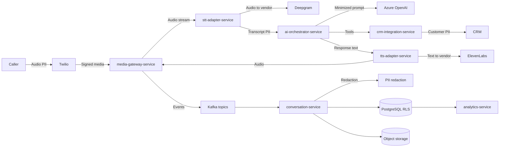
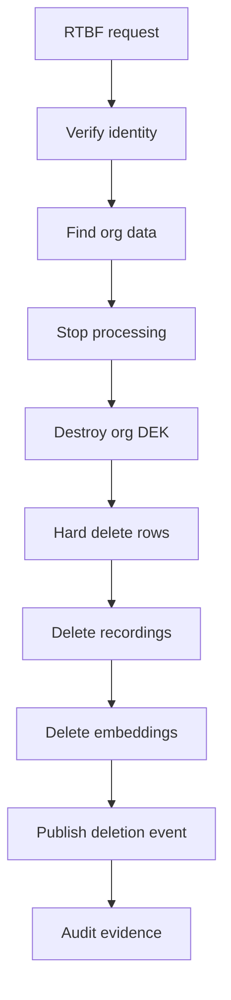
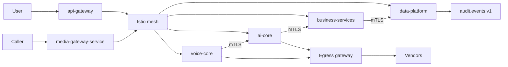

# 18. Security Architecture

VoxAgent security is designed around Zero Trust, tenant isolation, explicit identity, privacy-by-design, and deterministic auditability. This document extends the architecture contract and uses the canonical services, namespaces, topics, and decisions D1–D11. The live voice loop remains `media-gateway-service` ↔ `stt-adapter-service` ↔ `ai-orchestrator-service` ↔ `tts-adapter-service` over gRPC bidirectional streaming or WebSockets only; Kafka is async only.

## 18.1 Identity and Authentication

### Identity provider options

| Criterion | Keycloak | Microsoft Entra ID | Review |
|---|---|---|---|
| Tenant federation | Strong, flexible broker support | Strong for enterprise Microsoft tenants | Entra ID wins for Microsoft-native enterprise buyers; Keycloak wins for product-controlled SaaS identity. |
| Operational ownership | VoxAgent operates, patches, backs up | Microsoft managed | Keycloak increases SRE burden and becomes tier-0 infrastructure. |
| Custom realms and flows | Excellent | Good, but constrained by Entra patterns | Keycloak supports bespoke SaaS onboarding and non-Microsoft tenants more naturally. |
| Conditional access | Requires plugins or external policy | Mature conditional access, device posture, risk signals | Entra ID is stronger for workforce access. |
| B2B and enterprise SSO | Good via SAML/OIDC | Excellent | Entra ID has lower friction for large enterprises. |
| Cost and lock-in | Lower license cost, higher ops cost | License and ecosystem lock-in | Either choice creates migration risk through issuer and group-claim semantics. |
| Multi-region DR | Self-designed | Managed | Keycloak DR is often underestimated. |

**Alternatives considered**

1. **Keycloak as primary SaaS IdP with enterprise federation to Entra ID, Okta, and Google Workspace.** Best product control, consistent claims, and non-Microsoft coverage.
2. **Entra ID as primary workforce and customer identity.** Best for Microsoft-centered B2B deployments, weaker as the only answer for heterogeneous SaaS tenants.
3. **Hybrid.** Use Keycloak as VoxAgent tenant identity broker and allow Entra ID federation per enterprise org; use native Entra ID for internal staff.

**Recommendation:** Use **Keycloak as the product identity broker** for VoxAgent tenants and federation, with **Entra ID for internal workforce access** and optional customer federation. This preserves SaaS portability while satisfying Microsoft enterprise SSO. Put `identity-service` behind the same OIDC contract so a future Entra External ID migration is possible.

### Token model

Access tokens are JWTs with a maximum lifetime of 15 minutes. Refresh tokens are rotating, sender-constrained where possible, and revoked on reuse detection.

Required JWT claims:

```json
{
  "iss": "https://id.voxagent.example/realms/{realm}",
  "aud": ["voxagent-api", "api-gateway"],
  "sub": "uuidv7-user-or-client-id",
  "org_id": "uuidv7-organization-id",
  "roles": ["Supervisor"],
  "scopes": ["calls:read", "calls:monitor", "tickets:write"],
  "data_scope": ["region:in", "department:support"],
  "tenant_tier": "enterprise",
  "jti": "uuidv7-token-id",
  "iat": 1760000000,
  "exp": 1760000900
}
```

Validation occurs twice:

* `api-gateway`: verifies issuer, audience, expiry, signature, token binding where enabled, coarse route scopes, and tenant rate limits.
* Every service: verifies token again using Spring Security resource server support and enforces method-level authorization. No service trusts headers from `api-gateway` unless they are mesh-authenticated and internally signed.

Machine-to-machine clients use OAuth2 client credentials with narrow scopes. Human console sessions use authorization code with PKCE. Break-glass admin access requires MFA, just-in-time approval, and enhanced audit.

### Architecture Review (self-critique)

Keycloak gives product control but creates a highly sensitive stateful tier. The largest flaw is operational complexity: key rotation, realm backups, and cross-region failover must be engineered early. Entra ID reduces that burden but may not fit non-Microsoft SaaS tenants. The hybrid recommendation is more complex than one IdP, but it avoids locking VoxAgent into either a pure self-hosted or pure Microsoft identity posture.

## 18.2 Authorization Architecture

### RBAC roles

| Role | Primary permissions | Explicit non-permissions |
|---|---|---|
| `PlatformAdmin` | Platform-wide operations, tenant lifecycle, emergency controls | No unmasked PII access by default; requires just-in-time grant. |
| `OrgAdmin` | Manage organization users, agent config, integrations, consent policy | Cannot access other `org_id` values. |
| `Supervisor` | Monitor calls, review transcripts, approve escalations, quality review | Cannot administer platform or bypass consent policy. |
| `HumanAgent` | Handle assigned escalations, create notes, update tickets | Cannot bulk export transcripts. |
| `Analyst` | Aggregated analytics, quality reports, anonymized trend data | Cannot listen to recordings unless explicitly granted. |
| `ApiClient` | Scoped API automation, campaign imports, CRM sync | No console access; scopes define all actions. |

### ABAC policies

Core policies:

* `org_id` in token must match resource `org_id`; PostgreSQL RLS is the final backstop.
* `data_scope` must cover resource tags such as region, department, campaign, and regulatory boundary.
* Agent console access is time-bound for HumanAgent and Supervisor roles, with optional time-of-day and location/device posture policy.
* PII and recording access requires purpose, consent state, and role-specific clearance.
* AI tool execution by `ai-orchestrator-service` is constrained by org, conversation state, tool scope, and risk classification.

Enforcement locations:

* `api-gateway`: coarse route authorization, token validation, tenant rate limit, WAF policy, schema validation.
* Services: fine-grained authorization using Spring Security method security and domain policy checks.
* Database: PostgreSQL RLS on all tenant tables using `org_id` and session context.
* Async consumers: validate event org ownership, schema version, and consumer authorization before materialization.

### Policy engine options

| Option | Strengths | Weaknesses | Fit |
|---|---|---|---|
| Spring Security only | Simple, native, low latency | Policy sprawl in code, hard to audit globally | Good baseline for service-local checks. |
| OPA with Rego | Mature, sidecar or central decision point, strong Kubernetes ecosystem | Rego learning curve, decision latency if remote | Good for infrastructure and cross-service ABAC. |
| Cedar | Purpose-built authorization language, readable policies | Younger ecosystem outside AWS Verified Permissions | Attractive for SaaS app authorization, less mature in Spring stack. |

**Recommendation:** Start with Spring Security method security plus a shared authorization library and policy tests. Introduce **OPA** for centrally audited ABAC and Kubernetes admission/egress policy once policy duplication emerges. Re-evaluate Cedar if product authorization becomes policy-author editable.

### Architecture Review (self-critique)

The main flaw is dual enforcement complexity: gateway, service, and database checks can drift. This is intentional defense-in-depth, but must be backed by policy-as-code tests and negative authorization test suites. OPA is powerful but can become a distributed dependency on the hot path; latency-sensitive calls should use local bundles or service-local checks, not remote policy calls.

## 18.3 API Gateway and Edge Security

`api-gateway` runs in the `platform` namespace and is responsible for:

* OIDC authentication and coarse authorization.
* Tenant-aware rate limiting backed by Redis 7, with fallback to conservative local token buckets.
* WAF rules for OWASP API risks, malicious payloads, oversized bodies, and known exploit signatures.
* Request and response schema validation for public REST APIs and WebSocket upgrade pre-checks.
* Request signing for trusted internal headers such as `x-voxagent-org-id` and `x-voxagent-request-id`.
* Bot and abuse controls for public onboarding, login, and campaign APIs.

Hot-path media must not flow through `api-gateway`. RTP, Twilio media streams, and low-latency WebSocket media terminate at `media-gateway-service` in `voice-core`, because generic gateway hops add jitter, buffering, TLS termination overhead, and WAF inspection delays that violate the p95 1500 ms voice budget. `api-gateway` may authorize session setup, but media streams use short-lived signed session tokens and terminate directly at `media-gateway-service`.

### Architecture Review (self-critique)

The split edge model is harder to secure than placing everything behind one gateway. The risk is inconsistent controls between API and media entry points. The mitigation is to make `media-gateway-service` an explicit edge service with webhook validation, signed session tokens, NetworkPolicies, and mesh identity rather than pretending the generic gateway can safely handle real-time audio.

## 18.4 Encryption and Key Management

### In transit

* TLS 1.3 for all external APIs, webhooks, WebSockets, and vendor integrations.
* mTLS inside Kubernetes through a service mesh.
* SIP TLS and SRTP for SIP trunking and carrier integrations.
* Certificate rotation is automated with cert-manager and mesh CA rotation policy.

### Service mesh comparison

| Criterion | Istio | Linkerd | Review |
|---|---|---|---|
| Traffic policy depth | Very strong | Simpler | Istio supports advanced egress, retries, and authz. |
| Operational complexity | Higher | Lower | Linkerd is easier for small teams. |
| Extensibility | High | Moderate | Istio fits complex enterprise networking. |
| Latency overhead | Tunable but non-trivial | Generally lighter | Hot-path services need benchmark validation. |
| Ecosystem | Broad | Focused | Istio has stronger enterprise support. |

**Recommendation:** Use **Istio** for production because egress control, mTLS policy, authorization policy, telemetry, and enterprise ecosystem matter for VoxAgent. Keep the hot-path `voice-core` mesh policy minimal and benchmark sidecar or ambient mode overhead. Linkerd remains a valid simpler alternative if Istio operational cost exceeds team maturity.

### At rest

* PostgreSQL 16: disk encryption and cloud-managed TDE where available; sensitive columns protected separately.
* Kafka: broker volume encryption, TLS, ACLs, SASL/OIDC or mTLS identities, and encrypted tiered storage.
* Redis 7: encryption in transit and at rest where managed offering supports it; Redis is not a source of truth.
* Object storage: AES-256 server-side encryption with customer-managed keys for recordings, exports, and WORM audit archives.

### Field-level encryption for PII

| Option | Strengths | Weaknesses | Review |
|---|---|---|---|
| PostgreSQL `pgcrypto` | Simple SQL-level encryption | Harder key separation, app may still see plaintext, query limitations | Useful for low-risk fields, not sufficient for per-org crypto-shredding. |
| App-level envelope encryption | Per-org data encryption keys, clean key revocation, portable | More application complexity, query limitations, key caching risk | Best fit for GDPR RTBF and enterprise tenant isolation. |

**Recommendation:** Use application-level envelope encryption for PII columns and object references. Each `Organization` receives a data encryption key encrypted by a Key Vault key encryption key. RTBF and tenant deletion can crypto-shred by destroying the DEK, followed by hard-delete jobs for indexes, transcripts, embeddings, and backups at lifecycle expiry.

### Architecture Review (self-critique)

Encryption can become security theater if plaintext is widely exposed in application logs, traces, caches, and embeddings. Envelope encryption solves key erasure but makes querying and support operations harder. Design must minimize plaintext lifetime and explicitly classify which fields can be indexed, embedded, exported, or cached.

## 18.5 Secrets Management

| Criterion | Azure Key Vault | HashiCorp Vault | Review |
|---|---|---|---|
| Cloud integration | Excellent on Azure, managed identities | Good but requires integration | Azure Key Vault is simpler for Azure OpenAI and AKS. |
| Dynamic secrets | Limited | Excellent | Vault wins for dynamic DB credentials and PKI. |
| Operations | Managed | Self-managed or HCP | Vault introduces an availability-critical control plane. |
| Multi-cloud | Weaker | Strong | Vault fits multi-cloud strategy. |
| Cost and skill | Lower operational burden | Higher skill requirement | Team maturity is decisive. |

**Recommendation:** Use **Azure Key Vault** initially with managed identities and the Secrets Store CSI Driver. Adopt HashiCorp Vault only if dynamic secrets, multi-cloud portability, or advanced PKI become mandatory.

Secrets policy:

* Secrets are mounted via CSI volumes or fetched through workload identity, not stored in Kubernetes Secret objects unless sealed and policy-controlled.
* Vendor API keys for Azure OpenAI, OpenAI, Deepgram, ElevenLabs, Azure Speech, and Twilio must not be exposed as environment variables; env vars leak via crash dumps, `/proc`, support bundles, and accidental logs.
* Rotation: vendor keys every 90 days or on personnel/vendor incident; database credentials every 30 days if static; certificates per mesh policy; immediate rotation on suspected compromise.
* `config-service` stores references and versions, never raw secret values.

### Architecture Review (self-critique)

CSI-mounted secrets reduce env-var leakage but still place plaintext on node filesystems and in process memory. Rotation is only real if services can reload keys without restarts and if vendor integrations support overlapping credentials. The documentation must be backed by automated secret scanning and admission policies blocking env-var secret injection.

## 18.6 Audit and Immutable Evidence

All services publish security-relevant events to `audit.events.v1` keyed by `orgId`. The topic retains 365 days with tiering to S3 or Blob and is exported to WORM storage and SIEM.

Audited events:

* Authentication success, failure, MFA challenge, refresh token reuse, and session revocation.
* Authorization denial and privilege escalation.
* Tenant, user, role, policy, integration, prompt, flow, and model configuration changes.
* PII access, transcript access, recording playback, export, and deletion requests.
* AI actions from `ai-orchestrator-service`, including tool calls and external side effects.
* Human override, barge-in intervention, escalation, and agent handoff.
* Vendor failover, safety filter override, and payment-scope redirection.

Audit records are append-only, schema-versioned, signed or hash-chained in batches, and stored independently of the application database. Break-glass reads are audited at higher severity.

### Architecture Review (self-critique)

Kafka is not WORM storage; it is only the transport. The risk is treating `audit.events.v1` retention as compliance retention. The architecture must include independent immutable storage, retention lock, legal hold, and SIEM reconciliation so malicious admins cannot quietly delete evidence.

## 18.7 PII Protection and Data Flow

PII appears in audio, transcripts, CRM records, tickets, appointments, leads, call summaries, embeddings, and analytics. The default is data minimization: send vendors only the fields required for the task and prefer zero-retention or no-training contractual settings.



Controls by hop:

| Hop | PII present | Controls |
|---|---|---|
| Caller to Twilio | Voice, caller ID | TLS/SRTP where available, Twilio account isolation, DPA, recording consent. |
| Twilio to `media-gateway-service` | Audio stream, call metadata | Webhook signature validation, short-lived media tokens, IP allow-list where stable. |
| `media-gateway-service` to `stt-adapter-service` | Audio | mTLS, `voice-core` NetworkPolicies, no Kafka on hot path. |
| `stt-adapter-service` to Deepgram or Azure Speech | Audio | DPA, zero-retention or no-training config, regional endpoint selection, redaction where feasible. |
| `ai-orchestrator-service` to Azure OpenAI or OpenAI | Transcript snippets, tool context | Prompt minimization, PII redaction/tokenization, no-training settings, private networking for Azure OpenAI where possible. |
| `tts-adapter-service` to ElevenLabs or Azure Speech TTS | Response text, names | Avoid sending unnecessary CRM data, vendor DPA, voice cloning controls. |
| Kafka async topics | Transcripts and events | ACLs, encryption, schema validation, retention limits, topic-level minimization. |
| PostgreSQL and object storage | Full records and recordings | RLS, envelope encryption, retention policy, WORM where required. |

### Architecture Review (self-critique)

The biggest privacy weakness is vendor sprawl: STT, LLM, TTS, telephony, and CRM each see different slices of sensitive data. Contractual DPAs and zero-retention flags are necessary but not sufficient. VoxAgent needs technical minimization, tenant-specific vendor routing, and automated verification of vendor configuration drift.

## 18.8 GDPR, SOC2, and PCI Boundaries

### GDPR controls

* Lawful basis is recorded per `Organization`, use case, region, and call purpose.
* Call recording consent is jurisdiction-aware, including two-party consent regions. `ConsentRecord` is captured before recording and linked to `Call`.
* Data residency follows D9: shared clusters by default, enterprise tier receives dedicated schema, dedicated DB, or regional deployment.
* RTBF covers PostgreSQL rows, object recordings, search indexes, pgvector embeddings, Redis caches, Kafka-derived projections, exports, and downstream CRM sync where contractually possible.



### SOC2 control mapping

| SOC2 criterion | VoxAgent control |
|---|---|
| CC1 Governance | Security ownership, architecture review board, policy exceptions tracked. |
| CC2 Communication | Security training, customer trust documentation, incident communication plan. |
| CC3 Risk assessment | Threat modeling for voice, AI actions, vendors, and multi-tenancy. |
| CC4 Monitoring | OpenTelemetry, SIEM, SLO alerts, audit reconciliation. |
| CC5 Control activities | RBAC, ABAC, change approvals, GitOps, segregation of duties. |
| CC6 Logical access | OIDC, MFA, short-lived tokens, mTLS, NetworkPolicies. |
| CC7 System operations | Runbooks, incident response, vulnerability management, DR tests. |
| CC8 Change management | PR reviews, CI scans, ArgoCD approvals, progressive delivery. |
| CC9 Risk mitigation | Vendor DPAs, BCP, encryption, backups, failover exercises. |

### PCI boundary

Payment DTMF capture is outside AI scope. DTMF masking and payment collection must be routed to a PCI-compliant payment provider or Twilio Pay style flow. VoxAgent must not send cardholder data to `ai-orchestrator-service`, STT, TTS, transcripts, logs, Kafka, or analytics.

### Architecture Review (self-critique)

GDPR deletion is hard because Kafka, backups, object storage, embeddings, and third-party systems create copies. Crypto-shredding is fast but not a substitute for deletion workflows and vendor propagation. PCI isolation must be validated by tests that prove DTMF and cardholder data cannot enter transcripts or LLM prompts.

## 18.9 Zero Trust Architecture

Zero Trust principles:

* Every user, workload, and vendor integration has an identity.
* No namespace or network path is implicitly trusted.
* Kubernetes NetworkPolicies default-deny ingress and egress per namespace.
* Egress to Azure OpenAI, OpenAI, Twilio, Deepgram, ElevenLabs, Azure Speech, CRM systems, and email/SMS providers is allow-listed through controlled egress gateways.
* Workload identity maps Kubernetes service accounts to cloud permissions.
* Admin access is just-in-time, MFA-protected, and fully audited.



Namespace policies:

* `voice-core`: admits telephony/media ingress only to `media-gateway-service`; hot-path services can call each other and controlled AI/vendor egress.
* `ai-core`: receives from `voice-core` and `api-gateway`; can call `knowledge-service`, PostgreSQL, Redis, and LLM egress.
* `business-services`: receives gateway and event traffic; no direct hot-path media ingress.
* `data-platform`: accepts only service-account-authenticated database, Kafka, Redis, and observability traffic.
* `platform`: hosts `api-gateway`, observability, GitOps, mesh control plane, and egress policy.

### Architecture Review (self-critique)

NetworkPolicies are easy to write and hard to keep correct as services evolve. The highest risk is emergency allow-all rules during incidents. GitOps-managed policy, automated reachability tests, and periodic deny-by-default audits are required to keep Zero Trust from degrading into diagram-only security.

## 18.10 Telephony Security

* Validate every Twilio webhook with Twilio signature validation using raw request bodies and exact public URL reconstruction.
* Use short replay windows and reject duplicate webhook event IDs.
* SIP trunks use SIP TLS and SRTP; credentials are rotated and limited by source trunk/IP where practical.
* STIR/SHAKEN is required for outbound caller ID reputation and fraud reduction.
* Toll-fraud protection includes per-tenant destination allow/deny lists, spend limits, velocity limits, premium-rate blocking, anomaly detection, and emergency shutdown controls.
* Outbound `campaign-service` dialing obeys consent, quiet hours, DNC lists, local regulations, and campaign-level rate limits.

### Architecture Review (self-critique)

Telephony security depends heavily on carrier behavior and country-specific rules. STIR/SHAKEN helps caller ID reputation but does not prove caller identity to the application. Toll-fraud controls must be treated as financial risk controls with real-time alerts, not just configuration settings.

## 18.11 Voice-Specific Threats

| Threat | Risk | Controls |
|---|---|---|
| Caller ID spoofing | Attacker impersonates customer by phone number | Do not trust ANI alone; require OTP to registered number or app push for sensitive actions. |
| Voice deepfake | Synthetic voice bypasses human trust | Use step-up verification; flag acoustic anomalies; avoid using voice match as sole factor. |
| Prompt injection by caller | Caller manipulates AI to leak data or perform actions | Tool allow-lists, policy checks, system prompt hardening, output validation, human approval for high-risk actions. |
| Barge-in abuse | Caller interrupts safety prompts or consent | Consent and payment prompts are non-skippable; state machine enforces completion. |
| Replay attack | Recorded voice reuses OTP or knowledge factors | One-time challenges, freshness checks, transaction binding. |
| Agent social engineering | Caller tricks HumanAgent during handoff | Agent console displays verification level, risk flags, and approved actions. |

**Recommendation:** Use multi-factor caller verification for sensitive actions: OTP to registered number, knowledge factors, CRM-backed context checks, and risk scoring. Voice biometrics may be offered only as a convenience signal, never as the sole authenticator, because deepfake quality and consent requirements make it fragile and legally sensitive.

### Architecture Review (self-critique)

Voice security is adversarial and fast-moving. Voice biometrics are tempting but create biometric privacy obligations and false confidence. The safer design is risk-based step-up authentication and bounded tool authorization, even if it adds friction to high-risk call flows.
