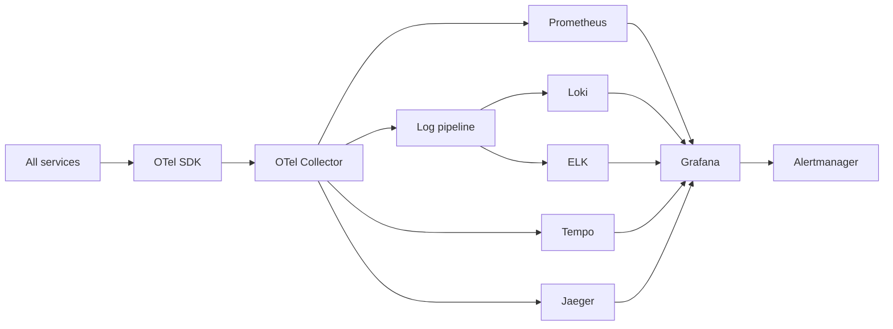
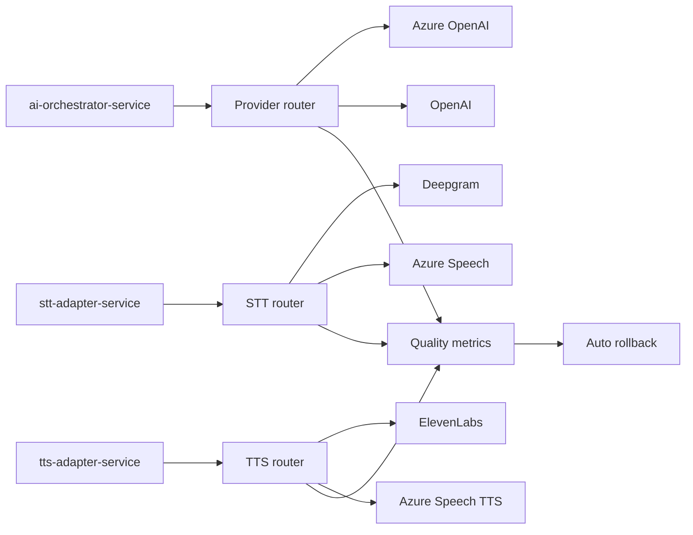

# 19. Observability Architecture

VoxAgent observability must make the real-time voice loop explainable at the level of a single call turn while preserving tenant privacy. The canonical latency target is p50 ≤ 800 ms and p95 ≤ 1500 ms from end of user speech to first synthesized audio.

## 19.1 Observability Stack

Every canonical service emits OpenTelemetry traces, metrics, and structured logs. Java 21 Spring Boot 3.3+ services use the OpenTelemetry Java agent plus explicit SDK instrumentation for voice-turn stages and AI tool calls.



Logging backend comparison:

| Option | Strengths | Weaknesses | Recommendation |
|---|---|---|---|
| Loki | Low-cost log aggregation, label-based, excellent Grafana integration | Not full-text search first; requires disciplined labels | Recommended default for cost and operational simplicity. |
| ELK | Mature full-text search, rich ecosystem, strong ad hoc forensics | Higher cost, heavier operations, mapping/index risk | Supported for customers who require ELK or SIEM-forwarding semantics. |

Tracing backend comparison:

| Option | Strengths | Weaknesses | Recommendation |
|---|---|---|---|
| Tempo | Cost-effective, object-storage backed, Grafana native | Search depends on exemplars and metrics | Recommended default. |
| Jaeger | Familiar, mature UI and APIs | Storage and scale tuning burden | Keep compatible export path for teams standardized on Jaeger. |

Grafana is the single pane: SLO dashboards, call drill-down, tenant health, provider health, Kafka lag, cost, and incident views.

### Architecture Review (self-critique)

A single pane can become a single bottleneck if dashboards are slow or noisy. Loki is cost-effective but weak for arbitrary forensic search compared with ELK. The recommendation optimizes cost and SRE operability, but enterprise deployments should allow ELK export and SIEM integration without changing service instrumentation.

## 19.2 Metrics Catalog

| Service | Key metrics | Voice and business SLIs |
|---|---|---|
| `api-gateway` | request rate, p95 latency, 4xx/5xx, auth failures, rate-limit decisions | tenant API availability, schema validation failures. |
| `call-management-service` | call create latency, call state transitions, webhook failures | call setup success, call setup time. |
| `media-gateway-service` | concurrent_calls, jitter_buffer_ms, packet_loss, websocket reconnects, active drains | media ingress availability, barge_in_rate. |
| `stt-adapter-service` | provider latency, stream reconnects, partial/final ratio, provider errors | asr_word_error_proxy, stt_stage_latency_ms. |
| `tts-adapter-service` | time_to_first_byte_ms, synthesis duration, provider errors, cache hit rate | tts_stage_latency_ms, first_audio_latency_ms. |
| `ai-orchestrator-service` | LLM TTFT, total tokens, tool calls, guardrail blocks, cache hits | voice_turn_latency_ms, llm_token_rate, tool_call_duration, escalation_rate. |
| `knowledge-service` | retrieval p95, embedding latency, index size, pgvector query latency | retrieval_success_rate, top_k_relevance_proxy. |
| `conversation-service` | turn persistence lag, redaction latency, summary latency | transcript_completion_rate, sentiment_distribution. |
| `ticket-service` | ticket create/update latency, failures, idempotency conflicts | ticket_action_success_rate. |
| `scheduling-service` | availability query latency, booking success, conflicts | appointment_booking_success_rate. |
| `crm-integration-service` | sync latency, API quota use, retries, failures | crm_sync_success_rate. |
| `notification-service` | send latency, provider errors, bounce/failure rate | notification_delivery_rate. |
| `campaign-service` | dial rate, contact attempts, opt-out rate, abandoned call rate | campaign_compliance_violations, cost_per_call. |
| `agent-routing-service` | queue depth, assignment latency, human accept rate | escalation_wait_time, human_handoff_success_rate. |
| `identity-service` | login latency, token issuance, MFA failures, policy denies | auth_success_rate. |
| `config-service` | config fetch latency, prompt version changes, cache hit rate | config_rollout_error_rate. |
| `analytics-service` | ingestion lag, query latency, report generation failures | analytics_freshness_lag. |
| Kafka | consumer lag, produce errors, DLQ depth, broker ISR, topic throughput | async_processing_delay, outbox_lag. |
| PostgreSQL | connection pool, lock waits, replication lag, RLS errors, pgvector p95 | data_plane_availability. |
| Redis | command latency, evictions, memory, connection failures | session_state_cache_health. |

`voice_turn_latency_ms` is a histogram with stage labels: `vad`, `stt`, `llm`, `tool`, `tts`, `egress`, and `total`. Exemplars link slow turns to traces.

Required metric dimensions are `service`, `namespace`, `org_tier`, `region`, `provider`, `stage`, and `outcome`. Avoid `callId` or `orgId` as metric labels due to cardinality; include them in traces and logs.

Canonical Kafka topic observability covers `call.events.v1`, `call.media.metadata.v1`, `conversation.turns.v1`, `conversation.completed.v1`, `ai.actions.v1`, `ticket.events.v1`, `appointment.events.v1`, `notification.commands.v1`, `crm.sync.commands.v1`, `campaign.dial.commands.v1`, `lead.events.v1`, `escalation.events.v1`, `knowledge.ingestion.v1`, `audit.events.v1`, and `dlq.<consumer-group>`. Each topic dashboard tracks produce error rate, end-to-end event age, consumer lag by group, schema validation failures, retries, and DLQ routing rate.

### Architecture Review (self-critique)

The catalog is intentionally broad and could become expensive if every dimension is used everywhere. The biggest risk is high-cardinality labels. Teams must enforce label governance and use logs/traces for identifiers such as `callId`, while metrics stay aggregate and SLO-oriented.

## 19.3 Tracing Design

Each call has a root trace created by `call-management-service` or `media-gateway-service`. Each user turn is a child span subtree. `traceparent` propagates through gRPC metadata, WebSocket session metadata, REST headers, and Kafka headers for async consumers.

Span naming convention:

| Span | Owner | Example attributes |
|---|---|---|
| `call.setup` | `call-management-service` | `call.id`, `org.id`, `telephony.provider`. |
| `media.stream.receive` | `media-gateway-service` | `call.id`, `codec`, `jitter.ms`. |
| `voice.turn` | `media-gateway-service` | `turn.id`, `barge_in`, `latency.total`. |
| `stt.stream` | `stt-adapter-service` | `provider`, `latency.stt`, `failover`. |
| `llm.chat` | `ai-orchestrator-service` | `model`, `tokens.in`, `tokens.out`, `ttft.ms`. |
| `tool.call` | `ai-orchestrator-service` | `tool.name`, `duration.ms`, `side_effect`. |
| `tts.stream` | `tts-adapter-service` | `provider`, `voice.id`, `ttfb.ms`. |
| `kafka.produce` | any producer | `topic`, `partition`, `event.type`. |
| `kafka.consume` | async consumer | `topic`, `consumer.group`, `lag.ms`. |

Sampling strategy:

* 100% of errors, policy denials, provider failovers, and calls with user-reported quality issues.
* Tail-based sampling for slow voice turns above 1500 ms p95 objective.
* 5% baseline for healthy traffic, configurable by tenant tier and incident mode.
* Short-lived debug sampling can be enabled per `org_id` with approval and automatic expiry.

Head sampling critique: head sampling is cheap but misses the exact traces needed most, because it decides before knowing whether a call becomes slow, fails provider failover, or hits a bad tool path. Use tail sampling at the OTel Collector for production diagnostics.

### Architecture Review (self-critique)

Tail sampling requires buffering and can drop context during collector overload. The design must protect collector capacity as production infrastructure, not best-effort telemetry. Privacy is also a tracing risk: span attributes must not include transcript text, raw prompts, phone numbers, or vendor secrets.

## 19.4 Logging Design

All services emit structured JSON logs with common fields:

```json
{
  "timestamp": "2026-09-24T22:58:11.818+05:30",
  "level": "INFO",
  "service": "ai-orchestrator-service",
  "namespace": "ai-core",
  "traceId": "...",
  "spanId": "...",
  "callId": "...",
  "orgId": "...",
  "turnId": "...",
  "event": "tool_call_completed",
  "outcome": "success"
}
```

Rules:

* Logs include `callId`, `orgId`, `traceId`, and `turnId` where applicable.
* PII redaction occurs before logging. Redaction covers phone numbers, names, emails, addresses, free-form transcript text, payment data, auth tokens, API keys, and vendor request bodies.
* Raw audio, full prompts, transcripts, JWTs, refresh tokens, and secrets are never logged.
* Error logs use safe exception mappers that strip headers and request bodies.
* Audit events are not just logs; they are durable events on `audit.events.v1`.

### Architecture Review (self-critique)

Correlation IDs are useful but still sensitive because they allow cross-system linkage. PII redaction filters are imperfect, especially for multilingual transcripts and names. The safest stance is to avoid logging content by design and to make rare content-level debugging a governed, time-bound, audited workflow.

## 19.5 Alerts and SLO Policy

Runbook link convention: `runbooks/{service}/{alert-name}.md`. Alerts route by service owner, severity, tenant tier, and region.

| Alert | Condition | Severity | Runbook |
|---|---|---|---|
| Voice latency SLO burn | `voice_turn_latency_ms` p95 > 1500 ms for 5m | SEV2 | `runbooks/voice-core/voice-latency-slo.md` |
| Severe voice outage | p95 > 2500 ms or success < 95% for 5m | SEV1 | `runbooks/voice-core/voice-outage.md` |
| Call setup failures | call setup failures > 1% for 5m | SEV2 | `runbooks/call-management-service/call-setup-failures.md` |
| STT provider errors | Deepgram errors > 2% for 5m | SEV2 | `runbooks/stt-adapter-service/provider-errors.md` |
| TTS provider errors | ElevenLabs or Azure Speech TTS errors > 2% for 5m | SEV2 | `runbooks/tts-adapter-service/provider-errors.md` |
| LLM provider errors | Azure OpenAI errors > 2% for 5m | SEV2 | `runbooks/ai-orchestrator-service/provider-errors.md` |
| Kafka consumer lag | lag > SLO for 10m by consumer group | SEV2 | `runbooks/data-platform/kafka-lag.md` |
| Outbox lag | oldest outbox row > 2m | SEV2 | `runbooks/data-platform/outbox-lag.md` |
| DLQ depth | `dlq.<consumer-group>` depth > 0 for 10m or rapid growth | SEV3 or SEV2 | `runbooks/data-platform/dlq-depth.md` |
| PostgreSQL unavailable | primary connection failures > threshold | SEV1 | `runbooks/data-platform/postgres-failover.md` |
| Redis degraded | Redis p95 > 20 ms or unavailable | SEV2 | `runbooks/data-platform/redis-degraded.md` |
| rt-voice pod restarts | pod restarts on `rt-voice` node pool > 0 in 10m | SEV2 | `runbooks/voice-core/rt-voice-restarts.md` |
| Provider cost anomaly | cost_per_call > baseline by 30% for 30m | SEV3 | `runbooks/platform/provider-cost-anomaly.md` |
| Audit pipeline delay | `audit.events.v1` export lag > 5m | SEV2 | `runbooks/platform/audit-pipeline-delay.md` |

SLO policy:

* Voice p95 latency and call setup success are user-facing SLOs.
* Error budgets gate risky releases; if burn rate exceeds policy, freeze non-critical prod changes except mitigations.
* Provider-specific errors trigger failover and vendor incident tracking.
* Synthetic calls run continuously from each production region and count toward detection, not customer SLO unless explicitly configured.

### Architecture Review (self-critique)

Alert tables tend to age badly. The critical flaw is relying on static thresholds when traffic patterns and provider baselines change. SLO burn-rate alerts, anomaly detection for cost, and synthetic test calls reduce this, but alert ownership and runbook drills are what keep the system operable.

# 20. Failure Scenarios

Failure handling protects the live call experience first, then data integrity, then analytics freshness. The hot path must not depend on Kafka, and Redis state must be reconstructible from PostgreSQL per D3.

## 20.1 Multi-provider AI Failover



Provider routing is implemented behind Spring AI `ChatModel` and voice provider abstractions, with per-tenant policy from `config-service`. Failover is automatic for transient provider failure, rate limiting, regional outage, or SLO burn.

### Architecture Review (self-critique)

Provider failover is not free. Models differ in behavior, latency, safety filters, tool calling, and cost. Automatic failover must be constrained by tenant approval, model compatibility tests, and prompt regression checks or it can turn an outage into a quality incident.

## 20.2 Scenario Matrix

| Scenario | Blast radius | Detection | Automatic handling | Caller degradation script | RTO |
|---|---|---|---|---|---|
| LLM down | AI responses slow or unavailable for active and new AI calls in affected region/provider | LLM provider errors, voice latency SLO burn | `ai-orchestrator-service` fails Azure OpenAI to OpenAI via Spring AI, uses semantic response cache and safe canned responses for common intents | “I’m having trouble reaching my assistant brain. I can still take a message or connect you to a human.” | 2 min for failover, 15 min full stabilization |
| Kafka down | Async events, analytics, CRM sync, notifications delayed; hot path unaffected | Kafka produce errors, consumer lag, outbox lag | Transactional outbox buffers in PostgreSQL; hot path continues; producers degrade non-critical event publication; DLQs pause | No caller message unless action depends on async notification; then “I’ll save this and send confirmation shortly.” | 15 min broker recovery, 4h backlog recovery target |
| PostgreSQL down | New business operations fail; current calls continue partially from Redis; durable writes paused | PostgreSQL unavailable, connection pool exhaustion | Current calls continue with Redis state and in-memory buffers; new bookings/tickets fail closed; replica promotion; outbox resumes after recovery | “I can continue this call, but account changes may be delayed. I can send a follow-up once systems recover.” | 5 to 15 min promotion, RPO ≤ 5 min with PITR |
| Redis down | Session cache, semantic cache, rate-limit backend degraded | Redis degraded, command errors | Reconstruct state from PostgreSQL; local in-memory fallback with conservative TTL; gateway uses local rate limits; cache misses accepted | Usually silent; if latency rises, “One moment while I verify that.” | 5 min failover to replica/managed cache |
| STT provider down | Speech recognition fails or degrades for active calls | STT provider errors, asr proxy drop, voice latency SLO burn | `stt-adapter-service` reconnects stream Deepgram to Azure Speech mid-call, marks transcript confidence lower | “I’m reconnecting my speech service. Please repeat that last sentence.” | 1 min provider failover |
| TTS provider down | Agent cannot synthesize voice or premium voice unavailable | TTS provider errors, first audio latency alert | `tts-adapter-service` fails ElevenLabs to Azure Speech TTS; uses cached and pre-recorded fallback phrases | Pre-recorded: “I’m experiencing voice issues. Please hold while I reconnect.” | 1 min failover |
| Twilio fails | New PSTN calls fail; active calls may drop depending on failure | Call setup failures, media disconnects, Twilio webhook failures | SIP trunk failover where configured; alternate provider routing; publish status; DR number porting process for prolonged incidents | “We’re having phone network trouble. Please try again shortly or use the backup number.” | 15 min trunk failover, hours to days for number porting |
| Network partition | Split services, partial region/provider reachability, inconsistent control plane | Mesh errors, regional synthetic failures, Kafka ISR shrink, PG replication lag | Istio retries with budgets, circuit breakers, Kafka quorum preserves consistency, PostgreSQL primary fencing, region-pinned calls avoid cross-region hairpin | “I may need a moment due to network issues. I can take a message if this continues.” | 5 to 30 min depending partition scope |

## 20.3 Detailed Failure Handling

### LLM down

* Blast radius: `ai-orchestrator-service` responses, tool decisions, summarization quality, and conversation flow in affected model/provider.
* Detection: LLM provider error-rate alert, TTFT anomaly, voice latency SLO burn, synthetic call failures.
* Automatic handling: retry idempotent requests with bounded backoff, fail Azure OpenAI to OpenAI through Spring AI `ChatModel`, switch to smaller approved model if configured, use Redis semantic response cache, and escalate complex intents to `agent-routing-service`.
* Fencing: never retry non-idempotent tool side effects without idempotency keys.
* RTO: 2 minutes for automatic provider failover.

### Kafka down

* Blast radius: async services `conversation-service`, `ticket-service`, `crm-integration-service`, `notification-service`, `campaign-service`, `analytics-service` lag; hot-path voice loop remains unaffected.
* Detection: producer errors, broker health, ISR shrink, consumer lag, outbox lag, DLQ depth.
* Automatic handling: transactional outbox persists events in PostgreSQL; polling publisher pauses; consumers resume from offsets; non-critical async side effects are delayed.
* RTO: 15 minutes for managed broker recovery; backlog RTO depends on lag and partition capacity.

### PostgreSQL down

* Blast radius: tenant config reads after cache expiry, new tickets, scheduling, CRM sync, audit export metadata, identity writes.
* Detection: connection pool failure, query latency, replication lag, primary health, synthetic CRUD failure.
* Automatic handling: active calls continue using Redis state and already-loaded config; new state-changing business operations fail closed; read replicas serve safe read-only paths; primary failover promotes replica; services reconnect with exponential backoff.
* RTO: 5 to 15 minutes; RPO ≤ 5 minutes with PITR and synchronous or semi-sync replication where enterprise tier requires.

### Redis down

* Blast radius: rate limiting, semantic cache, call state cache, idempotency short-cache, and hot-path latency.
* Detection: Redis command failures, latency, evictions, connection errors.
* Automatic handling: reconstruct current state from PostgreSQL where possible, local in-memory cache with small TTL for active calls, conservative rate limits at `api-gateway`, disable non-essential cache-dependent optimizations.
* RTO: 5 minutes for managed failover.

### STT provider down

* Blast radius: callers cannot be understood or recognition accuracy drops.
* Detection: Deepgram error rate, stream close codes, empty transcript ratio, asr_word_error_proxy degradation.
* Automatic handling: `stt-adapter-service` reconnects to Azure Speech with call context and rolling audio buffer if available; asks caller to repeat when final transcript is lost.
* RTO: 1 minute.

### TTS provider down

* Blast radius: agent voice response unavailable or lower quality.
* Detection: TTS provider errors, TTFB alert, synthesis timeout.
* Automatic handling: fail ElevenLabs to Azure Speech TTS; use pre-recorded fallback phrases for hold, transfer, apology, consent, and goodbye; optionally switch to SMS follow-up through `notification-service`.
* RTO: 1 minute.

### Twilio fails

* Blast radius: inbound/outbound telephony, webhook delivery, Twilio media streams.
* Detection: call setup failure > 1%, webhook signature-valid but delayed/missing events, synthetic call failures from carrier probes.
* Automatic handling: SIP trunk failover for configured enterprise tenants, outbound campaign pause, alternate provider route for new calls, customer status page updates.
* DR number porting critique: emergency number porting is slow, carrier-dependent, and not a real-time failover mechanism. Maintain pre-provisioned backup numbers and communicate them in advance for critical tenants.
* RTO: 15 minutes for pre-provisioned alternate trunk; hours to days for number porting.

### Network partition

* Blast radius: depends on partition between namespaces, AZs, region, provider, or data plane.
* Detection: service mesh error budget, synthetic regional probes, Kafka ISR changes, PostgreSQL replication lag, cross-zone packet loss.
* Automatic handling: mesh retries with small budgets and circuit breakers, region-pinned calls avoid mid-call relocation, Kafka KRaft quorum chooses availability only when majority survives, PostgreSQL fencing prevents dual primary, write paths fail closed when quorum is unsafe.
* RTO: 5 to 30 minutes for most AZ/provider partitions; regional disaster follows DR plan.

### Architecture Review (self-critique)

The handling strategy prioritizes current calls, which means some business operations deliberately fail or delay. This is correct for a voice product but can surprise CRM and analytics stakeholders. Runbooks must state what is allowed to be stale, what must fail closed, and when humans take over.

## 20.4 Degradation-Mode Matrix

| Capability | Normal | LLM degraded | Kafka degraded | PostgreSQL degraded | Redis degraded | STT degraded | TTS degraded | Telephony degraded |
|---|---|---|---|---|---|---|---|---|
| Active calls | Full AI | Cached or human handoff | Unaffected | Continue with cached state | Higher latency | Ask repeat and failover | Fallback voice | May drop if carrier affected |
| New calls | Accepted | Accepted with limited intents | Accepted | Limited if config unavailable | Accepted with conservative limits | Accepted after failover | Accepted after failover | Alternate trunk or fail |
| Tickets | Real-time tool action | Human approval | Delayed events | Fail closed | Mostly unaffected | Possible transcript gap | Unaffected | Depends on call setup |
| Scheduling | Real-time | Limited | Delayed notifications | Fail closed | Mostly unaffected | Possible transcript gap | Unaffected | Depends on call setup |
| CRM sync | Async | Delayed if tool unavailable | Delayed | Delayed | Unaffected | Transcript quality lower | Unaffected | Depends on call setup |
| Analytics | Near real time | Lower quality | Stale | Stale | Mostly unaffected | Lower accuracy | Mostly unaffected | Lower volume |
| Audit | Real time | Real time | Buffered by outbox | Local buffer then flush | Real time | Real time | Real time | Real time if reachable |

### Architecture Review (self-critique)

The matrix hides tenant-specific differences. Enterprise tenants may require dedicated failover providers, stricter RTO, or no fallback to OpenAI for residency reasons. Degradation behavior must be policy-driven by `config-service`, not hard-coded globally.
