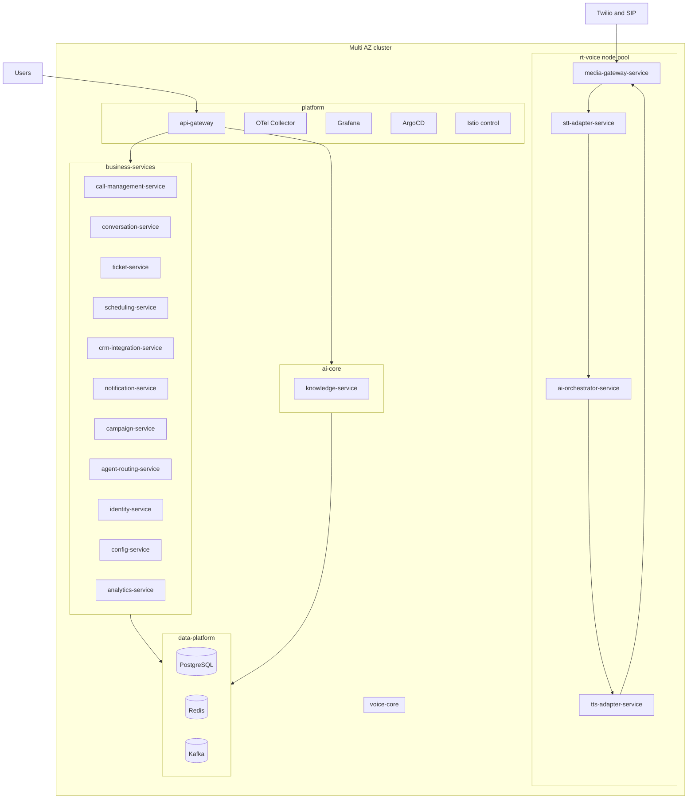
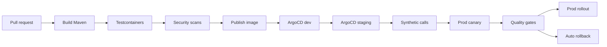
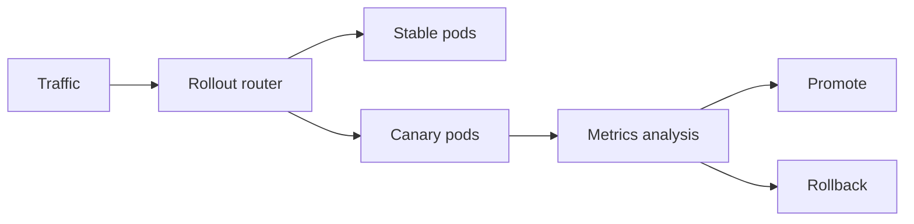
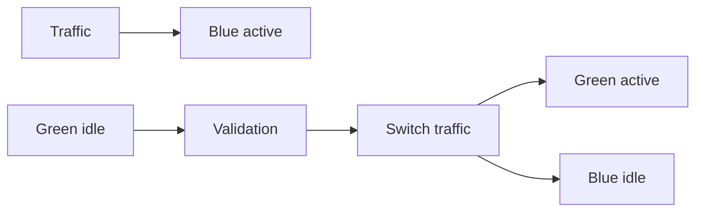

# 21. Deployment Architecture

VoxAgent deploys to Kubernetes with namespace and node-pool boundaries aligned to the architecture contract. The deployment model optimizes for low-jitter real-time voice, isolated data systems, GitOps control, and safe progressive delivery.

## 21.1 Kubernetes Runtime Architecture

`rt-voice` node pool requirements:

* Taints: `workload=rt-voice:NoSchedule`; hot-path pods use matching tolerations.
* Guaranteed QoS: requests equal limits for CPU and memory on `media-gateway-service`, `stt-adapter-service`, `tts-adapter-service`, and latency-critical `ai-orchestrator-service` pods.
* Static CPU manager policy, CPU pinning, no CPU throttling, ZGC tuned for Java 21 services.
* Topology spread across AZs and nodes for hot-path pods.
* Minimal noisy neighbors: no batch jobs, analytics, Kafka, or observability-heavy workloads on `rt-voice`.

Scaling model:

* HPA for synchronous services on request rate, p95 latency, and concurrency.
* KEDA on Kafka lag for async consumers: `conversation-service`, `ticket-service`, `crm-integration-service`, `notification-service`, `campaign-service`, and `analytics-service`.
* Custom metric `concurrent_calls` for `media-gateway-service`; CPU-based HPA is insufficient because voice capacity is constrained by concurrent streams, jitter, codec cost, and provider backpressure before CPU necessarily saturates.
* `ai-orchestrator-service` scales on active turns, LLM TTFT, queue depth, and token throughput.
* PodDisruptionBudgets preserve minimum hot-path availability during node drains and upgrades.

### Architecture Review (self-critique)

The diagram shows logical placement but not all managed-service realities. PostgreSQL, Redis, and Kafka may be managed outside the cluster in production, which is preferable for many teams. The `rt-voice` pool adds cost and scheduling complexity, but mixing voice workloads with batch analytics would create unpredictable latency and is a worse tradeoff.

## 21.2 Call Draining and Rolling Deploys

Long-lived calls conflict with standard rolling deployments. Killing a `media-gateway-service` pod can drop active calls even if Kubernetes considers termination graceful.

Required drain behavior:

1. `preStop` hook marks pod as draining in readiness endpoint and shared state.
2. Readiness fails, so no new media sessions are assigned.
3. Existing calls continue until completion.
4. Maximum drain window is 30 minutes.
5. After 30 minutes, remaining calls receive a graceful transfer, apology, or controlled termination depending tenant policy.
6. Shutdown flushes final metadata to the outbox and emits `call.events.v1` if durable systems are available.

Alternatives:

| Approach | Pros | Cons | Recommendation |
|---|---|---|---|
| Drain active calls | Simple, preserves call quality, compatible with Twilio media sessions | Slower rollouts, capacity temporarily reduced | Recommended default. |
| Call migration between pods | Faster rollouts, theoretical zero drain wait | Hard with WebSocket/RTP state, jitter buffers, STT/TTS streams, vendor sessions | Avoid unless using a media server designed for migration. |
| Forced short calls during deploy | Operationally simple | Customer-hostile and creates dropped calls | Not acceptable for production. |

### Architecture Review (self-critique)

A 30-minute drain can slow emergency security patches. The mitigation is over-provisioning during rollouts, max call duration policies for some use cases, and separating media relay from deploy-heavy business logic. True call migration remains a future option if the platform moves to LiveKit or a specialized media server.

## 21.3 Namespace Strategy, Quotas, and NetworkPolicies

| Namespace | Services and workloads | Quotas | NetworkPolicies |
|---|---|---|---|
| `voice-core` | `media-gateway-service`, `stt-adapter-service`, `tts-adapter-service` | Guaranteed CPU for hot path, strict memory, limited replicas per node | Ingress from telephony and mesh only; egress to AI, STT/TTS vendors, Redis, observability. |
| `ai-core` | `ai-orchestrator-service`, `knowledge-service` | Token and retrieval concurrency limits, memory for embeddings retrieval | Ingress from `voice-core` and `api-gateway`; egress to LLM vendors, PostgreSQL, Redis. |
| `business-services` | `call-management-service`, `conversation-service`, `ticket-service`, `scheduling-service`, `crm-integration-service`, `notification-service`, `campaign-service`, `agent-routing-service`, `identity-service`, `config-service`, `analytics-service` | Standard CPU/memory quotas by service class; async burst quotas | Ingress from `api-gateway`, Kafka, mesh; no direct media ingress. |
| `data-platform` | PostgreSQL, Redis, Kafka if in-cluster, schema registry, backup jobs | Storage, IOPS, and memory reservations; anti-affinity required | Ingress only from authorized service accounts; admin access from platform tooling. |
| `platform` | `api-gateway`, OTel Collector, Grafana, Loki or ELK, Tempo or Jaeger, ArgoCD, mesh control plane | Control-plane priority class; storage for observability | Controlled ingress from internet to gateway only; egress gateways enforce vendor allow-lists. |

Policies are default-deny for ingress and egress. All exceptions are GitOps-managed and reviewed with service ownership.

### Architecture Review (self-critique)

Namespace boundaries are not hard security boundaries by themselves. Real isolation comes from NetworkPolicies, workload identity, RBAC, admission control, and cloud IAM. The risk is namespace sprawl without ownership; every namespace needs quotas, SLOs, and policy owners.

## 21.4 Helm and GitOps Model

Chart options:

| Model | Pros | Cons | Recommendation |
|---|---|---|---|
| Umbrella chart | One install command, simple dependency view | Coupled releases, hard partial rollback, noisy diffs | Avoid for production microservice delivery. |
| Per-service charts | Independent versioning and rollback, clear ownership | More chart maintenance | Recommended. |
| Shared library chart | Standard templates, common labels, probes, service mesh, PDBs | Version compatibility must be governed | Use with per-service charts. |

Recommended model:

* One Helm chart per canonical service.
* Shared library chart for Spring Boot defaults, probes, service accounts, Istio resources, PodDisruptionBudgets, HPA/KEDA, NetworkPolicies, and OpenTelemetry annotations.
* Values layering: `values.yaml` base, `values-dev.yaml`, `values-staging.yaml`, `values-prod.yaml`, and tenant overlays for enterprise dedicated deployments.
* ArgoCD app-of-apps or ApplicationSets manage environments and regions.
* Configuration promotion is pull-request based; direct kubectl changes are reverted by GitOps.

### Architecture Review (self-critique)

Per-service charts can drift if the library chart is weak or teams bypass standards. Umbrella charts are tempting early but become release bottlenecks. The recommendation requires platform discipline and chart contract tests, but it supports independent service evolution and rollback.

## 21.5 CI and CD Pipeline

Pipeline stages:

1. Pull request: code review, architecture-impact labels, threat-model trigger for security-sensitive changes.
2. Build: Maven with Java 21, reproducible container image, SBOM generation.
3. Tests: unit, Spring Boot integration, Testcontainers for PostgreSQL 16, Redis 7, and Kafka KRaft.
4. Scans: SAST, dependency vulnerabilities, license policy, IaC, container image, secrets scan.
5. Publish: signed image and provenance attestation.
6. ArgoCD sync to dev.
7. Staging: run contract tests, migration tests, provider sandbox tests, and synthetic call tests.
8. Synthetic call harness: places real test calls through Twilio or SIP test trunks, validates call setup time, transcript accuracy proxy, voice_turn_latency_ms, barge-in behavior, tool execution, and recording consent.
9. Production progressive delivery with Argo Rollouts and automated rollback on latency, error rate, provider cost, or quality regressions.

### Architecture Review (self-critique)

Most CI pipelines test HTTP APIs well and voice poorly. The synthetic call harness is critical and expensive because it uses real telephony and vendors. Without it, deployments can pass all tests while breaking turn-taking, STT reconnects, TTS streaming, or consent prompts.

## 21.6 Blue-Green and Canary Delivery

### Canary

Canary gradually shifts traffic to a new version. It is recommended for stateless services and many warm/async services, including `api-gateway`, `call-management-service`, `knowledge-service`, `conversation-service`, `ticket-service`, `scheduling-service`, `crm-integration-service`, `notification-service`, `campaign-service`, `agent-routing-service`, `identity-service`, `config-service`, and `analytics-service`.

For `media-gateway-service`, canary must be **call-session-sticky**: only new calls are routed to canary pods, and an active call never moves versions. Canary analysis must use voice-specific metrics, not just HTTP 5xx.

LLM prompt, tool, and model changes deploy as configuration canaries through `config-service`. Automatic rollback uses quality metrics: containment rate, escalation rate, user interruption, latency, safety blocks, tool failures, and post-call sentiment.

### Blue-green

Blue-green creates a full parallel environment and switches traffic when verified. It is useful for database-coupled big-bang changes, major protocol changes, or risky migrations requiring fast full rollback.

Recommendation:

* Use **canary via Argo Rollouts** for most stateless and async services.
* Use **call-session-sticky canary** for `media-gateway-service`, `stt-adapter-service`, `tts-adapter-service`, and latency-sensitive `ai-orchestrator-service` changes.
* Use **blue-green** for incompatible database migrations, large dependency upgrades, or major mesh/gateway changes.

### Architecture Review (self-critique)

Canary metrics for AI quality are probabilistic and can be gamed by traffic mix. Blue-green is safer for infrastructure but expensive and can hide state divergence. Release decisions must combine automated gates with human approval for high-risk model, prompt, and data migration changes.

## 21.7 Multi-Region and Disaster Recovery

Strategy:

* Active-active control plane for `api-gateway`, `identity-service`, `config-service`, `call-management-service`, and read-heavy tenant configuration.
* Region-pinned calls: once a call starts in a region, the live media and voice loop stay in that region to avoid jitter and cross-region failure coupling.
* Data residency follows D9: shared regional clusters by default, enterprise tier can receive dedicated schema, dedicated DB, or dedicated regional deployment.
* Vendor routing is regional where possible: Azure OpenAI regional deployments, Azure Speech regional endpoints, Deepgram region support where contractually available, and Twilio edge selection.

DR targets:

| Component | RTO | RPO | Backup and recovery |
|---|---|---|---|
| PostgreSQL 16 | 15 min regional failover target | ≤ 5 min standard, stricter for enterprise tier | PITR, cross-region replicas, tested restore, schema migration rollback. |
| Kafka KRaft | 30 min regional service restoration | Depends on replication, target ≤ 5 min for committed events | Multi-AZ brokers, tiered storage, MirrorMaker or managed equivalent for DR topics. |
| Redis 7 | 5 to 15 min | Reconstructible from PostgreSQL | Managed failover, no source-of-truth data. |
| Object storage | 15 min to alternate region read path | Near zero with GRS | Versioning, lifecycle, immutability for audit, restore drills. |
| Kubernetes workloads | 30 min region failover for warm services | Config in Git | ArgoCD bootstrap, image registry replication, DNS failover. |
| Voice calls | Existing calls may drop on regional disaster | Not applicable for active media | Region-pinned active calls; new calls route to healthy region or backup number. |

Backup strategy:

* PostgreSQL PITR with daily full, continuous WAL archiving, quarterly restore tests, and tenant-level restore procedures.
* Kafka tiered storage for retained events and replay; compacted config-like topics only if introduced later.
* Object storage GRS for recordings, exports, and WORM audit archives.
* ArgoCD and Helm values in Git; cluster recreation is automated.
* Key backups and recovery procedures for Azure Key Vault keys must be tested without violating key custody.

### Architecture Review (self-critique)

Active-active is easy to claim and hard to implement for stateful systems. Region-pinned calls simplify the hardest real-time problem but mean active calls can still drop during a regional disaster. The recommended posture is honest: protect new call intake and data durability first, then reduce active-call loss as media infrastructure matures.
