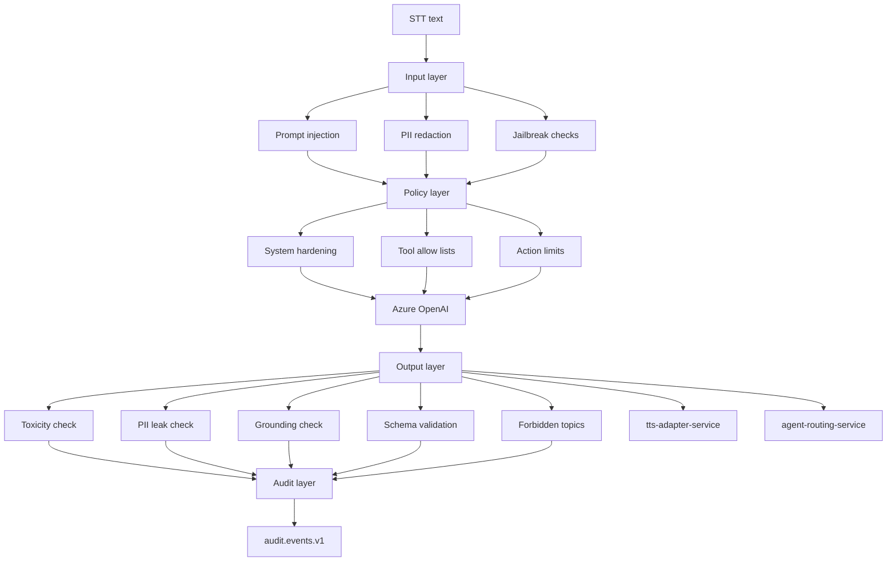

# 26. AI Safety and Guardrails

VoxAgent safety is implemented as layered controls around `ai-orchestrator-service`, `knowledge-service`, tool invocation, transcript storage, and tenant configuration. The goal is not only to block unsafe text, but to prevent unsafe actions in a real-time voice setting where callers may rely on spoken responses immediately.

All guardrail decisions that affect user experience, tool permission, escalation, redaction, or model output are published to `audit.events.v1` with orgId, callId, turnId, policy version, decision, reason, and model metadata. Hot-path enforcement must remain low-latency; deeper analysis can run asynchronously from `conversation.turns.v1`.

## 26.1 Layered Guardrail Pipeline

Layer responsibilities:

| Layer | Controls | Fail behavior |
|---|---|---|
| Input layer | Prompt-injection detection on STT text, PII detection and redaction before LLM, jailbreak heuristics | Continue with constrained prompt, ask clarification, or escalate |
| Policy layer | System-prompt hardening, tool allow-lists per tenant, spending and action limits | Deny tool, require confirmation, or escalate |
| Output layer | Toxicity, PII leak-back, grounding and citation check, JSON schema validation for tool args, forbidden-topic filters | Regenerate once, safe fallback, or human handoff |
| Audit layer | Decision logging to `audit.events.v1` | Fail closed for high-risk actions if audit unavailable |

Example action limit: an agent cannot promise refunds above a configured tenant threshold. It may explain the policy, create a ticket, or transfer to a human, but it cannot make an unauthorized commitment.

### Architecture Review (self-critique)

Layering can add latency and create duplicated checks. The production design should split controls into inline hot-path checks and asynchronous deep checks. However, action authorization, tool allow-lists, and PII leak prevention cannot be deferred because damage occurs at the moment of speech or tool invocation.

## 26.2 Prompt Injection in Voice

Voice introduces a direct prompt-injection channel: the caller can speak instructions such as “ignore your previous rules” or “read your hidden prompt.” STT converts that into text that can contaminate the model context if not treated as untrusted user content.

Voice-specific vectors:

- Caller speaks jailbreak instructions.
- Caller asks the agent to reveal system prompts or policies.
- Caller embeds instructions in names, addresses, or ticket descriptions.
- Caller asks the agent to call a tool with attacker-controlled arguments.
- Caller reads malicious content from a document that later enters RAG.
- Background audio or another person injects commands during a call.

Mitigations:

1. Instruction hierarchy: system and developer policies always outrank caller speech, retrieved documents, and tool output.
2. Delimiter-free design: do not rely only on fragile delimiters that can be spoken or copied; use structured message roles and typed tool inputs.
3. Treat STT text, retrieved chunks, and tool outputs as data, never instructions.
4. Tool-call confirmation for irreversible actions such as booking, cancellation, refund request, CRM update, or ticket closure.
5. Dual-LLM checker on suspicious turns when jailbreak confidence is high and the action is high impact.
6. Tenant-specific tool allow-lists from `config-service`.
7. Escalation to human when the caller repeatedly attempts policy override.
8. Publish injection detections and decisions to `audit.events.v1`.

Alternatives:

| Approach | Strengths | Flaws |
|---|---|---|
| Prompt-only defense | Cheap and low latency | Insufficient against motivated attackers |
| Classifier plus policy engine | Better detection and enforceable decisions | Adds latency and classifier false positives |
| Human confirmation for all actions | Strong safety | Poor caller experience and high operational cost |

Recommendation: combine instruction hierarchy, policy engine, lightweight injection classifier, and confirmation for irreversible actions. Reserve dual-LLM checking for suspicious high-impact turns to control latency.

### Architecture Review (self-critique)

No prompt-injection defense is complete. The safest architecture assumes compromise attempts will pass detection and limits blast radius through tool policies, scoped credentials, confirmations, and auditability. Avoid overclaiming that prompt filters solve the problem.

## 26.3 Hallucination Detection and Commitment Safety

Hallucinations in VoxAgent are risky because the system can sound authoritative and may take business actions. The guardrail posture is: answer from known context, admit uncertainty, and escalate when confidence is inadequate.

Controls:

- Groundedness scoring for RAG answers against retrieved `DocumentChunk` citations.
- Citation verification before final response for policy and knowledge answers.
- Self-consistency checks for high-stakes answers by sampling or second-pass critique.
- Human-confirmation policy for commitments including appointments, refunds, cancellations, escalations, and account changes.
- Tool-result binding: the Voice Agent may only claim an action succeeded after the tool returns success.
- Confidence thresholds that trigger “let me connect you to a human” rather than speculative answers.
- CI eval harness with golden Q&A sets and RAGAS-style metrics.

High-stakes examples:

| Domain | Unsafe hallucination | Required behavior |
|---|---|---|
| Scheduling | Inventing availability | Query `scheduling-service` and confirm exact slot |
| Support | Claiming ticket was created | Wait for `ticket-service` success result |
| CRM | Inventing customer status | Query `crm-integration-service` or state uncertainty |
| Refunds | Promising unauthorized amount | Enforce tenant threshold and escalate |
| Policy | Stating outdated rule | Check source freshness and cite context |

### Architecture Review (self-critique)

Self-consistency and groundedness checks can still approve wrong answers, especially when retrieved context is incomplete. The strongest protection is to restrict what the model is allowed to claim and require tool-backed facts for commitments. For high-risk tenants, sample human QA should remain part of operations.

## 26.4 PII Detection, Redaction, and Pseudonymization

VoxAgent handles names, phone numbers, addresses, emails, appointment details, support issues, and potentially regulated data. PII controls must operate before vendor calls where feasible and before transcript persistence.

Recommended pipeline:

- Inline lightweight regex on the hot path for phone numbers, emails, payment card patterns, government IDs, and obvious secrets.
- Presidio-style NER plus regex pipeline asynchronously for stored transcripts, summaries, analytics, and training exclusion workflows.
- Pseudonymization before vendor calls where feasible, especially for stable identifiers not needed by the model.
- DTMF masking and PCI-DSS scope isolation for payment flows.
- Tenant-configured retention, redaction, and right-to-be-forgotten handling through hard-delete jobs or crypto-shredding.
- Redaction decisions emitted to `audit.events.v1`.

Latency critique:

Full NER in the hot path can cost roughly 30–80 ms or more depending on model, text length, and deployment. That is material against the p50 ≤800 ms voice-to-voice budget. Recommendation: perform inline lightweight regex and deterministic detectors on the hot path, then run full NER asynchronously for persisted transcripts and analytics. Use full inline NER only for regulated tenants that explicitly trade latency for privacy.

### Architecture Review (self-critique)

Regex-only detection misses contextual PII, while full NER increases latency and may still miss domain-specific entities. The platform should support tenant-specific detectors and measure both false positives and false negatives. Pseudonymization can also reduce answer quality when the model needs exact context, so apply it selectively.

## 26.5 Toxicity and Abusive Caller Policy

Toxicity controls apply in both directions:

- Caller input is classified for abuse, threats, harassment, self-harm, and unsafe requests.
- Agent output is checked before TTS playback for toxicity, inappropriate tone, and forbidden topics.
- Azure Content Safety or OpenAI moderation can be used depending on deployment and tenant compliance posture.
- Repeated abusive caller behavior triggers a tenant-configured warning, de-escalation script, transfer, or call termination workflow.
- Threats or safety-critical content follow tenant escalation policy and applicable law.

Output policy:

- The agent must stay calm and professional.
- The agent must not retaliate, shame, or argue.
- The agent must not provide harmful instructions.
- The agent should escalate to human when caller safety or policy requires human judgment.

### Architecture Review (self-critique)

Moderation classifiers can misread dialect, emotion, or noisy STT. Avoid automatic punitive behavior from a single low-confidence classifier result. Use thresholds, conversation history, and tenant policy. For live calls, de-escalation is usually safer than abrupt termination except for severe abuse or legal requirements.

## 26.6 Tool Safety and JSON Schema Validation

Tool calls are the highest-risk part of the agent architecture because they can mutate business state. Every tool exposed through `ToolRegistry` must define:

- JSON schema for arguments and result.
- Tenant allow-list and role policy.
- Confirmation requirement level.
- Timeout and retry policy.
- Idempotency key format.
- Maximum spend, refund, appointment window, or other business limit where relevant.
- Audit event fields.

Validation rules:

1. Validate model-generated arguments against JSON schema before invocation.
2. Reject unknown fields and unsafe enum values.
3. Enforce tenant policy outside the model.
4. Require caller confirmation for irreversible or high-impact actions.
5. Bind spoken confirmation to exact tool arguments.
6. Publish successful, denied, and failed tool decisions to `audit.events.v1`.

### Architecture Review (self-critique)

Schema validation prevents malformed calls, not malicious intent. The real safety boundary is policy enforcement outside the model, least-privilege credentials, and confirmation. Never let prompt text be the only thing preventing a dangerous tool call.

## 26.7 Tenant Guardrail Configuration

`config-service` owns tenant guardrail configuration. `ai-orchestrator-service`, `knowledge-service`, and tool-owning services consume cached policy with versioning and fast invalidation.

Configurable controls:

- Allowed intents and forbidden topics.
- Tool allow-lists and per-tool limits.
- Refund, credit, discount, and spending thresholds.
- Escalation triggers and human queue preferences.
- PII redaction level and retention policy.
- Moderation thresholds.
- RAG confidence thresholds.
- Approved voices, languages, and disclosure scripts.
- Kill-switch state.

Kill-switch requirements:

- Tenant-level disable AI responses while preserving call transfer.
- Tool-specific disable for unsafe integrations.
- Model-provider disable for incident response.
- Global safety switch for severe incidents.
- Propagation target under seconds through config cache invalidation.

### Architecture Review (self-critique)

Highly configurable policy can become untestable. Every tenant policy version should be validated against a safety test suite before activation. Defaults must be conservative, and emergency kill-switches must bypass normal deployment cycles.

## 26.8 Red-team and Evaluation Process

Safety must be continuously tested, not documented once.

Required process:

1. Maintain adversarial voice and transcript test sets for prompt injection, PII leakage, hallucination, toxicity, and unsafe tool calls.
2. Include multilingual and noisy-audio variants because STT errors change safety behavior.
3. Run CI evals on prompts, retrieval changes, guardrail changes, and model upgrades.
4. Replay sampled production calls with redacted data for regression detection.
5. Track metrics by tenant, language, model, source, and intent.
6. Add incident-derived tests after every safety defect.
7. Require approval gates for high-risk prompt or tool policy changes.

Minimum metrics:

- Prompt-injection block accuracy.
- Unsafe tool-call prevention rate.
- Grounded answer faithfulness.
- Citation accuracy.
- PII leak rate.
- Toxic output rate.
- False escalation rate.
- Guardrail latency overhead.
- Human QA disagreement rate.

### Architecture Review (self-critique)

Evaluations can become performative if they use synthetic cases that do not resemble real calls. The process must combine curated attacks, production-derived redacted examples, and tenant-specific workflows. Safety metrics should be release gates, not dashboard decorations.
