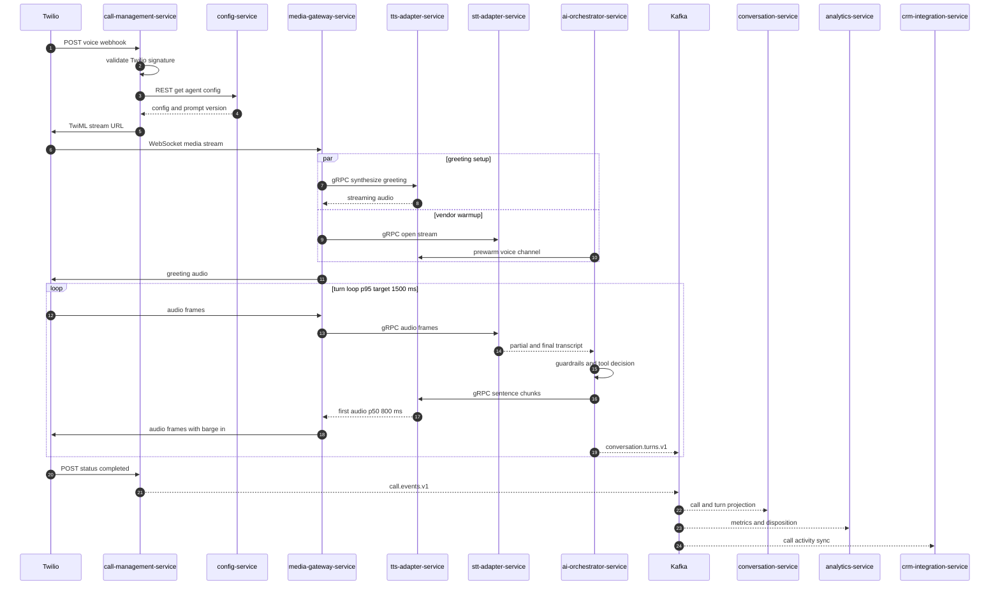
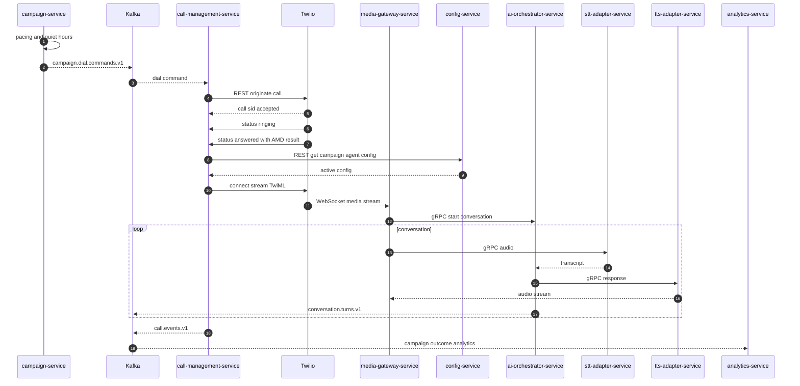
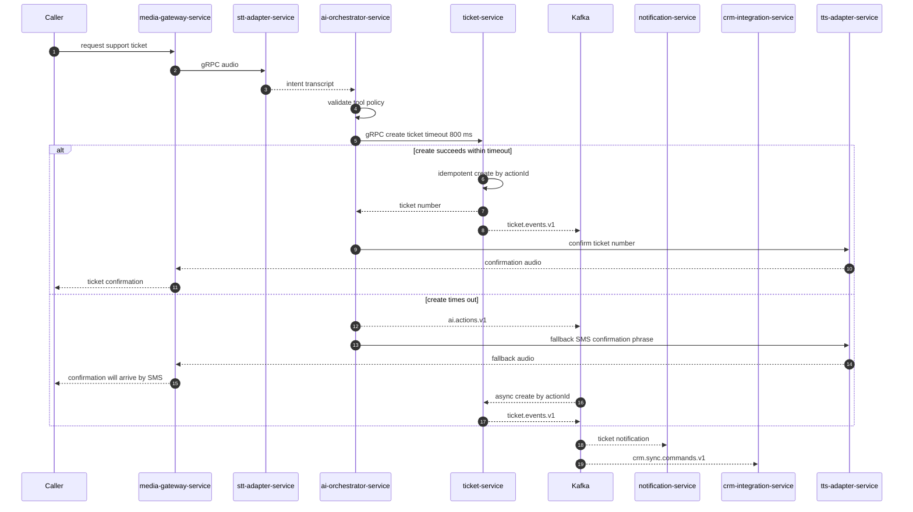
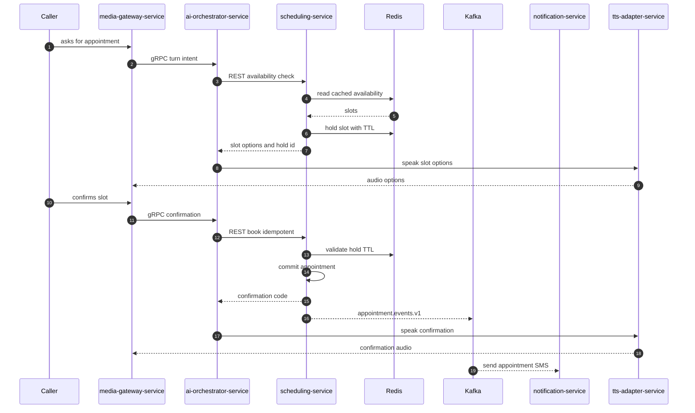
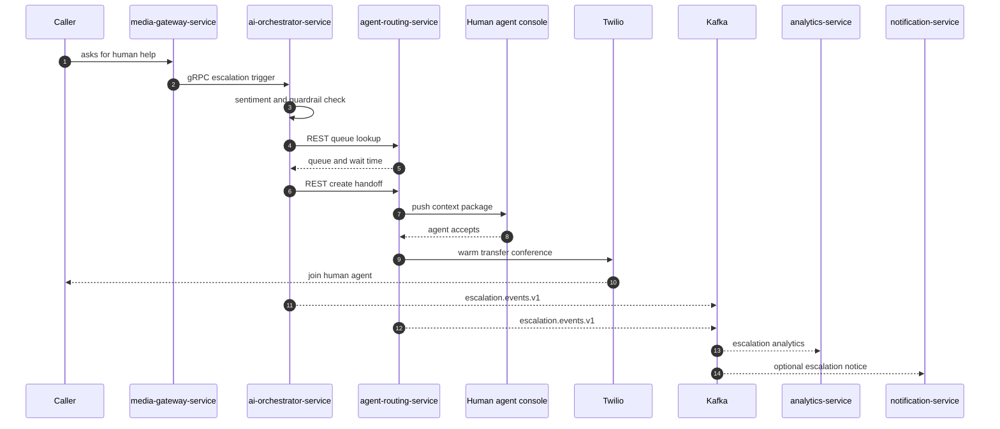
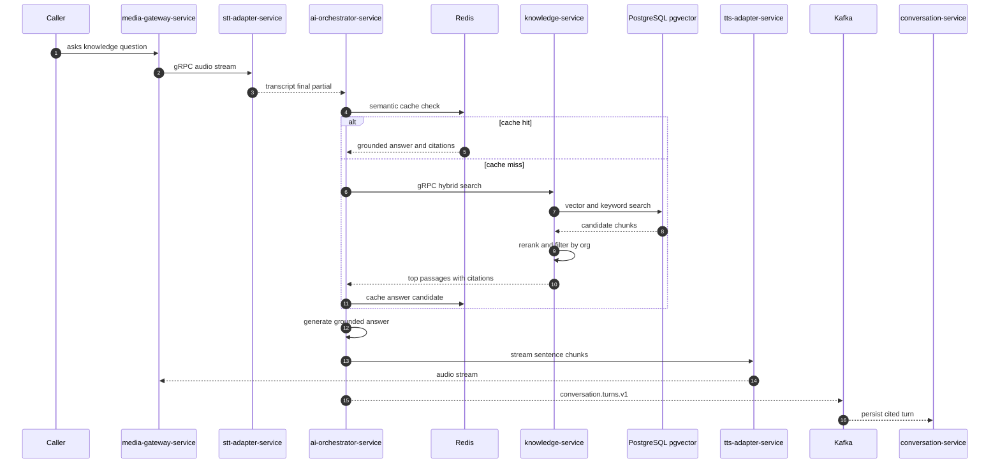

# 23. Sequence Diagrams

Legend: solid arrows are synchronous REST, gRPC, or WebSocket interactions; dashed arrows are asynchronous Kafka publication or consumption. Service names use the canonical architecture contract exactly.

## 23.1 Incoming Call

Latency notes: webhook setup is control-plane and should complete within 500 ms. The live turn loop is the critical budget: VAD and endpointing 150 to 250 ms, STT final partial 100 to 200 ms, LLM TTFT 250 to 450 ms, TTS TTFB 100 to 200 ms, and jitter egress 50 to 100 ms.

### Architecture Review (self-critique)

The diagram is intentionally optimistic. Real Twilio webhook retries, NAT traversal, noisy mobile audio, and vendor WebSocket cold starts can erase the latency budget. The design must prewarm Deepgram and TTS streams at call start and aggressively measure p95 by stage, not just end-to-end averages.

## 23.2 Outbound Call

Latency notes: outbound answer detection is not in the voice-to-voice budget but affects abandonment and customer experience. Once answered, the same 800 ms p50 and 1500 ms p95 turn budget applies.

### Architecture Review (self-critique)

Outbound is a compliance minefield. The technical sequence is straightforward, but TCPA, consent, quiet hours, AMD false positives, and abandonment-rate rules are harder than dialing. `campaign-service` should not be shipped until consent records and audit events are enforceable.

## 23.3 Ticket Creation

Resolution of tension: the agent attempts synchronous creation with an 800 ms deadline because callers expect a ticket number during the conversation. If the deadline fails, `ai-orchestrator-service` publishes `ai.actions.v1` through an outbox and uses a truthful fallback: the caller will receive SMS confirmation. `ticket-service` must be idempotent on `actionId` so sync and async paths cannot create duplicates.

### Architecture Review (self-critique)

This is the right compromise but still risky: synchronous business tools consume the LLM latency budget and introduce tail risk from PostgreSQL or CRM-like hooks. `ticket-service` must keep creation local, emit `ticket.events.v1`, and never block ticket number generation on external CRM synchronization.

## 23.4 Appointment Booking

Latency notes: availability lookup is a warm-path call and should target p95 below 300 ms from cache. Booking can exceed the voice loop budget if the caller is given a filler acknowledgement before confirmation.

### Architecture Review (self-critique)

Redis slot holds are necessary for conversational UX but insufficient for correctness. The final PostgreSQL write needs exclusion constraints or equivalent conflict detection. Calendar integrations can invalidate cached slots; the product must clearly state whether confirmation is final or pending external calendar acceptance.

## 23.5 Human Escalation

Context package: summary, transcript so far, detected intent, sentiment, identity verification status, tool actions, and recommended next step. It must be pushed before or at the same time as the conference invite to avoid a blind transfer.

### Architecture Review (self-critique)

The contract names `agent-routing-service`, but a production-grade human handoff needs a full console application, presence management, supervisor controls, and call disposition workflows. Without these, warm transfer is a telephony feature rather than a support product.

## 23.6 Knowledge Retrieval

Latency notes: semantic cache hit should return in under 50 ms. Cache miss retrieval should target p95 below 150 ms for pgvector under D4; crossing that threshold at scale is a trigger to evaluate Qdrant or Pinecone.

### Architecture Review (self-critique)

Grounding quality is not guaranteed by retrieval diagrams. The system needs eval sets, citation faithfulness scoring, chunk freshness checks, and refusal behavior when retrieved evidence is weak. Without that, fast RAG becomes fast hallucination with citations.
