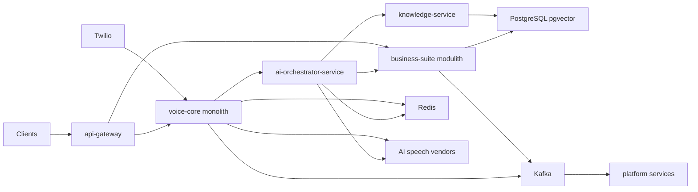

# 24. Cost Analysis

Cost assumptions are directional architecture estimates, not vendor quotes. They use the contract stack: Twilio primary telephony with Media Streams, Deepgram primary STT, Azure Speech TTS default, ElevenLabs premium TTS option, Azure OpenAI primary with OpenAI fallback, PostgreSQL 16 with pgvector, Redis 7, Kafka, Kubernetes, and OpenTelemetry tooling.

## 24.1 Unit Economics Assumptions

| Item | Assumption | Unit math |
|---|---:|---|
| Average call length | 5 minutes | 500K minutes means about 100K calls |
| Twilio voice plus media | 0.0145 USD per minute | 0.0085 voice plus 0.0060 media stream blended estimate |
| Deepgram STT | 0.0059 USD per minute | Contract requested Deepgram rate |
| Azure Speech TTS | 15 USD per 1M chars | About 700 generated chars per call minute means 0.0105 USD per minute |
| ElevenLabs premium TTS | 0.18 USD per 1K chars | About 700 generated chars per minute means 0.1260 USD per minute |
| LLM GPT-4o-class | 5 USD per 1M input, 15 USD per 1M output | 6 turns per call times 2K prompt plus 150 completion means 12K input and 900 output tokens per call, or 0.0735 USD per call and 0.0147 USD per minute |
| Observability | 10 to 20 percent of infra | Metrics, logs, traces, retention, and SIEM export |
| Egress | 0.001 to 0.003 USD per minute | Audio, traces, exports, cross-zone traffic |

Headline finding: per-minute vendor costs dominate infrastructure by roughly 5 to 10 times once calls are flowing. Telephony, STT, TTS, and LLM optimization matter more than shaving a few Kubernetes nodes.

## 24.2 Small Tier

Target: about 50 concurrent calls and 500K call minutes per month.

| Line item | Monthly estimate | Math |
|---|---:|---|
| Twilio voice plus media streams | 7,250 USD | 500K min times 0.0145 |
| Deepgram STT | 2,950 USD | 500K min times 0.0059 |
| Azure Speech TTS | 5,250 USD | 500K min times 700 chars per min times 15 per 1M |
| ElevenLabs premium TTS option | 63,000 USD | 500K min times 700 chars per min times 0.18 per 1K |
| GPT-4o-class LLM | 7,350 USD | 100K calls times 0.0735 |
| AKS or EKS nodes | 4,000 USD | hot-path pool, business pool, system pool |
| PostgreSQL 16 plus pgvector | 1,500 USD | HA managed instance and storage |
| Redis 7 | 700 USD | managed HA cache |
| Managed Kafka | 1,200 USD | small dedicated or shared cluster |
| Observability | 1,200 USD | logs, metrics, traces, alerting |
| Egress | 1,000 USD | audio and telemetry movement |
| Total with Azure TTS | 32,350 USD | 0.0647 USD per call minute |
| Total with ElevenLabs | 90,100 USD | 0.1802 USD per call minute |

## 24.3 Medium Tier

Target: about 1K concurrent calls and 10M call minutes per month.

| Line item | Monthly estimate | Math |
|---|---:|---|
| Twilio voice plus media streams | 145,000 USD | 10M min times 0.0145 |
| Deepgram STT | 59,000 USD | 10M min times 0.0059 |
| Azure Speech TTS | 105,000 USD | 10M min times 700 chars per min times 15 per 1M |
| ElevenLabs premium TTS option | 1,260,000 USD | 10M min times 700 chars per min times 0.18 per 1K |
| GPT-4o-class LLM | 147,000 USD | 2M calls times 0.0735 |
| AKS or EKS nodes | 45,000 USD | dedicated real-time node pools and autoscaling business pools |
| PostgreSQL 16 plus pgvector | 12,000 USD | larger HA primary, replicas, storage, backups |
| Redis 7 | 6,000 USD | clustered cache and reserved capacity |
| Managed Kafka | 15,000 USD | multi-broker managed Kafka with private networking |
| Observability | 18,000 USD | high-cardinality telemetry and log retention controls |
| Egress | 22,000 USD | media, vendor, and cross-zone transfer |
| Total with Azure TTS | 574,000 USD | 0.0574 USD per call minute |
| Total with ElevenLabs | 1,729,000 USD | 0.1729 USD per call minute |

## 24.4 Enterprise Tier

Target: about 10K concurrent calls and 100M call minutes per month.

| Line item | Monthly estimate | Math |
|---|---:|---|
| Twilio voice plus media streams | 1,450,000 USD | 100M min times 0.0145 before SIP discounts |
| Deepgram STT | 590,000 USD | 100M min times 0.0059 |
| Azure Speech TTS | 1,050,000 USD | 100M min times 700 chars per min times 15 per 1M |
| ElevenLabs premium TTS option | 12,600,000 USD | 100M min times 700 chars per min times 0.18 per 1K |
| GPT-4o-class LLM | 1,470,000 USD | 20M calls times 0.0735 |
| AKS or EKS nodes | 350,000 USD | multi-region real-time pools, reserved compute, overprovisioning |
| PostgreSQL 16 plus pgvector | 90,000 USD | sharded or tenant-dedicated HA footprint |
| Redis 7 | 45,000 USD | clustered regional caches |
| Managed Kafka | 120,000 USD | multi-region or dedicated managed Kafka estate |
| Observability | 160,000 USD | sampling, long-term retention, SIEM export |
| Egress | 240,000 USD | media, replicas, telemetry, vendor paths |
| Total with Azure TTS | 5,565,000 USD | 0.0557 USD per call minute |
| Total with ElevenLabs | 17,115,000 USD | 0.1712 USD per call minute |

## 24.5 Cost Levers

| Lever | Expected impact | Architectural tie-in |
|---|---|---|
| SIP trunking and self-hosted media | Reduces telephony cost at high volume | D6 trigger in Phase 3 |
| Smaller models for routing turns | Cuts LLM spend on classification and low-risk turns | Spring AI `ChatModel` abstraction from D5 |
| Semantic response cache | Avoids repeated LLM and RAG work | Redis 7 under D3 |
| TTS caching of common phrases | Reduces repeated synthesis of greetings, disclaimers, and confirmations | `tts-adapter-service` cache layer |
| PTU or reserved capacity | Stabilizes cost and latency for Azure OpenAI | Enterprise capacity planning |
| Prompt compaction | Reduces 12K input-token assumption | Conversation memory summarization |
| Vendor mix by tenant tier | Azure TTS default and ElevenLabs premium opt-in | Tenant config in `config-service` |

### Architecture Review (self-critique)

The cost model is useful but dangerously sensitive to assumptions: call length, prompt size, TTS character density, Twilio rate cards, and enterprise discounts can swing totals materially. The largest design correction is clear anyway: infra is not the main bill. If VoxAgent cannot reduce telephony, speech, and LLM unit costs, Kubernetes efficiency will not save gross margin.

# 25. Performance Optimization

## 25.1 Redis Caching Layers

| Cache | Owner | Key pattern | TTL | Risk control |
|---|---|---|---:|---|
| Agent config cache | `config-service`, `ai-orchestrator-service` | `org:{orgId}:agent:{agentDefinitionId}:v:{version}` | 5 min | ETag and Kafka invalidation |
| Semantic answer cache | `ai-orchestrator-service` | embedding hash plus tenant plus prompt version | 15 min to 24 h | Store citations and model version |
| Embedding cache | `knowledge-service` | text hash plus embedding model | 30 d | Recompute on model change |
| Availability cache | `scheduling-service` | resource plus date plus service type | 30 to 120 s | Final PostgreSQL conflict check |
| TTS phrase cache | `tts-adapter-service` | voice plus normalized phrase | 7 to 30 d | Exclude PII and dynamic values |
| Rate limit counters | `api-gateway` | tenant plus route plus window | window TTL | Redis cluster and local fail-closed policy |

Redis remains reconstructible under D3. No cache may be the only source of truth.

## 25.2 Streaming Everywhere

The hot path must pipeline token to sentence to audio rather than wait for complete responses:

1. `stt-adapter-service` streams partial and final transcripts.
2. `ai-orchestrator-service` begins generation after stable final partials and emits sentence chunks.
3. `tts-adapter-service` starts synthesis on the first complete sentence or safe phrase.
4. `media-gateway-service` streams first audio immediately, supports barge-in, and cancels stale TTS.
5. Kafka receives post-turn events only after the user experience is no longer waiting.

The target is not full-response latency; it is time to first synthesized audio: p50 at or below 800 ms and p95 at or below 1500 ms.

## 25.3 Async Post-call and Post-turn Work

Kafka is appropriate for `call.events.v1`, `conversation.turns.v1`, `conversation.completed.v1`, `ticket.events.v1`, `appointment.events.v1`, `notification.commands.v1`, `crm.sync.commands.v1`, `lead.events.v1`, `escalation.events.v1`, `knowledge.ingestion.v1`, and `audit.events.v1`. It is explicitly wrong for the live media loop. Use transactional outbox under D10 for business events so PostgreSQL writes and Kafka publication converge without distributed transactions.

## 25.4 HikariCP, pgBouncer, and Database Sizing

Baseline HikariCP sizing for blocking database work:

```text
pool_size = physical_cores * 2 per business service instance
```

Virtual threads increase request concurrency but do not increase database capacity. The connection pool still bounds PostgreSQL concurrency. For example, an 8-core `ticket-service` instance should start around 16 Hikari connections, then validate with wait-time metrics. If 20 service replicas each open 16 connections, PostgreSQL sees 320 possible sessions before admin, migration, and observability connections. Use pgBouncer in transaction pooling mode for high replica counts, but test prepared statement behavior and session state carefully.

## 25.5 PostgreSQL 16 Tuning

| Area | Guidance |
|---|---|
| `shared_buffers` | Start near 25 percent of RAM on dedicated instances; validate with cache hit and IO metrics |
| `work_mem` | Keep conservative globally; raise per-session for analytics jobs only |
| Autovacuum | Aggressive tuning for high-churn `ConversationTurn` and transcript staging tables |
| Partitioning | Partition `Call`, `ConversationTurn`, `Transcript`, `AuditLog`, and events by time and `org_id` where useful |
| Partition pruning | Keep queries time-bounded; avoid functions on partition keys |
| Indexing | Composite `org_id` plus time or status indexes; HNSW or IVFFlat for pgvector depending on volume |
| RLS | Validate plans under tenant predicates; RLS can hide bad query shapes until scale |
| Archival | Move old transcripts and recordings to object storage with metadata retained in PostgreSQL |

## 25.6 JVM and Runtime

| Area | Recommendation |
|---|---|
| Garbage collector | Java 21 ZGC for low pause targets in hot-path services |
| Warmup | Tiered compilation warmup with synthetic call flows before routing production traffic |
| CDS and AOT | Use Class Data Sharing and evaluate Spring AOT for faster startup and lower RSS |
| Direct buffers | Use direct `ByteBuffer` in `media-gateway-service` to reduce audio copy overhead |
| Virtual threads | Use for request concurrency, not CPU-bound media processing loops |
| Node placement | Dedicated `rt-voice` node pool with Guaranteed QoS, CPU pinning, and no throttling |
| Deployment | Drain media sessions before termination; no abrupt pod kills on active calls |

## 25.7 Network, gRPC, and Vendor Connections

Reuse gRPC channels between `media-gateway-service`, `stt-adapter-service`, `ai-orchestrator-service`, and `tts-adapter-service`. Use HTTP/2 connection pooling for Azure OpenAI, Deepgram, Azure Speech TTS, ElevenLabs, and Twilio APIs. Open Deepgram and TTS WebSockets at call start in parallel with greeting generation so the first real user turn does not pay vendor cold-start latency.

Deadlines are mandatory: hot-path gRPC calls need budgets, cancellation propagation, and fallback phrases. Retries on the hot path should be rare and bounded; duplicated audio is worse than a brief apology.

### Architecture Review (self-critique)

Performance advice is only credible if enforced by SLO dashboards and load tests. The most likely failure is death by tail latency: one slow vendor, one oversized prompt, one cold TTS socket, or one blocked PostgreSQL pool breaks the voice illusion. Optimization must be stage-measured and budget-driven, not generic tuning theater.

# 27. Future Roadmap

## 27.1 Phase 1 MVP, 0 to 4 months

| Dimension | Plan |
|---|---|
| Deliverables | Inbound calls only, single language, FAQ plus ticket plus appointment, Twilio, cascaded STT to LLM to TTS, basic guardrails, single region, tenant admin basics |
| Services shape | Prefer consolidated start: `api-gateway`, voice-core deployable, `ai-orchestrator-service`, business-suite modulith, `knowledge-service`, platform components |
| Exit criteria | 100 concurrent calls in staging, p95 first audio below 1500 ms on canned flows, ticket and appointment success above 99 percent, signed consent and audit baseline |
| Team shape | 1 tech lead, 2 backend engineers, 1 AI engineer, 1 frontend or console engineer, 1 DevOps engineer, 1 QA automation engineer, fractional security |

## 27.2 Phase 2 Growth, 4 to 8 months

| Dimension | Plan |
|---|---|
| Deliverables | Outbound campaigns, CRM integrations, multi-language, RAG general availability, human handoff console, SOC2 readiness, tenant rate limits |
| Services shape | Split `campaign-service`, `crm-integration-service`, `agent-routing-service`, and `notification-service` only if teams and load justify it |
| Exit criteria | 1K concurrent calls in performance environment, CRM sync retry and DLQ runbooks, human handoff under 60 seconds median wait, SOC2 control evidence automated |
| Team shape | Add product manager, solutions architect, security engineer, data engineer, and 2 more backend engineers |

## 27.3 Phase 3 Scale, 8 to 14 months

| Dimension | Plan |
|---|---|
| Deliverables | SIP trunking, multi-region active-active or active-warm, Azure OpenAI PTU, speech-to-speech pilot behind `VoicePipeline`, MCP tool integration, supervisor QA agent |
| Services shape | Evolve toward the contract's 17 services as scaling triggers are met: independent load, independent data ownership, independent team ownership |
| Exit criteria | 10K concurrent call test, regional failover exercise, per-tenant cost reporting, p95 RAG below 150 ms or vector DB migration decision, QA agent catches policy failures |
| Team shape | Platform team, voice infrastructure team, AI platform team, business apps team, SRE rotation, security and compliance owner |

## 27.4 Phase 4 Expansion, 14 months and beyond

| Dimension | Plan |
|---|---|
| Deliverables | Agent marketplace, voice cloning with consent framework, knowledge graph, debt-collection workflows with FDCPA controls, predictive dialing, advanced analytics |
| Services shape | Dedicated marketplace, metering, evaluation, and data warehouse capabilities; split services by tenant tier and regulatory domain |
| Exit criteria | Marketplace governance live, consent proof for cloned voices, FDCPA audit pack validated, predictive dialer compliance monitoring, enterprise dedicated deployments repeatable |
| Team shape | Multiple product squads plus centralized platform, SRE, security, compliance, data, and partner engineering teams |

### Architecture Review (self-critique)

The roadmap is ambitious and should be treated as an option map, not a commitment schedule. The highest risk is doing Phase 2 and Phase 3 platform work before Phase 1 proves customers will tolerate AI voice. Keep module boundaries now, but delay service splits until scale, compliance, or team autonomy forces them.

# 28. Architecture Review

## 28.1 Critical Challenges

| Challenge | Weakness | Alternative | Verdict |
|---|---|---|---|
| JVM media gateway under D8 | Java 21 with ZGC can work, but JVM in jitter-sensitive media path is contested | LiveKit, Jambonz, Rust gateway, Go gateway, or Twilio-hosted media | Keep `media-gateway-service` thin and isolated on `rt-voice`; revisit immediately if jitter, GC, or CPU copy overhead breaks p95 |
| 17 microservices for MVP | Too many repos, pipelines, databases, dashboards, and on-call surfaces | Consolidated modulith start with preserved module boundaries | Start with 5 deployables, split only at scale triggers |
| pgvector ceiling under D4 | PostgreSQL works early but may suffer beyond 20M vectors or retrieval p95 above 150 ms | Qdrant, Pinecone, Weaviate | Use pgvector now, instrument recall and p95, plan migration seam |
| Kafka before PMF under D1 | Operational overhead and schema governance burden | Outbox table plus managed queue, or fewer topics initially | Use managed Kafka only where replay matters; keep hot path off Kafka |
| Cascaded pipeline under D7 | STT to LLM to TTS has additive latency | GPT realtime or speech-to-speech vendor | Keep cascaded for control and tools; pilot behind `VoicePipeline` in Phase 3 |
| Cost structure | Telephony, STT, TTS, and LLM dominate infra | SIP, caching, smaller models, reserved capacity | Optimize unit economics from day one |
| Missing components | Billing, prompt evals, human console, data warehouse not in 17-service list | Add platform capabilities before enterprise launch | Treat as product-critical, not nice-to-have |

## 28.2 Improved MVP Architecture

The improved architecture starts with fewer deployables while preserving the contract's bounded contexts internally. This reduces operational load without discarding the target architecture.



Deployables:

| Deployable | Contains initially | Split trigger |
|---|---|---|
| voice-core monolith | `media-gateway-service`, `stt-adapter-service`, `tts-adapter-service`, call-control adapter module | Hot-path scaling, media jitter, separate voice infrastructure team |
| `ai-orchestrator-service` | Agent loop, guardrails, tool registry, provider abstraction | Keep separate from day one due to specialized latency and AI release cadence |
| business-suite modulith | `call-management-service`, `conversation-service`, `ticket-service`, `scheduling-service`, `campaign-service`, `agent-routing-service`, `notification-service`, `crm-integration-service` modules | Independent load, data ownership, compliance boundary, or team ownership |
| `knowledge-service` | RAG ingestion, search, embeddings, citations | Keep separate due to data volume and indexing workload |
| platform services | `identity-service`, `config-service`, `analytics-service` modules plus observability glue | Split identity and config before enterprise security review |

## 28.3 Weaknesses and Bottlenecks

| Area | Risk | Severity | Mitigation |
|---|---|---:|---|
| Voice latency | Vendor cold starts and prompt bloat break p95 | High | Prewarm sockets, prompt budgets, stage SLOs |
| Media runtime | JVM may introduce audio jitter | Medium to high | Thin gateway, direct buffers, dedicated nodes, LiveKit fallback |
| Data model | Transcript tables become high-churn and huge | High | Partitioning, archival, autovacuum tuning |
| RAG | pgvector recall and latency degrade with scale | Medium | Hybrid search, rerank, vector DB migration seam |
| Tool calls | Synchronous business tools block conversation | High | 800 ms deadlines, filler phrases, async fallback |
| Tenant isolation | RLS mistakes leak data | Critical | Automated RLS tests, tenant context enforcement, security review |

## 28.4 Cost Risks

| Cost risk | Failure mode | Mitigation |
|---|---|---|
| Twilio volume | Per-minute telephony dominates enterprise spend | D6 SIP trunking and high-volume tenant routing |
| ElevenLabs premium | Premium TTS can triple total cost per minute | Make opt-in, cache phrases, default to Azure Speech TTS |
| LLM prompts | Long conversation history inflates input tokens | Summaries, retrieval discipline, smaller routing models |
| Observability | Audio-scale telemetry creates runaway log bills | Sampling, cardinality controls, retention tiers |
| Multi-region | Active-active doubles idle capacity | Active-warm until enterprise contracts justify active-active |

## 28.5 Operational Risks

| Operational risk | Why it matters | Control |
|---|---|---|
| Drain-unsafe deploys | Active calls can be dropped mid-conversation | Connection draining, pod termination budgets, call-aware rollouts |
| Kafka DLQ neglect | Async failures silently accumulate | DLQ ownership, replay tooling, runbooks |
| Vendor outage | STT, TTS, LLM, or Twilio failures are user-visible | Fallback vendors, circuit breakers, status-aware routing |
| Prompt regressions | Small prompt edits can break regulated workflows | Prompt eval harness and approval workflow |
| Human handoff gap | Escalations fail without a console and staffing model | Build console before selling escalation-heavy use cases |
| Compliance drift | Consent, retention, and audit vary by tenant | Policy engine, immutable `audit.events.v1`, tenant controls |

## 28.6 Missing Components Found

| Missing component | Why it is needed | Recommended owner |
|---|---|---|
| Rate-limited tenant billing and metering service | Cost allocation, quota enforcement, invoicing, abuse control | Platform team |
| Prompt evaluation and regression harness | Prevents unsafe prompt changes and model regressions | AI platform team |
| Human agent console app | Required for real handoff, screen-pop, and disposition | Product application team |
| Data warehouse | Long-horizon analytics, finance reporting, QA, model improvement | Data team |

### Architecture Review (self-critique)

The target architecture is technically credible but too heavy as the first implementation. The best version is evolutionary: build a consolidated modulith with strict internal boundaries, prove latency and product value, then split toward the 17 canonical services when scaling triggers are observable. The contract should be treated as a north star, not a day-one deployment mandate.

# 29. Final Recommendation

## 29.1 Recommended Architecture

Start consolidated and evolve. Use 5 deployables for the first production release: `api-gateway`, voice-core monolith, `ai-orchestrator-service`, business-suite modulith, and `knowledge-service`, supported by platform modules for identity, config, analytics, observability, PostgreSQL, Redis, and Kafka. Preserve the canonical service boundaries in packages, schemas, topic names, and ownership so the system can split into the contract's 17 services when concurrency, team autonomy, compliance, or tenant isolation requires it.

## 29.2 Recommended Stack

| Layer | Recommendation |
|---|---|
| Runtime | Java 21, Spring Boot 3.3+, virtual threads for request concurrency, ZGC for low pauses |
| AI | Spring AI, Azure OpenAI primary, OpenAI fallback, provider abstraction, single tool-calling voice agent |
| Speech | Deepgram STT primary, Azure Speech fallback, Azure Speech TTS default, ElevenLabs premium |
| Telephony | Twilio first, SIP trunking under D6 at scale |
| Data | PostgreSQL 16, RLS, partitioning, pgvector, object storage archival |
| Cache | Redis 7 for config, semantic, embedding, availability, TTS phrase, and rate-limit caches |
| Events | Kafka with Schema Registry for async events only, transactional outbox under D10 |
| Platform | Kubernetes, Helm, ArgoCD, OpenTelemetry, Prometheus, Grafana, Loki or ELK, Jaeger or Tempo |
| Security | OIDC, JWT, mTLS service mesh, Vault or Azure Key Vault, audit events, PII redaction |

## 29.3 Deployment Strategy

Use Kubernetes with ArgoCD and progressive delivery. Canary non-media services with request and error SLO checks. For voice deploys, require drain-aware rollouts: stop accepting new calls, let active WebSocket and gRPC streams complete, enforce maximum drain windows, then terminate. Run hot-path services on the `rt-voice` node pool with Guaranteed QoS, CPU pinning, and no throttling.

## 29.4 Data Model

Use PostgreSQL 16 as the system of record with `org_id` on every tenant table, Row-Level Security, UUIDv7 IDs, and time partitioning for `Call`, `Conversation`, `ConversationTurn`, `Transcript`, `AuditLog`, and high-volume event tables. Use pgvector for early RAG with a migration trigger at more than 20M vectors or retrieval p95 above 150 ms. Keep recordings and old transcript bodies in object storage with metadata and retention controls in PostgreSQL.

## 29.5 AI Design Pattern

Use a single tool-calling Voice Agent in `ai-orchestrator-service`, plus an async Supervisor QA agent that reviews completed conversations for quality, compliance, and coaching. Put guardrails before and after model calls: input safety, PII redaction, tool policy checks, grounded answer validation, and response safety. Use Spring AI abstractions for `ChatModel`, embeddings, and tools; implement tools as Spring AI `@Tool` beans behind a `ToolRegistry` that can front MCP servers later under D11.

## 29.6 First 90 Days Build Order

1. Build `api-gateway`, `identity-service` module, tenant context, JWT, RLS baseline, and audit logging.
2. Build inbound Twilio flow in voice-core: webhook, WebSocket stream, `media-gateway-service` module, STT, TTS, and drain-aware deploys.
3. Build `ai-orchestrator-service` with tool registry, guardrails, prompt version loading, semantic cache, and stage latency metrics.
4. Build `config-service` module for `AIAgentDefinition`, voice settings, and prompt versions.
5. Build `knowledge-service` ingestion, pgvector hybrid search, citations, and RAG eval seed set.
6. Build business-suite ticket and appointment modules with idempotent tool APIs and transactional outbox.
7. Add `conversation-service` projections from `conversation.turns.v1` and `call.events.v1`.
8. Add `notification-service` module for SMS confirmations through `notification.commands.v1`.
9. Run latency load tests at 50, 100, and 250 concurrent calls with vendor fallbacks.
10. Implement cost dashboards per tenant before launching paid pilots.
11. Add human handoff prototype only after the human agent console screen-pop path exists.
12. Gate every prompt release through regression tests and recorded-call simulations.

### Architecture Review (self-critique)

The final recommendation deliberately deviates from a pure 17-microservice deployment because that would optimize for an org size VoxAgent does not yet have. The risk is that the modulith becomes permanent accidental architecture. Avoid that by enforcing module boundaries, separate schemas where needed, published event contracts, and explicit split triggers from the first sprint.
